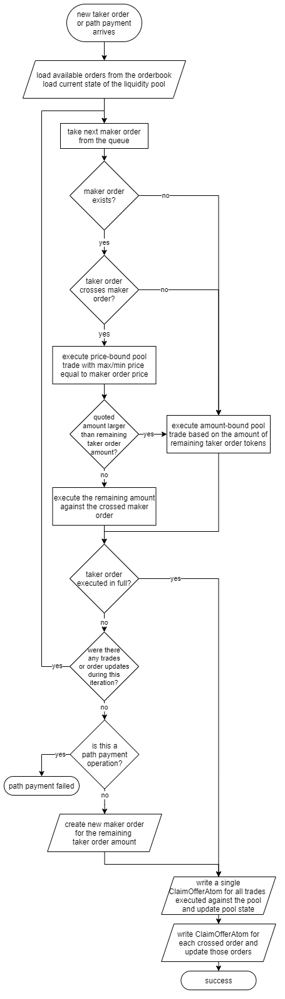

## Preamble

```
CAP: 0037
Title: Automated Market Makers
Working Group:
    Owner: OrbitLens <orbit@stellar.expert>
    Authors: OrbitLens <orbit@stellar.expert>
    Consulted: Jon Jove <jon@stellar.org>, Nicolas Barry <nicolas@stellar.org>, Nikhil Saraf<nikhil@stellar.org>, Phil Meng <phil@stellar.org>, Leigh McCulloch <leigh@stellar.org>, Tomer Weller <tomer@stellar.org> 
Status: Draft
Created: 2021-03-03
Discussion: https://groups.google.com/g/stellar-dev/c/Ofb2KXwzva0/m/LLcUKWFmBwAJ
Protocol version: TBD
```

## Simple Summary

This proposal introduces liquidity pools and automated market makers on the
protocol level. AMMs rely on a mathematical formula to quote asset prices. A
liquidity pool is a ledger entry that contains funds deposited by users
(liquidity providers). In return for providing liquidity to the protocol, users
earn fees from trades. The described approach of the interleaved order execution
combines the liquidity of existing orderbooks with liquidity pools.

## Motivation

Orderbooks market-making (especially on-chain) may be quite tricky. It requires
trading bots that constantly track external asset prices and adjust on-chain
orders accordingly. In turn, this process results in endless offer adjustments
which clog ledger history.

Market makers need to provision liquidity and maintain inventories. For a few
trading pairs it is more or less straightforward but the ecosystem expansion
brings new assets, new trading pairs. Consequently, inventory requirements
increase, as well as the number of operations required to maintain positions on
all orderbooks.

On the other hand, automated market makers provide natural incentives for
liquidity crowdsourcing, making it much easier for ordinary users to participate
in the process while gaining interest on their long-term holdings.

Asset issuers don't need to wait until the token attracts a critical mass of
users. They can start making several trading pairs with a newly issued asset by
merely depositing tokens to the pool or engaging community users to provision
liquidity. This will certainly simplify the process of starting a new project on
Stellar, as well as provide a powerful marketing flywheel for early-stage
tokens.

The AMM concept implies that no third-party company holds user funds at any
point, and the algorithm itself doesn't rely on external data. Therefore,
potential regulatory risks are limited compared to the classic exchange design.

Liquidity pools don't store any complex information, don't require regular
position price adjustments, and work completely deterministically. From the
perspective of the on-chain execution, those characteristics offer much better
scalability compared to the existing DEX.

Proposed interleaved order execution on both the orderbook and liquidity pool
provides a familiar exchange experience in combination with the ability to have
on-chain limit orders. On the other hand, it fully incorporates all benefits of
shared liquidity pools, at the same time hiding the underlying technical details
from end-users. Users always get the best possible exchange price based on the
combined liquidity.

## Abstract

This proposal brings the concept of shared liquidity pools with automated market
making to the protocol. Users deposit funds to a pool providing liquidity to the
automated market maker execution engine which can quote asset prices based on an
algorithm that derives the price directly from the amounts of tokens deposited
to the pool.

Pool fees charged on every executed trade are accumulated in the pool,
increasing its liquidity. A user can withdraw the pool stake plus proportional
accrued interest from the pool. Collected interest incentivizes users to deposit
their funds to the pool, participating in the collective liquidity allocation.

## Specification

- New ledger entries `LiquidityPoolEntry` and `LiquidityStakeEntry`
- New operations `DepositPoolLiquidityOp` and `WithdrawPoolLiquidityOp`
- Semantic altered for existing operations `ManageSellOfferOp`,
  `ManageBuyOfferOp`, `CreatePassiveSellOfferOp`, `PathPaymentStrictReceiveOp`,
  `PathPaymentStrictSendOp`

### XDR changes

```diff check.ignore=true
--- a/src/xdr/Stellar-ledger-entries.x
+++ b/src/xdr/Stellar-ledger-entries.x
@@ -403,6 +403,43 @@ struct ClaimableBalanceEntry
     ext;
 };
 
+/* Contains information about current balances of the liquidity pool*/
+struct LiquidityPoolEntry
+{
+    Asset assetA;   // asset A of the liquidity pool
+    Asset assetB;   // asset B of the liquidity pool
+    int64 amountA;  // current amount of asset A in the pool
+    int64 amountB;  // current amount of asset B in the pool
+    int64 stakes;   // total number of pool shares owned by the account
+    double fee;     // weighted average pool fee defined by pool participants
+
+    // reserved for future use
+    union switch (int v)
+    {
+    case 0:
+        void;
+    }
+    ext;
+};
+
+/* Represents information about the account stake in a pool */
+struct LiquidityStakeEntry
+{
+    AccountID accountID; // account this liquidity stake belongs to
+    Asset assetA;        // asset A of the liquidity pool
+    Asset assetB;        // asset B of the liquidity pool
+    int64 stake;         // share of the pool that belongs to the account
+    double fee;          // proposed pool fee
+
+    // reserved for future use
+    union switch (int v)
+    {
+    case 0:
+        void;
+    }
+    ext;
+};
+
 struct LedgerEntryExtensionV1
 {
     SponsorshipDescriptor sponsoringID;
@@ -431,6 +468,10 @@ struct LedgerEntry
         DataEntry data;
     case CLAIMABLE_BALANCE:
         ClaimableBalanceEntry claimableBalance;
+    case LIQUIDITY_POOL:
+        LiquidityPoolEntry LiquidityPool;
+    case LIQUIDITY_STAKE:
+        LiquidityStakeEntry LiquidityStake;
     }
     data;
 
@@ -479,6 +520,21 @@ case CLAIMABLE_BALANCE:
     {
         ClaimableBalanceID balanceID;
     } claimableBalance;
+
+case LIQUIDITY_POOL:
+    struct
+    {
+        Asset assetA;
+        Asset assetB;
+    } LiquidityPool;
+
+case LIQUIDITY_STAKE:
+    struct
+    {
+        AccountID accountID;
+        Asset assetA;
+        Asset assetB;
+    } LiquidityStake;
 };
```

```diff check.ignore=true
--- a/src/xdr/Stellar-transaction.x
+++ b/src/xdr/Stellar-transaction.x
@@ -48,7 +48,9 @@ enum OperationType
     END_SPONSORING_FUTURE_RESERVES = 17,
     REVOKE_SPONSORSHIP = 18,
     CLAWBACK = 19,
-    CLAWBACK_CLAIMABLE_BALANCE = 20
+    CLAWBACK_CLAIMABLE_BALANCE = 20,
+    DEPOSIT_POOL_LIQUIDITY = 21,
+    WITHDRAW_POOL_LIQUIDITY = 22
 };
 
 /* CreateAccount
@@ -390,6 +392,37 @@ struct ClawbackClaimableBalanceOp
     ClaimableBalanceID balanceID;
 };
 
+/* Deposits funds to the liquidity pool
+
+    Threshold: med
+
+    Result: DepositPoolLiquidityResult
+*/
+struct DepositPoolLiquidityOp
+{
+    Asset assetA;         // asset A of the liquidity pool
+    Asset assetB;         // asset B of the liquidity pool
+    int64 maxAmountA;     // maximum amount of asset A a user willing to deposit
+    int64 maxAmountB;     // maximum amount of asset B a user willing to deposit
+    uint32 priceAccuracy; // deposit price slippage accuracy
+    double fee;           // proposed pool fee
+};
+
+/* Withdraws all funds that belong to the account from the liquidity pool
+
+    Threshold: med
+
+    Result: WithdrawPoolLiquidityResult
+*/
+struct WithdrawPoolLiquidityOp
+{
+    Asset assetA;    // asset A of the liquidity pool
+    Asset assetB;    // asset B of the liquidity pool
+    int64 stake;     // stake to withdraw
+};
+
+
+
 /* An operation is the lowest unit of work that a transaction does */
 struct Operation
 {
@@ -1186,6 +1219,67 @@ default:
     void;
 };
 
+/******* DepositPoolLiquidity Result ********/
+
+enum DepositPoolLiquidityResultCode
+{
+    // codes considered as "success" for the operation
+    DEPOSIT_POOL_LIQUIDITY_SUCCESS = 0,
+    // codes considered as "failure" for the operation
+    DEPOSIT_POOL_LIQUIDITY_MALFORMED = -1,           // bad input
+    DEPOSIT_POOL_LIQUIDITY_NOT_ALLOWED = -2,         // invalid pool assets combination
+    DEPOSIT_POOL_LIQUIDITY_PRICE_MISMATCH = -3,      // current pool price doesn't match deposit price
+    DEPOSIT_POOL_LIQUIDITY_INSUFFICIENT_AMOUNT = -4, // not enough funds for a deposit
+    DEPOSIT_POOL_LIQUIDITY_LOW_RESERVE = -5          // not enough funds to cover base reserve
+};
+
+struct DepositPoolLiquiditySuccessResult
+{
+    // liquidity pool stake that belongs to account
+    LiquidityStakeEntry stake;
+};
+
+union DepositPoolLiquidityResult switch (
+    DepositPoolLiquidityResultCode code)
+{
+case DEPOSIT_POOL_LIQUIDITY_SUCCESS:
+    DepositPoolLiquiditySuccessResult success;
+default:
+    void;
+};
+
+/******* WithdrawPoolLiquidity Result ********/
+
+enum WithdrawPoolLiquidityResultCode
+{
+    // codes considered as "success" for the operation
+    WITHDRAW_POOL_LIQUIDITY_SUCCESS = 0,
+    // codes considered as "failure" for the operation
+    WITHDRAW_POOL_LIQUIDITY_MALFORMED = -1,     // bad input
+    WITHDRAW_POOL_LIQUIDITY_NOT_FOUND = -2,     // account doesn’t have a stake in the pool
+    WITHDRAW_POOL_LIQUIDITY_INVALID_STAKE = -3, // invalid stake amount
+    WITHDRAW_POOL_LIQUIDITY_NO_TRUSTLINE = -4,  // account does not have an established and authorized trustline for one of the assets
+    WITHDRAW_POOL_LIQUIDITY_LINE_FULL = -5      // account would go above the trustline limit
+};
+
+struct WithdrawPoolLiquiditySuccessResult
+{
+    Asset assetA;   // asset A of the liquidity pool
+    Asset assetB;   // asset B of the liquidity pool
+    int64 amountA;  // amount of asset A withdrawn from the pool
+    int64 amountB;  // amount of asset B withdrawn from the pool
+    int64 stake;    // pool share that has been redeemed
+};
+
+union WithdrawPoolLiquidityResult switch (
+    WithdrawPoolLiquidityResultCode code)
+{
+case WITHDRAW_POOL_LIQUIDITY_SUCCESS:
+    WithdrawPoolLiquiditySuccessResult success;
+default:
+    void;
+};
+
```

## Semantics

Modified semantics of trading-related operations presented in this CAP allows to
drastically reduce the number of new interaction flows. Liquidity from the pools
will be immediately available for existing Stellar applications through the
convenient offers and path payment interface operations.

In this proposal, a constant product invariant is used for all calculations
  
Other invariants can be implemented as separate pools with different price
quotation formulas and execution conditions.

#### DepositPoolLiquidityOp

`DepositPoolLiquidityOp` operation transfers user funds to the selected
liquidity pool defined as `LiquidityPoolEntry`.

- Before processing a deposit, basic validation is required to ensure that a
  given combination of assets is allowed. For example, the situation when
  `assetA`=`assetB` should result in `DEPOSIT_POOL_LIQUIDITY_NOT_ALLOWED` error.
  This version of the proposal doesn't imply any other restrictions, but this
  may change in the future.
- The node performs a lookup of a `LiquidityStakeEntry` by hash derived from the
  operation source account address, `poolType`, `assetA`, and `assetB`.
- If the proposed pool fee (`fee` parameter) is less than 0.0001 or greater than
  0.01, `DEPOSIT_POOL_LIQUIDITY_NOT_ALLOWED` error returned.
- The node loads source account balances for `assetA`, `assetB`. If any of the
  balances do not exist, `DEPOSIT_POOL_LIQUIDITY_INSUFFICIENT_AMOUNT` error
  returned.
- Deposited assets ratio calculated as  
    
  Current pool price:  
    
  where:
    - ***A*** and ***B*** - amounts of asset A and asset B currently in the pool
    - ***a*** and ***b*** - `maxAmountA` and `maxAmountB` defined in the
      operation
- Maximum allowed price deviation is controlled by the `priceAccuracy` (***d***)
  parameter.  
    
  In case of a significant deviation, `DEPOSIT_POOL_LIQUIDITY_PRICE_MISMATCH`
  error returned. This check is ignored if the pool doesn't exist
  or `priceAccuracy` equals to zero.
- Effective token amounts that can be deposited are adjusted to follow the
  current price.  
  If
  
  , token A deposit amount is adjusted as  
  )  
  otherwise  
  )  
  where:
    - )
    - )
    - ***a*** and ***b*** – maximum effective amounts of tokens A and B that can
      be deposited to the pool. If the actual deposited amount of any token
      equals zero, `DEPOSIT_POOL_LIQUIDITY_INSUFFICIENT_AMOUNT` error returned.
- Stake weight calculated as  
  )  
  where
    - ***s*** - account stake (share of the pool obtained after the deposit)
    - ***a*** and ***b*** - effective amount of tokens to deposit
    - ***S*** - total stakes currently in the pool (from `LiquidityPoolEntry`)
    - ***A*** and ***B*** - correspondingly amount of token A and B currently
      deposited to the pool
- If `LiquidityPoolEntry` does not exist on-chain (this is the first deposit),
  it is created automatically. The stake weight for the deposit, in this case,
  the stake computed as  
  )
- If ***s***=0 (this can be the case with a very small stake or as a result of
  rounding approximation), the node
  returns `DEPOSIT_POOL_LIQUIDITY_INSUFFICIENT_AMOUNT` error.
- If one of the assets is XLM and its balance does not satisfy the basic reserve
  requirement, `DEPOSIT_POOL_LIQUIDITY_LOW_RESERVE` error returned.
- If the account `LiquidityStakeEntry` exists, the stake is increased
  `stake`+=***s*** and the proposed pool fee updated with the value from the
  deposit operation. Otherwise, new `LiquidityStakeEntry` created,
  `numSubEntries` for the source account incremented, and base reserve locked.
- Effective pool fee recalculated using a weighted average formula:
  
  where
    - ***Fₙ*** - new pool fee
    - ***S*** - total stakes currently in the pool (from `LiquidityPoolEntry`)
    - ***F*** - current pool fee
    - ***s*** - account stake
    - ***f*** - pool fee proposed by the account
- The node modifies `LiquidityPoolEntry` setting `amountA`+=***a***,
  `amountB`+=***b***, `stakes`+=***s***, fee=***Fₙ***.
- Deposited funds transferred into the pool.
- `DEPOSIT_POOL_LIQUIDITY_SUCCESS` code returned.

#### WithdrawPoolLiquidityOp

`WithdrawPoolLiquidityOp` operation withdraws funds from a liquidity pool
proportionally to the account stake size.

- The node performs a lookup of a `LiquidityStakeEntry` by hash derived from the
  operation source account address, `poolType`, `assetA`, and `assetB`.
- If corresponding `LiquidityStakeEntry` was not found,
  `WITHDRAW_POOL_LIQUIDITY_NOT_FOUND` error is returned.
- Requested stake withdrawal size larger then `LiquidityStakeEntry` `stake`
  value yields `WITHDRAW_POOL_LIQUIDITY_INVALID_STAKE` error. If the
  requested `stake` equals zero, the entire account liquidity is withdrawn.
- The node loads current state of the matching liquidity pool.
- An account has a right to withdraw liquidity stake equal to  
    
  The amount of tokens to withdraw for each asset is computed as  
  )  
  )  
  where
    - ***s*** - share to withdraw
    - ***S*** - total number of pool shares from `LiquidityPoolEntry`
    - ***A*** and ***B*** - current token amount of the asset A and asset B in
      the pool respectively
- Trustlines info loaded for `assetA` and `assetB`. If the source account does
  not have a trustline for one of the assets or the trustline is not authorized,
  `WITHDRAW_POOL_LIQUIDITY_NO_TRUSTLINE` error returned. If a trustline limit
  prevents the transfer, `WITHDRAW_POOL_LIQUIDITY_LINE_FULL` error returned.
- `LiquidityStakeEntry` updated: `stake`-=***s***. If the remaining stake equals
  zero, `LiquidityStakeEntry` is removed, `numSubEntries` for the source account
  is decremented, and base reserve unlocked.
- Effective pool fee recalculated using a weighted average formula:
  
  where
    - ***Fₙ*** - new pool fee
    - ***S*** - total stakes currently in the pool (from `LiquidityPoolEntry`)
    - ***F*** - current pool fee
    - ***s*** - stake to withdraw
    - ***f*** - pool fee proposed by the account (from `LiquidityStakeEntry`)
- `LiquidityPoolEntry` updated: `amountA`-=***a***, `amountB`-=***b***,
  `stakes`-=***s***, fee=***Fₙ***. If the remaining pool stake equals zero,
  `LiquidityPoolEntry` is removed.
- Funds transferred to the source account balances.
- `WITHDRAW_POOL_LIQUIDITY_SUCCESS` code returned.

#### Semantic changes for existing operations

Behavior updated for `ManageSellOfferOp`, `ManageBuyOfferOp`,
`CreatePassiveSellOfferOp`, `PathPaymentStrictReceiveOp`,
`PathPaymentStrictSendOp` operations.

When a new (taker) order arrives, the DEX engine loads the current state of all
liquidity pools for the traded asset pair, fetches available cross orders
(maker orders) from the orderbook, and iterates through the fetched maker
orders.

On every step, it checks whether the next maker order crosses the price of the
taker order. Before the maker order execution the engine estimates the number of
tokens that can be traded on each liquidity pool for the same trading pair up to
the price of the current maker order.

Amounts to be traded against the pool can be calculated using the following set
of formulas:

- Price-bound swap (estimate based on the target price)  
  If *new price* > *current price*:  
  %5Ccdot(1%2Bf)))  
  )  
  If *new price* < *current price*:  
  %5Ccdot(1%2Bf)))  
  %5Ccdot%20P-A))
- Amount-bound buy swap (estimate based on the target token amount)  
  For a given token A target amount:  
  %7D%7BA-a%7D))  
  For a given token B target amount:  
  %7D%7BB-b%7D))
- Amount-bound sell swap (estimate based on the source token amount)  
  For a given token A source amount:  
  %7D%7BA%2Ba%7D))  
  For a given token B source amount:  
  %7D%7BB%2Bb%7D))  
  where
    - ***A*** and ***B*** - current amounts of asset A and asset B in the pool
    - ***a*** and ***b*** – effective amounts of asset A and asset B to swap
    - ***f*** - trading pool fee
    - ***P*** - maximum price (equals currently processed maker order price)

If ***a***>0 and ***b***>0, the corresponding amount of purchased tokens is
deducted from the pool and added to the variable accumulating the total amount
traded on the pool. Another variable accumulates matching sold asset amount.

After that, the current maker order itself is matched to the remaining taker
order amount, and so on, up to the point when a taker order is executed in full.
If a manage offer operation is being processed and the outstanding amount can't
be executed on the orderbook nor the pool, a new maker order with the remaining
amount is created on the orderbook.

Pool settlement occurs – traded tokens are deducted from the pool and added to
the account balance, and matching amount of asset B transferred from the account
balance to the pool.

The same behavior applies to path payment operations. This CAP doesn't imply any
changes of current order matching or execution process for DEX offers.

A trade against a pool generates a `ClaimOfferAtom` result with `offerID` equal
to `-poolType` and empty `sellerID`.

A simplified flow of the interleaved trade execution process:



## Design Rationale

#### Orderbook+AMM Execution

Basic liquidity pools implementation separately from the existing DEX has
several shortcomings:

- The new AMM interface requires new trading operations. In addition to the
  existing `ManageSellOfferOp` and `ManageBuyOfferOp`, it also requires
  something like `SwapSellOp` and `SwapBuyOp` for the interaction with AMM.
  Another two operations required for path payments:
  `SwapPathPaymentStrictReceiveOp` and `SwapPathPaymentStrictSendOp`.
- While having separate DEX and orderbook looks like a simpler solution, in
  reality, it results in significantly larger codebase changes (more operations
  and more use-cases to handle), a lot of work on the Horizon side, and much
  more effort from the ecosystem developers.
- The trading process becomes confusing for regular users. What's the difference
  between an order and a swap? How to get the best rate?  
  Of course, sooner or later wallets and exchange interfaces should come to the
  rescue, providing hints in the interface and maybe even aggregating
  information across the liquidity pool and orderbook for a given assets pair to
  ensure the best possible exchange price. That's feasible, but not very
  user-friendly and may lead to confusion.
- Fragmented liquidity means that for any trade or path payment larger than
  several dollars a wallet needs to perform several trades (against the
  orderbook and liquidity pools) in order to deliver an adequate price to a
  user, increasing the number of transactions necessary for a swap. In the case
  of path payments, users will have to choose whether they want operation
  atomicity with inferior price (due to the path payment tapping either into a
  liquidity pool or an orderbook) or get a better price while sacrificing the
  atomicity.
- The long-existing problem of bots spamming the ledger while competing for
  arbitrage opportunities substantially widens because independent AMMs rely on
  arbitrage actors that rebalance pools if the price on the AMM floats too far
  from global market prices. This presents much more profitable opportunities
  than doing circular path payments for several ordebook trading pairs. Given
  the limited capacity of the ledger, this will lead to the whole network
  paralysis once the competition between several arbitrage bots and market
  makers inflate transaction fees to the sky. Most of the time, it will be
  impossible to execute a simple payment because the whole ledger capacity will
  be flooded with arbitrage transactions sent in response to any DEX offer
  update from market makers.

Advantages of the proposed approach:

- Users always receive the best possible price as the trade is executed against
  the entire liquidity available for the certain trading pair.
- The orderbook and liquidity pool always remain in the balanced state which
  means there are no arbitrage opportunities between the pool and orderbook. The
  trading engine automatically conducts arbitrage rebalancing on each trade
  under the hood, eliminating the need for external arbitrage actors.
- There are no reasonable use-cases that require trading exclusively on the
  pool. Price manipulations is probably the only applicable example of pool-only
  swaps.
- Smaller attack surface since there is no way to trade on pool directly. This
  also automatically prevents attacks based on the imbalanced oracle state and
  significantly increases the cost of intentional price manipulations as the
  attacker has to trade against the entire aggregated liquidity on the given
  asset pair.
- Better developer experience and interoperability between assets and products.
  Keeping things simple allows to avoid developer mistakes, and streamline the
  experience.
- Immediate availability of liquidity pools for existing applications without
  the need to upgrade the codebase.
- It's fairly easy to add new pool-specific swap operations in the future if
  such a necessity emerges. At the same time, deprecating swap operations in
  favor of the interleaved orderbook+AMM execution looks fairly more complex.

#### ClaimOfferAtom

`ClaimOfferAtom` reused for the pool trades has an empty seller account
reference since the trade is executed against the pool. In order to distinguish
between specific pools which participated in the trade, the `offerID` field
contains a negated `poolType` value (to avoid potential conflict with real offer
IDs).

This allows us to use the same data contract for all trades regardless of the
pool/orderbook type. However, introducing a separate contract specifically for
pool trades might be beneficial in terms of storage consumed by operation
results.

#### Cooperative Pool Fee Adjustments

Due to diverse trading conditions for different trading pairs, a uniform flat
fee may not provide the best yield/risk ratio in edge cases –
stablecoin/stablecoin liquidity pools benefit from reduced trading fees so that
most of the trades will touch the pool instead of executing purely on the
orderbook while illiquid or very volatile trading pairs require higher fees to
counter possible impermanent loss or low yield scenarios.

To provide the required pool fee flexibility without inventing complex voting
mechanics, the voting prerogative delegated to the liquidity providers which can
set the `fee` parameter in `DepositPoolLiquidityOp` operation, so the users can
vote for the pool fee with their liquidity stakes. The effective pool yield
represents a weighted average of proposed liquidity stake fees. This way
accounts with larger stakes have more voting power which is fair given that
every liquidity provider risks proportional to the deposited stake.

User can only vote for a fee value in a range between 0.0001 and 0.01 (0.01-1%)
– a safeguard protecting market participant from paying overpriced fees on
illiquid markets while ensuring at least the minimum yield for liquidity
providers that participate in pool driven mostly by market makers.

This mechanism ensures that the effective pool fee is always up to date as any
deposit/withdrawal operation triggers the recalculation process. Along with an
uncomplicated and simple fee voting, it also provides an agile way to adjust to
ever-changing market conditions – people always can withdraw a stake and
immediately redeposit it with an updated fee in response to growing volatility
or narrowing spread on the matching orderbook.

#### Pool-Related Ledger Entries Optimizations

To deal with disambiguation and simplify the aggregation process, `assetA` and
`assetB` in `LiquidityPoolEntry` and `LiquidityStakeEntry` are always sorted in
the alphabetical order upon insertion. The comparator function takes into
account the asset type, asset code, and asset issuer address respectively.

Ledger key for the `LiquidityStakeEntry` is a hash derived from the account
address+`poolType`+`assetA`+`assetB` fields combination to optimize the storage.

#### No Assumptions Regarding Future Pool Types

This CAP makes no assumptions about possible pool functionality extensions or
the introduction of other pool types in the future. With high probability, those
potential new AMM architectures will require different implementation
approaches, separate deposit/withdrawal operations, and additional parameters in
ledger entries. It's impossible to predict requirements for yet-to-be-invented
concepts, so designing infrastructure with regard to unknown forthcoming changes
looks impractical.

As most of the existing approaches that can be ported to Stellar do not provide
significant benefits compared to the simple constant product invariant (or
existing DEX orderbooks), and the discussion didn't reveal circumstances
requiring the introduction of other pool types in the nearest future, it makes
sense to avoid excessive future-proofing of the proposed pool implementation.

## Protocol Upgrade Transition

### Backwards Incompatibilities

Proposed changes do not affect existing ledger entries. Updated trading
operations semantics are consistent with the current implementation and do not
require any updates on the client side.

This CAP should not cause a breaking change in existing implementations.

### Resource Utilization

The price quotation on the liquidity pool adds additional CPU workload in the
trading process. However, this may be compensated by the fewer orderbook orders
to match.

Utilized formulas and equations may require 128-bit number computations which
may be significantly slower than 64-bit arithmetics.

Every `LiquidityPoolEntry` requires storage space on the ledger but unlike
`LiquidityStakeEntry` it is not backed by the account base reserve. This
behavior can't be directly used to perform a resource execution attack as
every `LiquidityPoolEntry` requires at least one `LiquidityStakeEntry`.

## Security Concerns

TBD
