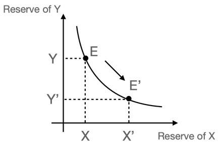

## Preamble

```
CAP: 0045
Title: SPEEDEX - Pricing
Working Group:
    Owner: Jonathan Jove <@jonjove>
    Authors: Geoff Ramseyer <@gramseyer>, Jay Geng <@jayz22>
    Consulted: Nicolas Barry <@monsieurnicolas>
Status: Draft
Created: 2022-02-04
Discussion: https://groups.google.com/g/stellar-dev/c/Fzkz0La58B8
Protocol version: TBD
```

## Simple Summary
Describe how [SPEEDEX](https://arxiv.org/abs/2111.02719) prices will be
computed.

## Working Group
This proposal is based on an earlier draft written by Geoff Ramseyer, to which
Nicolas Barry has also contributed.

## Motivation
In order for SPEEDEX to facilitate efficient and commutative trades over a set of assets across multiple market participants (orders, liquidity pools), a set of prices (one for each asset) need to be computed. The prices are chosen to minimize a heuristic objective function which ensures equilibrium between demands and endowments over the entire asset set. This CAP outlines the methodology by which the objective is computed and prices are computed.

### Goals Alignment
This proposal supports the development of SPEEDEX on Stellar, which in turn
supports the Stellar Network Goals

- The Stellar Network should run at scale and at low cost to all participants of
the network.
- The Stellar Network should enable cross-border payments, i.e. payments via
exchange of assets, throughout the globe, enabling users to make payments
between assets in a manner that is fast, cheap, and highly usable.

## Abstract
This proposal describes two methods by which SPEEDEX prices are computed, and a
method for choosing between these two methods. The first method takes advantage
of `GeneralizedTransactionSet` introduced in CAP-0042 to endow validators with
the power to compute SPEEDEX prices however they like prior to consensus. The
second method uses the parameters from `SpeedexConfigurationEntry` in CAP-0044
to run an iterative solver.

## Specification

### XDR changes
This patch of XDR changes is based on the XDR files in commit
(`90dbf13c483a4c126741a0e5ad0a222fb51ff299`) of stellar-core.

```diff mddiffcheck.base=90dbf13c483a4c126741a0e5ad0a222fb51ff299
diff --git a/src/xdr/Stellar-ledger.x b/src/xdr/Stellar-ledger.x
index 84b84cbf..ec66ffb0 100644
--- a/src/xdr/Stellar-ledger.x
+++ b/src/xdr/Stellar-ledger.x
@@ -176,14 +176,35 @@ case METAENTRY:
     BucketMetadata metaEntry;
 };
 
-// Transaction sets are the unit used by SCP to decide on transitions
-// between ledgers
 struct TransactionSet
 {
     Hash previousLedgerHash;
     TransactionEnvelope txs<>;
 };
 
+struct TransactionSetV1
+{
+    Hash previousLedgerHash;
+    TransactionEnvelope txs<>;
+
+    // prices are in one-to-one correspondence with
+    // SpeedexConfigurationEntry.assets
+    //
+    // prices are scale-invariant so only ratios matter
+    int64 prices<>;
+};
+
+// Transaction sets are the unit used by SCP to decide on transitions
+// between ledgers
+
+union GeneralizedTransactionSet switch (int v)
+{
+case 0:
+    TransactionSet v0TxSet;
+case 1:
+    TransactionSetV1 v1TxSet;
+};
+
 struct TransactionResultPair
 {
     Hash transactionHash;
@@ -203,11 +224,13 @@ struct TransactionHistoryEntry
     uint32 ledgerSeq;
     TransactionSet txSet;
 
-    // reserved for future use
+    // when v != 0, txSet must be empty
     union switch (int v)
     {
     case 0:
         void;
+    case 1:
+        GeneralizedTransactionSet txGeneralizedSet;
     }
     ext;
 };
@@ -358,9 +381,30 @@ struct LedgerCloseMetaV0
     SCPHistoryEntry scpInfo<>;
 };
 
+struct LedgerCloseMetaV1
+{
+    LedgerHeaderHistoryEntry ledgerHeader;
+    // NB: txSet is sorted in "Hash order"
+    GeneralizedTransactionSet txSet;
+
+    // NB: transactions are sorted in apply order here
+    // fees for all transactions are processed first
+    // followed by applying transactions
+    TransactionResultMeta txProcessing<>;
+
+    // upgrades are applied last
+    UpgradeEntryMeta upgradesProcessing<>;
+
+    // other misc information attached to the ledger close
+    SCPHistoryEntry scpInfo<>;
+};
+
 union LedgerCloseMeta switch (int v)
 {
 case 0:
     LedgerCloseMetaV0 v0;
+case 1:
+    LedgerCloseMetaV1 v1;
 };
-}
+
+} // namespace stellar
```

### Semantics
SPEEDEX pricing has two phases:

- The first phase takes place before consensus. Different validators may use
different implementations, and these implementations are free to make use of
any techniques including nondeterminism and parallelism.
- The second phase takes place during transaction application. Every validator
must implement the same semantics, and these semantics must be deterministic.

The prices ultimately used to settle trades will be either the prices from the
first phase, or the prices from the second phase. All nodes must use the same
heuristic to determine which prices are closer to market.

#### GeneralizedTransactionSet
This proposal takes advantage of `GeneralizedTransactionSet` introduced in
CAP-0042. Refer to that proposal to understand how `GeneralizedTransactionSet`
interacts with `LedgerHeader`.

#### The first phase
Because the first phase occurs before consensus, this proposal can only specify
what constitutes valid output. The `GeneralizedTransactionSet` is valid if

- `GeneralizedTransactionSet.v() == 1`
- `GeneralizedTransactionSet.v1TxSet().previousLedgerHash` is the hash of the
previous ledger
- every transaction in `GeneralizedTransactionSet.v1TxSet().txs` is valid
- `GeneralizedTransactionSet.v1TxSet().prices.size() == 0` or
`GeneralizedTransactionSet.v1TxSet().prices.size() == SpeedexConfigurationEntry.assets.size()`
- every price in `GeneralizedTransactionSet.v1TxSet().prices` is strictly
positive

#### The second phase
Because the second phase occurs during transaction application, this proposal
fully specifies the output.

The second phase is tatonnement. At a high level, tatonnement models the
behavior of a theoretical Walrasian auctioneer. If there is excess demand for
an asset, then raise the price of that asset. If there is excess supply for an
asset, then lower the price of that asset. Tatonnement has several components
which we will describe independently.

The first component of tatonnement is the demand aggregator, which determines
the total amount of an asset demanded by all market participants at given
prices. The demand aggregator sums the demand for every asset over liquidity
pools and orders. 

A liquidity pool holding assets `X` and `Y` has demand
```
X' = { (pX + Y) (1 - F) / (p * (2 - F)) :   p < (1 - F) Y/X
     { (pX + Y) / (p * (2 - F))         :   1/p < (1 - F) X/Y
     { X                                :   otherwise

Y' = { (pX + Y) / (2 - F)               :   p < (1 - F) Y/X
     { (pX + Y) (1 - F) / (2 - F)       :   1/p < (1 - F) X/Y
     { Y                                :   otherwise
```
where `p = p(X) / p(Y)` is the market price ratio. `F` is the fee ratio required by the liquidity pool. 

An offer selling `X` for `Y` at a minimum price ratio of `P` has demand
```
X' = { 0                       :   P / (1 - S) <= p
     { X - (p - P) X / (S * p) :   P < p < P / (1 - S)
     { X                       :   p <= P

Y' = { pX              :   P / (1 - S) <= p
     { (p - P) X / S   :   P < p < P / (1 - S)
     { 0               :   p <= P
```
where `p = p(X) / p(Y)` is the market price ratio, and
`S = 2^(-SpeedexConfigurationEntry.solverConfig.smoothness)`.

The second component of tatonnement is the heuristic objective function. A step
should only be taken if the step size is minimal or the objective function
decreases. The heuristic function is the squared l2 norm of price-weighted excess demand of all assets, and is configurable via 
`SpeedexSolverConfiguration.SpeedexSolutionComparisonHeuristic`. The excess demand for an asset is defined as the sum of
all demands from liquidity pools and orders for that asset minus the sum of all
endowments from liquidity pools and orders for that asset.

The third component of tatonnement is the actual solver. The following is a
pseudocode implementation of the solver:
```
// Input:
//     numAssets is the number of assets (uint32_t)
//     endowment is the total initial endowment of every asset (vector<int64_t>)
//     numIterations is the number of iterations to perform (uint32_t)
//     invMinStepSize is the reciprocal of the minimum step size (uint64_t)
//     stepSizeFactor is the factor by which invStepSize changes (uint64_t)
//
// Notes:
//     This pseudocode treats addition, subtraction, and scalar multiplication
//     of vectors in the manner that those operations work in any vector space
//
//     compute_demand and compute_objective are the first two components of
//     tatonnement described above, and they depend on SpeedexConfigurationEntry

// Set initial price of every asset
vector<int64_t> prices
for i in 0..numAssets
    prices[i] = 1 << 32 // Start at (roughly) the geometric mean of the entire price range so they can update in both directions

// Compute initial demand of every asset and compute objective
vector<int64_t> demands
for i in 0..numAssets
    demands[i] = compute_demand(prices, i)
uint128_t objective = compute_objective(demands - endowments)

// Perform numIterations of tatonnement
invStepSize = invMinStepSize // Start at min step size so we can take bigger steps if possible
for i in 0..numIterations
    // Compute trial prices
    vector<int64_t> trial_prices = prices
    for i in 0..numAssets
        step = prices[i] * (demand[i] - endowment[i]) / invStepSize
        // Prices must be positive in the Arrow-Debreu market
        if trial_prices[i] <= INT64_MAX - step && trial_prices[i] + step > 0
            trial_prices[i] += step
        else if trial_prices[i] > INT64_MAX - step
            trial_prices[i] = INT64_MAX

    // Compute trial demand of every asset and compute trial objective
    vector<int64_t> trial_demands
    for i in 0..numAssets
        trial_demands[i] = compute_demand(trial_prices, i)
    uint128_t trial_objective = compute_objective(trial_demands - endowments)

    // We take this step if
    // - this step reduces the objective function
    // - we can't make the step size smaller
    if trial_objective < objective || invStepSize >= invMinStepSize
        // We can take this step
        prices = trial_prices
        demands = trial_demands
        objective = trial_objective

        // Increase the step size so future steps will try to make more progress
        if invStepSize >= stepSizeFactor
            invStepSize /= stepSizeFactor
        else
            // Avoid dividing step by 0
            invStepSize = 1
    else
        // Reduce the step size so future steps will try to reduce the objective
        invStepSize *= stepSizeFactor
```
There are several places that this pseudocode can overflow, which is discussed in the [Possible places of overflow](#possible-places-of-overflow) section and future versions
of this proposal will explicitly handle that.

#### Choosing between the prices
If the first phase does not propose a price, i.e. `GeneralizedTransactionSet.v1TxSet().prices.size() == 0`, 
then the prices from the second phase will be used.

Otherwise, the prices from the first phase and from the second phase will be evaluated
using the heuristic objective function also used in tatonnement (see the second
component of tatonnement above). If the heuristic values are different, then
whichever prices produce a lower value will be used. If the heuristic values
are the same, then the prices from the second phase will be used.

## Design Rationale

### Two-phase pricing
Computing prices during before and after consensus maximizes the flexibility of
the protocol. Before consensus, validators have a great deal of flexibility to
use parallelism, randomness, outside data sources like the price stream from an
exchange, and different solvers. But a byzantine validator may nominate bad
prices, so the second phase after consensus limits how bad the prices can
actually be.

We considered other approaches, such as allowing validators to nominate an
alternative SPEEDEX solver configuration. The alternative solver configuration
could, for example, be generated by searching for a good configuration during
nomination or using outside data sources. But this is a very indirect approach;
why nominate the configuration when you can simply nominate the result. This
approach also doesn't avoid the need to perform tatonnement after validation,
because a byzantine validator could nominate a bad configuration. Therefore this
approach is also less performant than what is proposed in this CAP because every
node must do tatonnement twice instead of once.

### Empty set of prices is valid in the first phase
The first phase is optional because a validator that does not want to perform
any calculations could always choose random prices. If we tolerate random prices,
then we should acknowledge that no prices at all is probably just as useful.

### Demand from a liquidity pool
Consider a liquidity pool holding assets `X` and `Y` (we will also use `X` and
`Y` to denote the reserves of those assets). The market price ratio between the two assets is defined as:
<!-- $$
p = \frac{p_x}{p_y} = \lim_{\delta{x}\to0}\frac{\delta{y}}{\delta{x}}
$$ --> 
<div align="center"></div>

where <!-- $p_x$ -->  and <!-- $p_y$ -->  are prices of `X` and `Y` respectively, in arbitrary price unit. <!-- $\delta x$ -->  and <!-- $\delta y$ -->  are the infinitesimal quantities of `X` and `Y` that can be exchanged for each other. 

For a constant-product liquidity pool (the only type this proposal is concerned about), the constant-product invariant requires that any transaction within the pool must not reduce the the product of the two reserves (i.e. liquidity).

The liquidity pool starts at equilibrium point `E`, with reserve amounts `X` and `Y` respectively. 

Consider the scenario where the market decides on a lower price for `X` relative to `Y` than what is manifested in the current equilibrium `E`, the liquidity pool will buy `X` and sell `Y` (at the market rate) until a new equilibrium is established (call it `E’`) (see figure below).



From the constant-product invariant, the pool will buy X sell Y as long as :

<div align="center"></div>

where  and  are infinitesimal amount of `X` and `Y` to trade, whose relative price ratio is set by the market. `F` the liquidity pool's fee ratio. Expanding the above equation, rearranging, and dividing both sides by  :

<div align="center"></div>

Taking  and using the price definition, we get:

<div align="center"></div>

Rearranging:
<div align="center"></div>

In other words, as long as the external market price of `X` is less than or equal to the ratio, the liquidity pool will keep buying `X` and selling `Y` (thus reducing the ratio). The equilibrium is again reached when the inequality becomes equality: 

<div align="center"></div>

For an Arrow-Debreu market, the budget-constraint must also hold:

<div align="center"></div>


Solving the budget constraint and marginal price constraint together, we get the demand for `X` and `Y` when 
:
<div align="center"></div>

<div align="center"></div>

Observe that in this case, 


and 

Thus, the liquidity pool, as expected, sells `Y` and purchases `X`.

In the reverse scenario, when the market decides on a higher price of `X` relative to `Y`, the pool needs to sell `X` and purchase `Y` to reach new equilibrium `E'` (figure below).


By the exact same notion, when , the demand for `X` and `Y` are:
<div align="center"></div>
<div align="center"></div>

Observe in this case,  and 

Thus, the liquidity pool, as expected, sells `X` and purchases `Y`.

When the price is in between, i.e. , no trade will happen and both reserves stay the same.

### Demand from an order
Tatonnement does not handle discontinuities well. The demand from an order is
intrinsically discontinuous, so a natural solution is to smooth the demand. This
can be achieved by linearly interpolating the price-weighted demand between the case where the order does not execute and the case where the order does execute.

It doesn't matter whether you linearly interpolate the asset sold or the asset bought. The two quantities are linearly related according to the budget
constraint , so linear interpolation of one asset implies linear interpolation of the other.

To fully illustrate the demand interpolation heuristics, consider an offer selling asset `X` (we also use `X` to denote the amount of asset `X` being offered) for asset `Y` at limit price . At any point, the budget must be conserved:

<div align="center"></div>

Define , the price ratio between `X` and `Y` (`p` is also equivalent to the price of `X` when `Y` is the denominated asset), and ignore the fee component `F` (we do not collect fees from the orders), we get:
<!-- $$
y = p \cdot x
$$ --> 
<div align="center"></div>


The order cannot execute below its limit price. We designate some price above
its limit price at which the order executes fully. The ratio between this
price  and the limit price  is a function of the smoothness parameter .
Specifically, .

When <!-- $p \le p_{lim}$ --> , no trade will happen, demand for `Y` is `0`, and demand for `X` is the full amount of `X` valued at <!-- $pX$ --> .

When <!-- $p \ge p_{full}$ --> , the entire amount `X` is traded for `Y`, thus demand for `Y` is <!-- $y = p\cdot X$ --> , and demand for `X` is `0`.

For <!-- $p_{lim} < p < p_{full}$ --> , the demands are linearly interpolated from the end points (see figure below):
<!-- $$
\frac{p - p_{lim}}{Y'} = \frac{p_{full}-p_{lim}}{Y}
$$ --> 

<div align="center"></div>


Substituting <!-- $Y = \frac{p_{full}\cdot X}{1-F}$ -->  and <!-- $p_{full} = \frac{p_{lim}}{1-S}$ -->  and <!-- $p_{lim} = P$ --> , rearrange, we get when  the demand for `Y` is:
<!-- $$
Y' = \frac{(p-P)X}{S}
$$ --> 
<div align="center"></div>

The amount of `X` sold for `Y` is:
<!-- $$
\tilde{X} = \frac{Y'\cdot(1-F)}{p}=\frac{(p - P)X}{S\cdot p}
$$ --> 
<div align="center"></div>


And finally the demand for `X` is:
<!-- $$
X' = X - \tilde{X} = X - \frac{(p - P)X}{S\cdot p}
$$ --> 
<div align="center"></div>

### Possible places of overflow
As mentioned before, there are multiple places in the tatonnement process where overflowing an `int64_t` can occur:
- Endowment: the total endowment of an asset is calculated by summing over endowments from all orders and liquidity pools of that asset.
- Demand from an offer and liquidity pool: both offer and liquidity pool demand formulas contain `p*X` terms, where `p` is the price (`int64_t`) and `X` is the offer amount (`int64_t`) or the liquidity pool reserve amount (`int64_t`).
- `step`: calculating the price update step involves multiplying the price (`int64_t`) by the net demand (`int64_t`).
- The objective heuristics: the objective takes the squared l2-norm of price weighted demand, which has upper bound of `2 * (64 + 64) + 32 = 288 bits`. 

## Protocol Upgrade Transition

### Backwards Incompatibilities
This proposal does not introduce any backwards incompatibilities.

### Resource Utilization
This proposal increases resource utilization. Validators nominating values will
need to compute prices prior to consensus. After consensus, all validators will
need to use tatonnement to compute prices as well. The part before consensus can
be scaled to the capacity of the validator, but the part after consensus will
have to seek a balance between accuracy and the capacity of the weakest
validators.

## Security Concerns
This proposal does not introduce any security concerns.

## Test Cases
None yet.

## Implementation
None yet.
