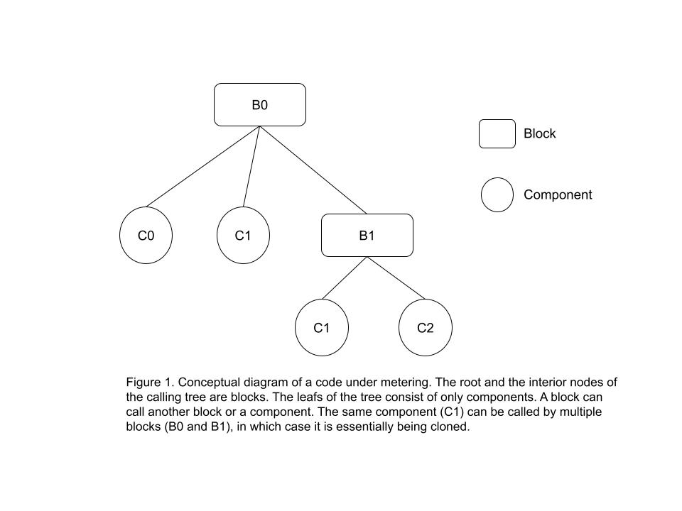
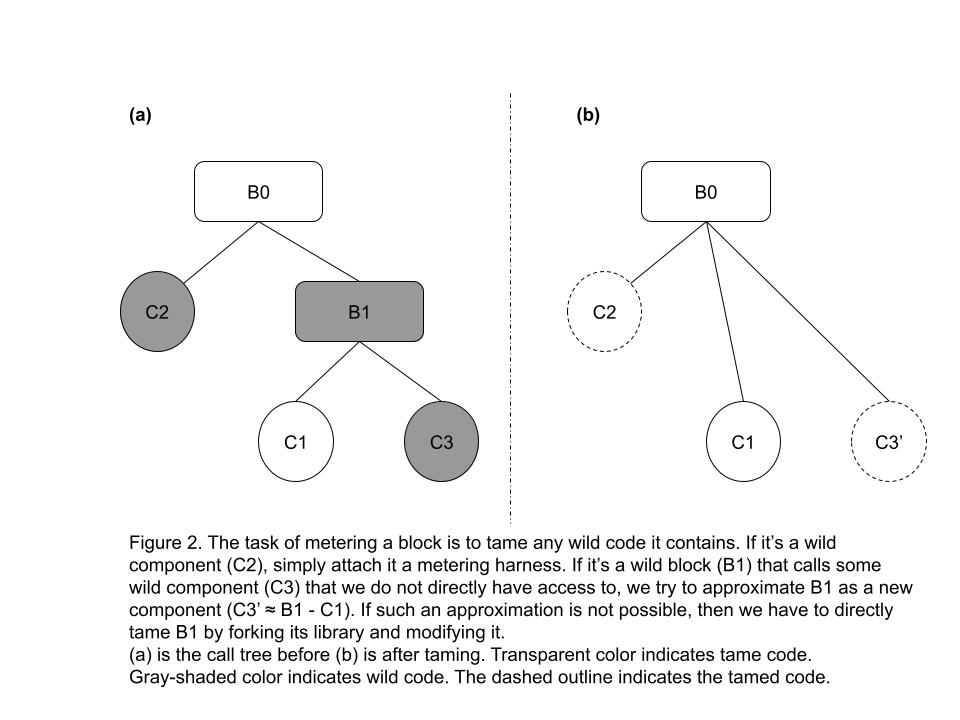

## Preamble

```
CAP: 0046-10
Title: Smart Contract Budget Metering
Working Group:
    Owner: Jay Geng <@jayz22>, Graydon Hoare <@graydon>
    Authors: Jay Geng <@jayz22>
    Consulted: Nicolas Barry <@MonsieurNicolas>, Dmytro Kozhevin <@dmkozh>
Status: Final
Created: 2022-12-20
Discussion:
Protocol version: 20
```

## Simple Summary

This CAP defines the resources for running a smart contract, and proposes an componentized, extensible framework of metering those resources during runtime against a predetermined budget. 

## Working Group
TBD

## Motivation
Resource **metering** serves as the canonical truth of the cost of executing a smart contract on the network. It has two main goals.
- Preventing DoS attacks
- Ensuring fair and efficient resource allocation

The ledger has capacity limits. If transaction processing is allocated 1s (out of the total 5s of ledger closing time), and the max number of smart contract transactions per ledger is `X`, then the max compute time of each transaction is `1/X`, ignoring non-smart transactions and parallel execution. Furthermore, the ledger processing unit has a memory capacity, which the total amount of memory usage (host objects, linear memory) of executing the smart contract transaction set cannot exceed. The resource **budget** reflects those limits.

### Requirements

The metered costs must align closely to the true costs of running a smart contract. 
- If metering underestimates the true costs, the ledger is susceptible to DoS attack. Underestimation also include where metering fails to properly consider exploitable edge cases whose true cost is significantly higher than the average. 
- If overestimate, the ledger fail to fully utilize its capacity. 

In addition, metering must have:
- High coverage: metering needs to cover all the non-trivial work done by the host. 
- Moderate overestimate: Metering needs to err on the side of worst case of the true cost, but should not be too far (within the same order of magnitude) from the average true cost.

### Design goals
- Simplicity – the metering model should be simple enough to understand. The cost composition should be easy to explain and reason about. 
- Extensibility and maintainability – should be straightforward to add metering to future code. Changes in the implementation should not require rewrite of metering. Every iteration of code changes should not require complete model re-calibration. 
- Efficiency – metering model should enable succinct implementation in the host that can be executed efficiently.

### Goals alignment
Aligns with the general goals of the overview [cap-0046](./cap-0046.md) as as well the fee model [cap-0047-07](./cap-0046-07.md).

## Abstract

This specification starts by defining which resource metrics are chosen to reflect the cost of running a smart contract. It then formalizes a process for breaking down the host (or any arbitrary code) into components and defines steps for deriving the cost parameters for each component. It then introduces new ledger configuration entries for storing the budget and metering parameters, and finally, discusses relevant issues regarding maintaining and upgrading these parameters. 

This CAP builds heavily on previous chapters of CAP-46. The reader needs to be comfortable with various concepts introduced in the CAP-46 (overview), 01 (the runtime environment), 03 (host functions), 09 (network configuration ledger entries). Familiarity with 05 (smart contract data) and 07 (fee model) is also beneficial. 

## Specification

Smart contract transactions on the ledger compete for 1. compute time 2. host memory. The two resource metrics we employ for budget and metering are **cpu instruction count** (`cpu_insns`) and **bytes of memory allocated** (`mem_bytes`). 

### Definitions
The entire host side code is broken down to a list of components and blocks:
- A **component** is some code whose costs can be approximated with a linear or constant function of some input value derived from the code’s inputs.
- A **block** is any code that cannot be measured this way, usually because it implements a complex or data-dependent algorithm.

Components and blocks may be wild or tame:
- Code is **wild** if it’s code we didn’t write and are not maintaining a fork of.
- Code is **tame** if it’s code we wrote or are maintaining a fork of.

### Requirements for a component
1. Can be modeled as a constant or linear function w.r.t. to a single input, on both resource types `cpu_insns` and `mem_bytes`.
2. Does not invoke another component. I.e. components are the the leafs of a call tree.



### Call-tree invariant
Consider the host code as a tree of called blocks and components (see figure 1), with the entrypoint at the root, blocks as interior nodes and components as leafs of the tree. 

We structure the host in such a way that ensures as an **invariant** that **every component in the call tree is metered on every path to it**. This is done by ensuring the following:
- Blocks consist of only trivial (no need to meter) code, calls to components, and calls to other blocks. 
- Every piece of wild component is converted to a tame component, tracked by the cost model with a unique code number assigned to it.
- Components are standalone and do not call other blocks or components — they are truly the leafs of the tree.

The full list of component types are defined in `enum ContractCostType`, see [XDR changes](#xdr-changes). 

Once the call-tree invariant is satisfied, we can ensure that if every single component is metered, the entire call-tree is metered. 

### Metering a component
During runtime, whenever a component is hit, the meter is incremented by `y = ax + b`, where `x` is the component's input, `a` and `b` are the pre-fitted linear and constant parameter of that resource type. The metering happens independently for `cpu_insns` and `mem_bytes`, so there will be two sets of parameters for each component.

To obtain the parameters, we isolate the component and set up a benchmark sandbox around it with profiling enabled (e.g. `perf_event` or `rusage`). We then call it repeatedly with varying input size, measure and record the resource output for each input size. Finally we fit a linear curve and extract the parameters. 

### Cost parameters
The result of calibration for per resource type is a set of `C` cost parameters containing `a` and `b` coefficients for each input type. All the cost parameters per resource type are stored in a `ConfigSettingEntry`. 

### The budget
The budget for each resource type is a `ConfigSettingEntry` that is determined in consensus by the validators. The budget reflects the ledger processing capacity in accordance to the requirements in the [Requirements](#requirements) section. Minimum budget for `cpu_insns` budget is 2'500'000 and for `mem_bytes` is 2MB.

At every metering charge, the cumulative resource consumption will be compared with the budget, and if exceeded, will result in a `SCEC_EXCEEDED_LIMIT` host error.

### XDR changes
See [cap-0046 Overview](./cap-0046-01.md) and [Stellar-contract-config-setting.x](../contents/cap-0046/Stellar-contract-config-setting.x) for the XDR changes. In particular `ConfigSettingEntry`
contains new entries for budget and metering. `ContractCostParamEntry` defines all cost component types with their explainations in the comment.

### Metering an arbitrary new piece of code
The main challenge of dealing with an arbitrary new piece of code (*wild* or *tame*) is to identify the components through an iterative process:
1. Break down the code into a call tree where each node consists of meaningful, non-trivial operation.
2. Identify the leaf nodes, making sure they are components according to the [requirements for a component](#requirements-for-a-component).
3. For any *tame* component, meter it according to [metering a component](#metering-a-component)
4. If it contains any *wild* code, follow [taming wild code](#taming-wild-code) to tame it. This step needs to be done in conjunction with 3. 
5. Start from the leaf nodes, mark them as metered, then proceed up level by level until the reaching root. 

If a node is composed of only metered children, it is a metered block. Once the root is metered, the call-tree invariant is satisfied and the entire call-tree is metered. 

### Taming wild code
As mentioned previously, one of the keys to satisfying the call-tree invariant is that all *wild* code, blocks or components, be tamed. A piece of *wild* code can appear in one of the following patterns:
1. Consists of a single wild component (**WC**)
2. A wild block (**WB**) that only consists of tamed blocks (**TB**s) and tamed components (**TC**s)
3. A WB that consists of a mixture of TCs (recall a TB is just a combination of TCs) and WCs which we do not have access to.
4. A WB that consist of several WCs

For 1, we are calling a WC which is standalone and does not call us back. We can easily tame the WC by defining it as a metered component following [metering a component](#metering-a-component). 

For 2, metering is already covered by the tamed code and there is nothing else we need to do. 

For scenario 3, we first try to approximate the WB as pure wild code, i.e. by minimizing the footprint of TCs. Concretely this means during the calibration process, set up the samples (e.g. making `x = 0` in the linear function) such that the TBs have minimal effect on the output resource consumption. If this is possible, we end up in scenario 4. See figure 2 below for illustration.

For scenario 4, we first approximate the WB as a single WC, by picking a single dominant input and calibrate it as a linear function. If it works, we end up back to scenario 1 and we are done.

If either 3 or 4 fails, then we have to tame it the brute force way either by forking the code and modifying it, or choosing a different library, or removing our dependency on it altogether.



## Design Rationale

### Why `cpu_insns` metric
We use cpu instruction count as the main metrics for "compute" because it is a direct proxy to process running time, i.e. `run_time = cpu_insns_count / clock_freq / ave_insns_per_cycle`.
The average instructions per cycle `ave_insns_per_cycle` depends on a set of CPU architecture-specific factors such as the instruction set, instruction length, micro-ops, instruction-level parallelism (which depends on instruction window size, branch-prediction), which are stable per architecture. 

Assuming 2GHz cpu with an avg. insns per cycle of 2, 1ms roughly equals 4'000'000 cpu instructions.

Note that the instruction count may vary across architectures, but the metering model needs to be same, so the metering model needs to produce the upper bound on all viable architectures.

Another considered alternative resource is execution time, which relates much closer to the actual cost in ledger closing time. However, execution time is much more volatile and less deterministic, which make it a less desirable target metric for metering. 

### Why `mem_bytes` metric
The bytes of memory allocated is a good proxy of the memory footprint of contract execution. The majority of the smart contract memory footprint comes from 1. a fixed-sized linear memory 2. immutable host objects created during contract execution, and both of these are not freed until the end of contract execution. This memory model is very similar to the arena allocator. Using allocated memory as the metric is an worst-case approximation that is 1. close to the actual memory cost 2. gives us flexibility to switch to an actual arena allocator later.

### Why do we have to model the costs?
In other words, why can't we measure and use the runtime resource consumption for metering? Because the profiling results are non-deterministic and 1. we can't use them for consensus 2. the contract execution outcome won't be able to be replayed bit-identically. Using an analytical model ensure determinism for consensus and replayability (more on this later).

### Why linear and constant components only?
Simplicity. We want the costs to follow a simple linear characteristic such that we can fit it accurately without needing a complex numerical model (and fitting process, heuristics etc). 

A model with higher order dependencies also risk the worst-case costs significantly outweighing the average, and any small deviation in the input resulting in significant over or underestimation of the costs. This goes against the [design goals](#design-goals).

### Host vs Wasm vm
This metering framework is generic and does not differentiate between the host and the Wasm vm. Both the host and the vm are treated as components and blocks defined in the [specification](#specification) section and subject to the same metering procedures. 

Our current choice of the Wasm virtual machine implementation is Wasmi, which is a lightweight interpreter of the wasm standard, written in the same language (Rust) as the host. Wasmi runs an inner interpreter loop that executes a single wasm instruction on each loop. Thus every wasm instruction logic fits the requirements of a component. `WasmInsnExec` in `ContractCostType` is designated for the wasm instructions.

### Relation to cap-0046-07 (fee model)

[CAP-0046-07](./cap-0046-07.md) proposed a fee model for smart contracts taking into account ledger access, storage and computation. This CAP details the computation aspect which includes cpu and memory. The metered `cpu_insns` goes into the fee model as input to the "compute" fee. While `mem_bytes` is not part of the fee model, it is subject to the network limit.

### Cost estimation
This proposal relies on the "preflight" mechanism to provide an estimation of the cpu and mem consumption in a transaction. These can only serve as guidance to the actual cost, since the ledger snapshot used for preflight may be outdated, as well as the actual logic during preflight and actual ("recording" vs "enforcing") modes may be different. Thus it is not guaranteed that a transaction staying below the budget during preflight will not exceed it during the actual run. 

### Config Settings Upgrade
Both the budget and metering parameters are stored on the ledger as `ConfigSettingEntry` and their upgrade and validation process have been discussed in [CAP-0046-09](./cap-0046-09.md). In general, the settings can be upgraded with or without a protocol version upgrade. 

In the case of a protocol version upgrade, here are the scenarios that also require a settings upgrade:
- New blocks have been introduced in the host that require introducing new components. Such changes include e.g. a new crypto primitive function. Note that if a new block merely consists of trivial code and calling existing components, then no settings upgrade is needed. 
- Changes on the host components, or version changes in its dependencies that result in observable difference in components' cost characteristics. In rare cases, if the cost characteristics becomes no longer linear, then the component needs to be broken down into finer sub-components. See [Taming wild code](#taming-wild-code).

### The “metered” stamp
We may need to introduce a new mechanism for stamping the metered entities in the host, following the definitions of wild/tamed components/blocks outlined in previous section. Such a mechanism would help us ensuring the call-tree invariant is satisfied by examining the root block. A further mechanism to automatically detect if metering is missing on a path would be even more ideal. 

We will also need to introduce set of reviewing standards that differentiates between block vs component changes. A metered component is subject to significantly higher bars for review and audit, to make sure the component criteria are truly satisfied, as they are the foundational building blocks of the budget metering framework.

In the future we may add tooling around ensuring metering coverage and assisting with updating parameters or adding new metered components. 

### Maintainability
The cost parameters need to be maintained to prevent the metering model from gradually deviating away from reality (model drift). Even if we maintain the same host unchanged, the host's dependencies may change that result in small performance differences which can accumulate over time, causing the cost models to drift. To combat that, we will need to publish a set of specs where the metering calibration benchmark needs to be run regularly, along with a suite of tests  and criteria for determining when the model parameters need to be updated. 

## Security Concerns
Missed or inaccurate metering can cause security concerns in two aspects:
- **Denial of Service**: the computed costs significantly underestimate the true cost of running a contract, this can slowdown the validators and prevent them to close the ledger in an acceptable time frame.
- **Under-Utilization of the Ledger Capacity**: this is not a direct attack per se. However, a side effect of overestimation in metering, is the ledger could be filled with many (deliberately crafted) fast contract transactions which theoretically could require more resource at the worst case, causing the ledger to be under-utilized. This may in turn cause other (important) transactions to queue up and not making into the ledger in a reasonable time. 

## Implementation
Metering, budget and calibration has been implemented in the [soroban-env](https://github.com/stellar/rs-soroban-env). Related integration work (such as the config settings) have been done in stellar-core and [soroban-sdk](https://github.com/stellar/rs-soroban-sdk). 
