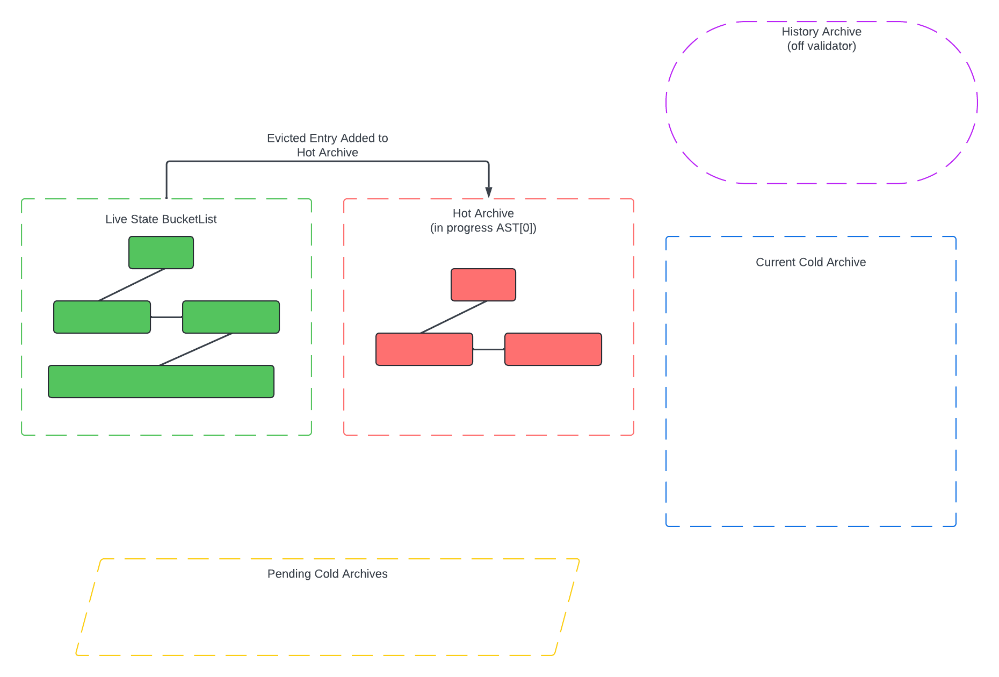
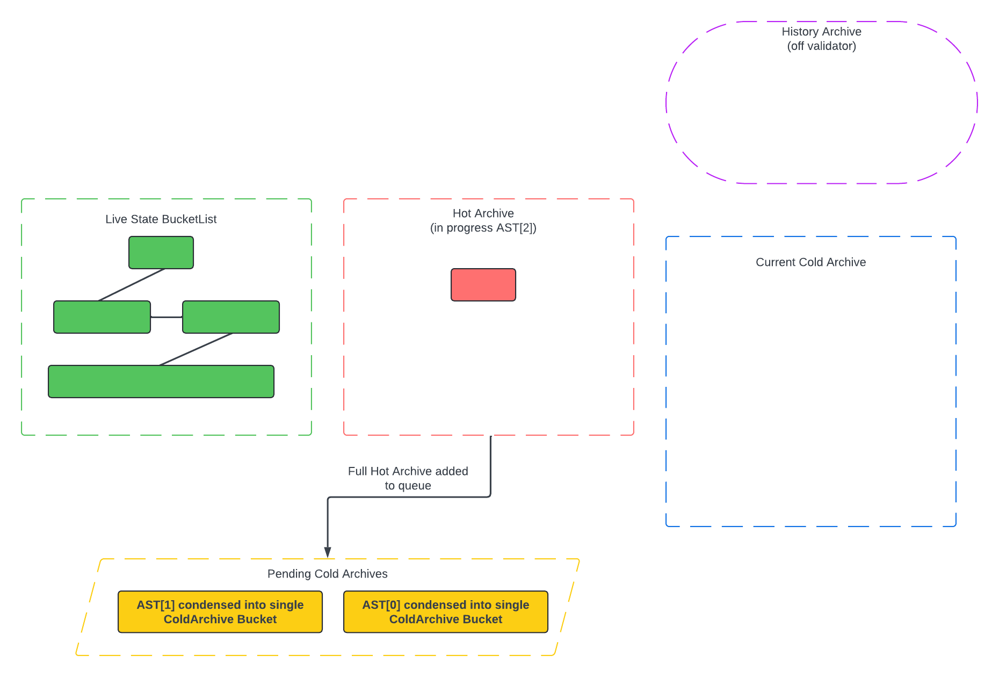
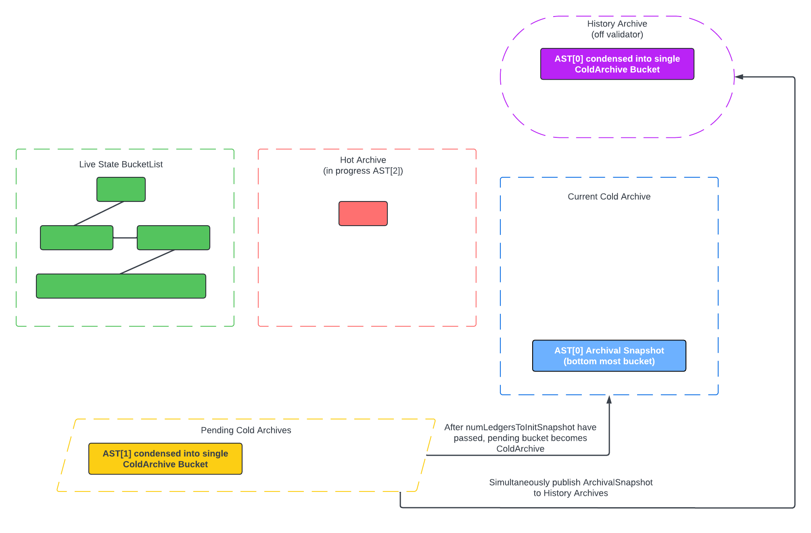
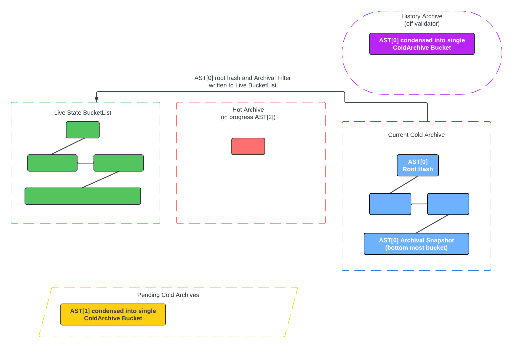
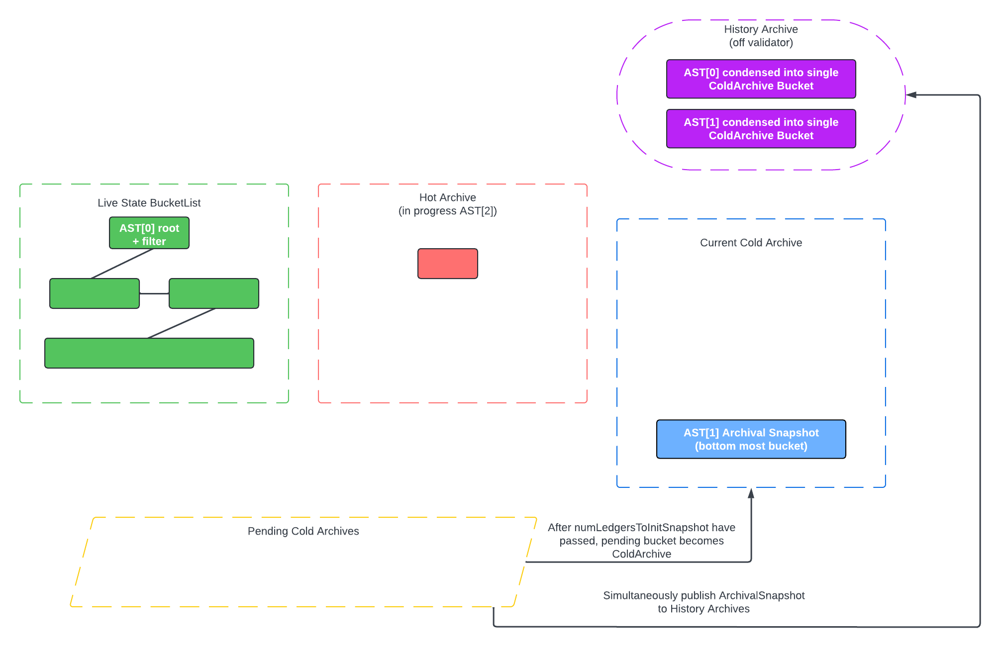

```
CAP: 0057
Title: State Archival Persistent Entry Eviction
Working Group:
    Owner: Garand Tyson <@SirTyson>
    Authors: Garand Tyson <@SirTyson>
    Consulted: Dmytro Kozhevin <@dmkozh>, Nicolas Barry <@MonsieurNicolas>
Status: Draft
Created: 2024-06-24
Discussion: https://github.com/stellar/stellar-protocol/discussions/1480
Protocol version: 23
```

## Simple Summary

This proposal allows the network to evict `PERSISTENT` entries, i.e., delete archived `PERSISTENT` entries from validators.

## Working Group

As specified in the Preamble.

## Motivation

To lower the storage requirements of validators and decrease the growth of History Archives.

### Goals Alignment

This change is aligned with the goal of lowering the cost and increasing the scale of the network.

## Abstract

Whenever a `PERSISTENT` entry is evicted or deleted by a transaction (as in deleted as part of TX execution), it will be removed from
the “Live State BucketList” (today called the BucketList) and added to the “Archived State Tree” (AST). The AST is made up of a collection
of immutable Merkle trees stored on top of the BucketList, called “Archival Snapshots”, plus a single mutable store called the
“Hot Archive”.

At any given point, all validators store the Hot Archive on disk. Whenever a `PERSISTENT` entry is evicted, it is added to the
Hot Archive. Eventually, the Hot Archive becomes full. At this point, the Hot Archive is “snapshotted” and converted into an immutable
Archival Snapshot. Validators retain only the Merkle root of the newly created Archival Snapshot and delete the rest of the snapshot.
The validators then initialize a new, empty Hot Archive and repeat the process.

While validators only store the Merkle root of each Archival Snapshot, the complete Archival Snapshots are persisted in the History
Archive. RPC nodes may locally store as few or as many of these snapshots as the operator desires, initialized directly via History
Archive files (RPC providers may also shard snapshots across multiple nodes such that no one RPC node is required to store all
snapshots). During preflight, RPC will use these local snapshots to attach Merkle style proofs for any archived entry encountered during preflight. These proofs can then be submitted via the `RestoreFootprintOp` to allow the entries to be used again and become part of the
Live State BucketList.

## Specification

### XDR changes

```
enum BucketListType
{
    LIVE = 0,
    HOT_ARCHIVE = 1,
    COLD_ARCHIVE = 2
};

enum HotArchiveBucketEntryType
{
    HOT_ARCHIVE_METAENTRY = -1, // Bucket metadata, should come first.
    HOT_ARCHIVE_ARCHIVED = 0,   // Entry is Archived
    HOT_ARCHIVE_LIVE = 1,       // Entry was previously HOT_ARCHIVE_ARCHIVED, or HOT_ARCHIVE_DELETED, but
                                // has been added back to the live BucketList.
                                // Does not need to be persisted.
    HOT_ARCHIVE_DELETED = 2     // Entry deleted (Note: must be persisted in archive)
};

union HotArchiveBucketEntry switch (HotArchiveBucketEntryType type)
{
case HOT_ARCHIVE_ARCHIVED:
    LedgerEntry archivedEntry;

case HOT_ARCHIVE_LIVE:
case HOT_ARCHIVE_DELETED:
    LedgerKey key;
case HOT_ARCHIVE_METAENTRY:
    BucketMetadata metaEntry;
};

enum ColdArchiveBucketEntryType
{
    COLD_ARCHIVE_METAENTRY     = -1,  // Bucket metadata, should come first.
    COLD_ARCHIVE_ARCHIVED_LEAF = 0,   // Full LedgerEntry that was archived during the epoch
    COLD_ARCHIVE_DELETED_LEAF  = 1,   // LedgerKey that was deleted during the epoch
    COLD_ARCHIVE_BOUNDARY_LEAF = 2,   // Dummy leaf representing low/high bound
    COLD_ARCHIVE_HASH          = 3    // Intermediary Merkle hash entry
};

struct ColdArchiveArchivedLeaf
{
    uint32 index;
    LedgerEntry archivedEntry;
};

struct ColdArchiveDeletedLeaf
{
    uint32 index;
    LedgerKey deletedKey;
};

struct ColdArchiveBoundaryLeaf
{
    uint32 index;
    bool isLowerBound;
};

struct ColdArchiveHashEntry
{
    uint32 index;
    uint32 level;
    Hash hash;
};

union ColdArchiveBucketEntry switch (ColdArchiveBucketEntryType type)
{
case COLD_ARCHIVE_METAENTRY:
    BucketMetadata metaEntry;
case COLD_ARCHIVE_ARCHIVED_LEAF:
    ColdArchiveArchivedLeaf archivedLeaf;
case COLD_ARCHIVE_DELETED_LEAF:
    ColdArchiveDeletedLeaf deletedLeaf;
case COLD_ARCHIVE_BOUNDARY_LEAF:
    ColdArchiveBoundaryLeaf boundaryLeaf;
case COLD_ARCHIVE_HASH:
    ColdArchiveHashEntry COLD_ARCHIVE_HASH;
};

enum LedgerEntryType
{
    ...
    BLOB = 10 // Stores arbitrary data for validator operation
};

struct LedgerEntry
{
    uint32 lastModifiedLedgerSeq; // ledger the LedgerEntry was last changed

    union switch (LedgerEntryType type)
    {
        ...
        case BLOB:
            BlobEntry blob;
    }
    data;

    // reserved for future use
    union switch (int v)
    {
    case 0:
        void;
    case 1:
        LedgerEntryExtensionV1 v1;
    }
    ext;
};

struct ShortHashSeed
{
    opaque seed[16];
};

enum BinaryFuseFilterType
{
    BINARY_FUSE_FILTER_8_BIT = 0,
    BINARY_FUSE_FILTER_16_BIT = 1,
    BINARY_FUSE_FILTER_32_BIT = 2
};

struct SerializedBinaryFuseFilter
{
    BinaryFuseFilterType type;

    // Seed used to hash input to filter
    ShortHashSeed inputHashSeed;

    // Seed used for internal filter hash operations
    ShortHashSeed filterSeed;
    uint32 segmentLength;
    uint32 segementLengthMask;
    uint32 segmentCount;
    uint32 segmentCountLength;
    uint32 fingerprintLength; // Length in terms of element count, not bytes

    // Array of uint8_t, uint16_t, or uint32_t depending on filter type
    opaque fingerprints<>;
};

union LedgerKey switch (LedgerEntryType type)
{
...
case BLOB:
    struct
    {
        int64 blobID;
        BlobType type;
    } blob;
};

enum BlobType
{
    ARCHIVAL_MERKLE_ROOT = 0,
    ARCHIVAL_FILTER = 1
};

struct BlobEntry
{
    int64 blobID; // Blob ID is the archival epoch
    union switch (BlobType type)
    {
        case ARCHIVAL_MERKLE_ROOT:
            Hash hash;
        case ARCHIVAL_FILTER:
            SerializedBinaryFuseFilter filter;
    } data;
};

enum ConfigSettingID
{
...
CONFIG_SETTING_STATE_ARCHIVAL_EXT = 14,
CONFIG_SETTING_STATE_ARCHIVAL_META = 15
};

// Contains state archival state that cannot be changed via
// config upgrade
struct StateArchivalMeta
{
    uint32 currArchivalEpoch;
    uint32 hotArchiveSize; // Current number of entries in the Hot Archive

    // Current iterator position for Merkle generation of the Cold Archive
    uint32 coldArchiveIterLevel;
    uint32 coldArchiveIterIndex;

    // Ledger at which the current pending archival snapshot will be
    // added to the merkle production queue
    uint32 pendingSnapshotPublishLedger;
};

union ConfigSettingEntry switch (ConfigSettingID configSettingID)
{
...
case CONFIG_SETTING_STATE_ARCHIVAL_EXT:
    StateArchivalSettingsExt stateArchivalSettingsExt;
case CONFIG_SETTING_ARCHIVAL_META:
    StateArchivalMeta stateArchivalMeta;
};

struct StateArchivalSettingsExt
{
// Rate limit how fast cold snapshots are converted to Merkle trees
uint32 maxEntriesToHash;
uint32 maxBytesToHash;

// Number of entries at which archival snapshot is considered full
uint32 archivalSnapshotSize;

// Number of levels in Archival Snapshot BucketList
uint32 archivalSnapshotDepth;

// The minimum number of ledgers between which the Hot Archive becomes full
// and when the corresponding archival snapshot is initialized and
// added to Merkle Production Queue
uint32 numLedgersToInitSnapshot;
};

enum ArchivalProofType
{
    EXISTENCE = 0,
    NONEXISTENCE = 1
};

struct ArchivalProofNode
{
    uint32 index;
    Hash hash;
}

typedef ArchivalProofNode ProofLevel<>;

struct ArchivalProof
{
    uint32 epoch; // AST Subtree for this proof

    union switch (ArchivalProofType t)
    {
    case EXISTENCE:
        struct
        {
            ColdArchiveBucketEntry entriesToProve<>;

            // Vector of vectors, where proofLevels[level]
            // contains all HashNodes that correspond with that level
            ProofLevel proofLevels<>;
        } existenceProof;
    case NONEXISTENCE:
        struct
        {
            LedgerKey keysToProve<>;

            // Bounds for each key being proved, where bound[n]
            // corresponds to keysToProve[n]
            ColdArchiveBucketEntry lowBoundEntries<>;
            ColdArchiveBucketEntry highBoundEntries<>;

            // Vector of vectors, where proofLevels[level]
            // contains all HashNodes that correspond with that level
            ProofLevel proofLevels<>;
        } nonexistenceProof;
    } type;
};

// The transaction extension for Soroban.
struct SorobanTransactionData
{
    union ExtensionPoint switch (int v)
    {
    case 0:
        void;
    case 1:
        ArchivalProof proofs<>;
    };

    SorobanResources resources;
    // Amount of the transaction `fee` allocated to the Soroban resource fees.
    // The fraction of `resourceFee` corresponding to `resources` specified 
    // above is *not* refundable (i.e. fees for instructions, ledger I/O), as
    // well as fees for the transaction size.
    // The remaining part of the fee is refundable and the charged value is
    // based on the actual consumption of refundable resources (events, ledger
    // rent bumps).
    // The `inclusionFee` used for prioritization of the transaction is defined
    // as `tx.fee - resourceFee`.
    int64 resourceFee;
};

struct LedgerCloseMetaV2
{
    ...
    // same as LedgerCloseMetaV1 up to here

    uint32 currentArchivalEpoch;

    // The last epoch currently stored by validators
    // Any entry restored from an epoch older than this will
    // require a proof.
    uint32 lastArchivalEpochPersisted;
};


union LedgerCloseMeta switch (int v)
{
case 0:
    LedgerCloseMetaV0 v0;
case 1:
    LedgerCloseMetaV1 v1;
case 2:
    LedgerCloseMetaV2 v2;
};

enum LedgerEntryChangeType
{
    LEDGER_ENTRY_CREATED = 0, // entry was added to the ledger
    LEDGER_ENTRY_UPDATED = 1, // entry was modified in the ledger
    LEDGER_ENTRY_REMOVED = 2, // entry was removed from the ledger
    LEDGER_ENTRY_STATE = 3,   // value of the entry
    LEDGER_ENTRY_RESTORE = 4  // archived entry was restored in the ledger
};

union LedgerEntryChange switch (LedgerEntryChangeType type)
{
case LEDGER_ENTRY_CREATED:
    LedgerEntry created;
case LEDGER_ENTRY_UPDATED:
    LedgerEntry updated;
case LEDGER_ENTRY_REMOVED:
    LedgerKey removed;
case LEDGER_ENTRY_STATE:
    LedgerEntry state;
case LEDGER_ENTRY_RESTORE:
    LedgerEntry restored;
};
```

### Semantics

#### Archival State Tree (AST)

The Archive State Tree (AST) is a collection of immutable Merkle trees whose leaves
are all archived entries and some `PERSISTENT` entry keys explicitly deleted via transaction
execution. The AST is a collection of subtrees indexed `AST[0]`, `AST[1]`, …, `AST[N]`.
The AST index number is called the Archival Epoch. We define the current
Archival Epoch as N + 1, where N is the index of the most recently completed AST
subtree.

For some Archival Epoch `k`, `AST[k]` is as follows:

`AST[k]` is a sorted, balanced, binary Merkle tree. When `AST[k]` is initialized, it
contains two dummy boundary leaves of type `COLD_ARCHIVE_BOUNDARY_LEAF`, one lower bound leaf and
one upper bound leaf (these boundary leafs are required for proofs-of-nonexistence).

In addition to these boundary leafs, `AST[k]` contains a leaf for

1. Every `PERSISTENT` entry evicted (but not restored) during archival epoch `k`. These entries
are stored in `AST[k]` as type `COLD_ARCHIVE_ARCHIVED_LEAF`.

2. Every `PERSISTENT` entry explicitly deleted via transaction execution during epoch `k`,
iff an ARCHIVED entry with given entry's key exists in some subtree AST[i] where i < k.
These keys are stored in `AST[k]` as type `COLD_ARCHIVE_DELETED_LEAF`.

Leaf nodes are sorted as follows:

```
cmp(lhs: ColdArchiveBucketEntry, rhs: ColdArchiveBucketEntry): // lhs < rhs
    if lhs.type == COLD_ARCHIVE_HASH and rhs.type == COLD_ARCHIVE_HASH:
        if lhs.level != rhs.level:
            return lhs.level < rhs.level

        return lhs.index < rhs.index

    else if rhs.type == COLD_ARCHIVE_HASH:
        return true

    else if lhs.type == COLD_ARCHIVE_HASH:
        return false

    else if lhs.type == COLD_ARCHIVE_BOUNDARY_LEAF
                and rhs.type == COLD_ARCHIVE_BOUNDARY_LEAF:
        return lhs.isLowerBound and not rhs.isLowerBound

    else if lhs.type == COLD_ARCHIVE_BOUNDARY_LEAF:
        return lhs.isLowerBound

    else if rhs.type == COLD_ARCHIVE_BOUNDARY_LEAF:
        return not rhs.isLowerBound

    else:
        return LedgerKey(lhs) < LedgerKey(rhs) // pre-existing compare function
```

Internal nodes, including the root node, are all of type `COLD_ARCHIVE_HASH` and constructed as follows:

Let us define a node's `level`, where leaf nodes have `level == 0`. For each leaf node with
`index == i`, there is the parent `COLD_ARCHIVE_HASH` node:

```
COLD_ARCHIVE_HASH {
    level: 1
    index: i
    hash: SHA(node[0][i])
}
```

Note that the entire leaf node of type `ColdArchiveBucketEntry` is hashed, not just the underlying
`LedgerEntry` or `LedgerKey`. We must hash the entire `ColdArchiveBucketEntry` in order to verify
the index of the entry being proved (a requirement for proofs of nonexistence).

All internal nodes with `level > 1` are constructed as follows:

```
Given ChildNode {
    level: n
    index: i
}

InternalNode = COLD_ARCHIVE_HASH {
    level: n + 1
    index: i / 2
    hash: if node[n][i + 1] exists:
                SHA(node[n][i] + node[n][i + 1])
          else:
                SHA(node[n][i])
}
```

#### Proof Structure

In order to protect against "Double Restore" attacks (see Security Concerns), it is necessary to prove that the version of
the `LedgerEntry` being restored is the newest version that exists in the entire AST. This is accomplished by proving that the
entry exists in a given subtree, and proving that the key does not exist in every newer subtree.

A restoration proof for archived entry `e` that was archived in epoch `k` is as follows:

```
generateArchivalProof(e: ColdArchiveArchivedLeaf, k: Epoch):
    let key = LedgerEntryKey(e)
    let epochOfArchival = k
    let completeProof = vector<ArchivalProof>{}

    let proofOfExistence = generateProofOfExistenceProof(e, AST[k])
    completeProof.push_back(proofOfExistence)

    for epoch in range(epochOfArchival, currentEpoch):
        // See "Archival Filter Optimization for Proofs of Nonexistence"
        if archivalFilterMiss(LedgerKey(e), epoch):
            let proofOfNonexistence = generateProofOfNonexistence(k, AST[epoch])
            completeProof.push_back(proofOfNonexistence)

    return completeProof
```

##### Proof of existence

A proof of existence that `e` exists in some subtree is a Merkle style proof of inclusion. This includes
the path from the root node of the tree down to the leaf node being proved and all sibling nodes along
the path, excluding the root node. Since the root node is maintained by the validator validating the proof,
it can be omitted. Additionally, if multiple entries are being proved, each `COLD_ARCHIVE_HASH` on the proof path
must only be included once.

```
// Merkle subtree is represented by the map [level][node_index]
generateProofOfExistence(subtree=AST[k], e: ColdArchiveBucketEntry, proof: optional<ArchivalProof>):

    // If proof is not null, we are adding a new entry onto a pre-existing proof
    if not proof:
        proof = ArchivalProof(type = EXISTENCE)
        proof.epoch = k

    proof.entries.push_back(e)

    let curIndex = e.index

    for level in range(1, treeDepth - 1): // Omit root node
        let curNode = subtree[level][curIndex]

        // Insert path node if not already in proof
        if curNode not in proof.pathLevel[level]:
            proof.pathLevel[level].push_back(curNode)

        // insert neighbor node if not already in proof
        let neighborIndex = curIndex % 2 == 0 ? curIndex + 1 : curIndex - 1
        let neighborNode = subtree[level][neighborIndex]
        if neighbor_node not in proof.pathLevel[level]:
            proof.pathLevel[level].push_back(neighborNode)

        // Update for next level
        curIndex /= 2

    return proof
```

Given a proof `p` and the root of the subtree `r`,
a validator can verify the proof by recomputing the neighbor hashes along
the path and checking the result against the saved root hash as follows:

```
verifyProofOfExistence(p: ArchivalProof, rootHash: Hash):

    for entry in proof.entries:
        let expectedHash = SHA(entry)
        let level = 1
        let index = entry.index

        while level < r.level:
            let proofHash = proof.getNode(level, index)
            if proofHash.hash != expectedHash:
                return INVALID

            let neighborIndex = cur_index % 2 == 0 ? cur_index + 1 : cur_index - 1
            let neighborNode = proof.getNode(level, neighborIndex)

            expectedHash = SHA(expectedHash + neighborNode)
            level += 1
            index /= 2

        If expectedHash == rootHash:
            return VALID
        else:
            return INVALID

```

##### Proof of nonexistence

A proof of nonexistence demonstrates that for a given `LedgerKey k`, no such
key exists in the given subtree. A proof of nonexistence for `k` in a given
subtree is a proof of existence for two keys `lowKey` and `highKey` such that:

1. `lowKey < k`
2. `highKey > k`
3. `lowKey` and `highKey` are direct neighbors in the subtree,
    i.e. `subtree[highKey].index - subtree[lowKey].index == 1`

The proof is generated as follows:

```
// Merkle subtree is represented by the map [level][node_index]
generateProofOfNonexistence(subtree=AST[n], k: LedgerKey, proof: optional<ArchivalProof>):

    // If proof is not null, we are adding a new entry onto a pre-existing proof
    if not proof:
        proof = ArchivalProof(type = NONEXISTENCE)
        proof.epoch = k

    proof.keysToProve.push_back(k)

    // Get leaf node with lower_bound key
    // Note: Because of dummy boundary entries, there is always
    // some lower bound key in subtree < k
    let lowBoundLeaf = lower_bound(subtree[0], k)
    proof.lowBoundEntries.push_back(lowerBoundLeaf)

    // Note: Because of dummy boundary entries, there is always
    // some upper bound key in subtree > k
    let highBoundLeaf = subtree[0][lowBoundLeaf.index + 1]
    proof.highBoundEntries.push_back(highBoundLeaf)

    // Note: generateNonexistenceSubProof is functionally identical to generateProofOfExistence
    generateNonexistenceSubProof(subtree, lowerBoundLeaf, proof)
    generateNonexistenceSubProof(subtree, upperBoundLeaf, proof)
```

To verify a proof of nonexistence, validators verify that the
lowerBound and upperBound proofs of existence are valid, then
must check that the two entries provided are direct neighbors as follows:

```
verifyProofOfNonexistence(p: ArchivalProof, rootHash: Hash):

    for i in range(0, len(p.keysToProve)):
        let k = p.keysToProve[i]
        let lowBound = p.lowBoundEntries[i]
        let highBound = p.highBoundEntries[i]

        // Check that bounds are correct
        if lowerBound >= highBound:
            return INVALID

        if lowerBound.index != highBound.index + 1:
            return INVALID

        if lowBound >= k or highBound <= k:
            return INVALID

        // Note: verifyNonexistenceSubProof is functionally equivalent to
        // verifyProofOfExistence
        if not verifyNonexistenceSubProof(lowBound, r, p)
                or not verifyNonexistenceSubProof(highBound, r, p):
            return INVALID

    return VALID
```

#### Archival Filter Optimization for Proofs of Nonexistence

Every new entry being created for the first time must prove that the entry does not
exist in the archive. In the most common case, this requires a proof of nonexistence
for the key in every AST subtree. This is very expensive, especially in a new entry creation
path. Additionally, every archived entry being restored must provide a series of proofs of
nonexistence to prove that there is no newer version of the entry in the archive.

To optimize these nonexistence proofs, all validators persist the set of keys in
each AST subtree via a probabilistic set called the "Archival Filter." The Archival Filter
is a [binary fuse filter](https://arxiv.org/abs/2201.01174), a more efficient variant of
bloom filters. Binary fuse filters are significantly more memory efficient than traditional
sets, but occasionally return false positives, i.e. the filter claims a key exists in the
set when it does not. However, the filter is guaranteed to never return a false negative.
If a key exists in the set, the filter always claims that the key exists. This means that if
the binary fuse filter claims a key does not exist in the set, it is guaranteed to not exist.
However if the filter claims a key exist in the set, it may or may not actually exist.
These guarantees allow validators to check for AST subtree exclusion directly without
the need of actual proofs of nonexistence in most cases. In the case of a false positive,
a full proof can be provided to "override," as detailed in the section below.

The Archival Filter will be implemented as a 3 wise binary fuse filter with a bit width of
32 bits. This provides a 1 / 4 billion false positive rate with a storage overhead of 36 bits
per key. At the current ledger size of approximately 47 million entries, there would be
approximately 211 MB of archival filter overhead. Additionally, there is only a 1% chance that
a single false positive would have occurred throughout the entire history of the Stellar
network.

#### Proof Requirement for Key Creation

When a key is being created, it has either never existed before, or has existed, but
has since been deleted. These cases carry different proof requirements.

If a key is never existed, is is necessary to prove that the key does not exist in
any AST subtree.

If a key previously existed and has been deleted, a proof of the deletion is required.
If the entry was deleted in epoch i, a proof of existence for a DELETED node must be
given for AST[i], and a proof of nonexistence for every subtree AST[k] where k > i.

This verification is as follows:

```
// proofs maps epoch -> ArchivalProof
isCreationValid(key: LedgerKey, proofs: map(uint32, ArchivalProof), lastEpoch: uint32):
    firstEpochForExclusion = 0

    // If a proof of existence is provided, we must be proving recreation.
    // The existence of a DELETED entry serves as the base of the proof, we
    // don't need proofs-of-exclusion older than the DELETED entry.
    // If multiple DELETED events occur in different AST subtrees, only a proof
    // for the most recent deletion is necessary.
    if proofOfExistence in proofs:
        existenceEpoch = proofOfExistenceEpoch(proofs)
        existenceProof = proofs[existenceEpoch]
        if existenceProof.entryBeingProved.type != DELETED:
            return INVALID

        if verifyProofOfExistence(existenceProof, roots[firstEpochForExclusion])
          == INVALID:
            return INVALID

        // Start checking for exclusion proofs after DELETED entry
        firstEpochForExclusion = existenceEpoch + 1

    for i in range(firstEpochForExclusion, lastEpoch):
        filterForEpoch = filters[i]

        if key in filterForEpoch:
            // Possible filter miss ocurred
            if i not in proofs:
                return INVALID

            p = proofs[i]

            // We should only ever need a single proof of existence
            // for the latest DELETED entry, handled above this loop
            if proof.type == EXISTENCE:
                return INVALID

            if p.entryBeingProved != key:
                return INVALID

            if verifyProofOfNonexistence(key, p, rootHashes[i]) == INVALID:
                return INVALID

    return VALID
```

#### Proof Requirement for Entry Restoration

When an entry is being restored, it is necessary to prove:

1. The entry (with correct value) exists in some subtree AST[i]
2. For every epoch k > i, no entry with the same key exists in AST[k]

Intuitively, it must be shown the entry exists in the archive, and is the
newest version of the entry in the archive. This verification is as follows:

```
// proofs maps epoch -> ArchivalProof
isRestoreValid(key: LedgerKey, proofs: map(uint32, ArchivalProof), lastEpoch: uint32):
    firstEpoch = getSmallestKey(proofs)
    existenceProof = proofs[firstEpoch]

    if existenceProof.type != EXISTENCE:
        return INVALID

    if verifyProofOfExistence(existenceProof, roots[firstEpoch]) == INVALID:
        return INVALID

    for i in range(firstEpoch + 1, lastEpoch):
        if key in filters[i]:
            if i not in proofs:
                return INVALID

            // Entry must not be deleted, so require proofs of nonexistence
            p = proofs[i]
            if p.entryBeingProved != key:
                return INVALID

            if p.type != NONEXISTENCE:
                return INVALID

            if verifyProofOfNonexistence(p, rootHashes[i]) == INVALID:
                return INVALID

    return VALID
```

#### Generating the AST

Each validator maintains the "Live State BucketList" (currently called the BucketList). This stores all live ledger state,
including entries that are archived, but have not yet been evicted. Additionally, validators will maintain the "Hot Archive",
an additional BucketList containing recently archived entries. Validators will maintain a "Cold Archive". The Cold
Archive contains the oldest archived entries stored on the validator. The Cold Archive is an in-progress AST subtree that is
slowly constructed over time. Eventually, the AST subtree is completed. The validators retain just the root Merkle hash,
construct and Archival Filter for the contents of the subtree and drop the now completed Cold Archive.

In this way each validator will maintain the Merkle root of all AST subtrees, as well as an Archival Filter for each subtree.
These roots and filters are stored as `LedgerEntry` of type `BLOB` in the Live State BucketList.

#### AST Generation Flow

Consider the initial archival epoch when full State Archival is first enabled. Only the current Hot Archive exists
(the in-progress subtree AST[0]). The Pending Cold Archive queue, current Cold Archive, and History Archive snapshots are
all empty.



After some time, the Hot Archive `AST[0]` will become full and enter the Pending Cold Archive Queue.
A new, empty Hot Archive is initialized for `AST[1]`. While in the Pending Cold Archive Queue, `AST[0]`
will be converted into a single Cold Archive Bucket and prepare the Archival Filter. In order to give
validators time to perform this merge, `AST[0]`
must stay in the queue for a minimum of `numLedgersToInitSnapshot` ledgers. In this example, `AST[1]` also becomes full
before `numLedgersToInitSnapshot` ledgers occur. Thus, `AST[1]` is also added to this queue, and `AST[2]` is initialized as
the current Hot Archive.



After `numLedgersToInitSnapshot` ledgers have passed, `AST[0]` is now eligible to become the current Cold Archive. On the
ledger that this occurs, `AST[0]` is removed from the Pending Cold Archive Queue and initialized as the current Cold Archive.
At this time, the Archival Filter is also persisted to the live BucketList.
Simultaneously, the single merged Cold Archive Bucket for `AST[0]` is published to history as the canonical Archival Snapshot for
epoch 0.



On a deterministic schedule, the root Merkle hash for `AST[0]` is generated over many ledgers. Note that during this time, even if
another `numLedgersToInitSnapshot` ledgers pass, `AST[1]` is not eligible to leave the queue until `AST[0]` has generated a Merkle
root and has been dropped by validators.

Eventually, the Merkle root for `AST[0]` is generated. As this time, the Merkle root and Archival Filter for `AST[0]` is written to the
Live State BucketList and the current Cold Archive `AST[0]` is dropped from validators.



After `AST[0]` is dropped from validators, if at least `numLedgersToInitSnapshot` have passed since `AST[1]` joined the Pending Cold
Archive Queue, `AST[1]` now becomes the current Cold Archive. The snapshot for `AST[1]` is published to the History Archives and the
cycle repeats.



#### Live State BucketList

The Live State BucketList most closely resembles the current BucketList. It will contain all “live” state of the ledger, including
Stellar classic entries, live Soroban entries, network config settings, etc. Additionally, it will include all AST information that is
permanent and must always be persisted by validators (Merkle roots and Archival Filters). This is a persistent store that is never deleted.
The Live State BucketList is published to the History Archive on every checkpoint ledger via the "history" category.

#### Hot Archive

The Hot Archive is a BucketList that stores recently evicted and deleted `PERSISTENT` entries and is `AST[currentArchivalEpoch]`.
It contains `HotArchiveBucketEntry` type entries and is constructed as follows:

1. Whenever a `PERSISTENT` entry is evicted, the entry is deleted from the Live State BucketList and added to the Hot Archive as a `HOT_ARCHIVE_ARCHIVED`
entry. The corresponding `TTLEntry` is deleted and not stored in the Hot Archive.
2. Whenever a `PERSISTENT` entry is deleted as part of transaction execution (not deleted via eviction event), the key is stored in the Hot
Archive as a `HOT_ARCHIVE_DELETED` entry iff an ARCHIVED entry with given entry's key exists in some subtree AST[i] where i < k.
3. If an archived entry is restored and the entry currently exists in the Hot Archive, the `HOT_ARCHIVE_ARCHIVED` previously stored in the Hot
Archive is overwritten by a `HOT_ARCHIVE_LIVE` entry.
4. If a deleted key is recreated and the deleted key currently exists in the Hot Archive, the `HOT_ARCHIVE_DELETED` previously stored in the
Hot Archive is overwritten by a `HOT_ARCHIVE_LIVE` entry.

For Bucket merges, the newest version of a given key is always taken. At the bottom level, `HOT_ARCHIVE_LIVE` entries are dropped.
The `HOT_ARCHIVE_LIVE` state indicates that the given key currently exists in the Live BucketList. Thus, any Hot Archive reference
is out of date and can be dropped.

The current Hot Archive is published to the History Archive via the "history" category on every checkpoint ledger.

Whenever the size of the Hot Archive exceeds `archivalSnapshotSize`, the given AST subtree becomes immutable and is added to the
`Pending Cold Archive Queue`, A FIFO queue holding all full AST subtrees that are "waiting" to become the current Cold Archive.
At this point a new, empty Hot Archive is initialized and the current Archival Epoch is incremented to begin constructing the next subtree.

Every BucketList in the `Pending Cold Archive Queue` is published to the History Archive in the "history" category on every checkpoint ledger.
Note that no Bucket files will actually be published, as the Pending Archival Snapshot is immutable.

#### Pending Cold Archive Queue

Whenever an AST subtree enters the `Pending Cold Archive Queue`,
it is converted into a single Bucket of type Cold Archive over many ledgers in a background thread. The full Merkle tree
for the given subtree will eventually be built on top of this single Bucket. Merging the pending AST BucketList
into a single Bucket before beginning Merkle tree construction allows for significantly more efficient History Archives.
This involves merging the pending AST of type Hot Archive BucketList into a single Bucket as follows:

1. Merge all levels of the Hot Archive BucketList into a single Bucket
2. Initialize a Cold Archive Bucket with a lower and upper bound entry of type `COLD_ARCHIVE_BOUNDARY_LEAF`.
3. Insert every entry from the merged Hot Archive BucketList into the Cold Archive Bucket:
    - Entries of type `HOT_ARCHIVE_ARCHIVED` will be converted to entries of type `COLD_ARCHIVE_ARCHIVED_LEAF`.
    - Entries of type `HOT_ARCHIVE_DELETED` will be converted to entries of type `COLD_ARCHIVE_DELETED_LEAF`.

Note that the initial Archival Snapshot has no entries of type `COLD_ARCHIVE_HASH`. This conversion is necessary because all
`ColdArchiveBucketEntry` must contain their index in the given Bucket.

During this time, the Archival Filter for the given AST subtree is also generated.

After entering the `Pending Cold Archive Queue`, a pending AST subtree becomes the current Cold Archive
when the following conditions are met:

1. At least `numLedgersToInitSnapshot` have passed since the pending AST subtree entered the queue
2. No Cold Archive currently exists
3. The given pending AST subtree is the oldest in the queue

If a merge has not completed on the ledger in which an AST subtree must leave the queue and initialize the Cold Archive,
the validator will block until the merge is complete. This is similar behavior to background Bucket merges today, where
the specific merge timing and speed is an implementation detail not part of protocol. Similar to Bucket merge schedules
today, very conservative time will be alloted for merges. However, if a new node is joining the network on the ledger
before the Cold Archive is set to be initialized, the node may lose sync with the network initially. However, this is
currently the case today with normal BucketList background merges and has not presented any significant issues.

#### Cold Archive

The Cold Archive contains entries of type `ColdArchiveBucketEntryType` and represents the complete Merkle tree for a given AST subtree.
The Cold Archive is initialized from a single, pre-existing Cold Archive Bucket constructed in the Pending Cold Archive Queue. This
single Bucket contains all leaf nodes for the given Merkle tree, but does not yet contain any intermediate hash nodes.

On the ledger in which the Cold Archive is initialized, the initial Cold Archive Bucket is published to history as the canonical
"Archival Snapshot" for the given epoch. The single leaf Bucket is published in the `archivalsnapshot` category of the History Archives.
Unlike Bucket snapshots in the `history` category of the History Archives, this snapshot in not used by validators to join the network.
Instead, it is used to initialize AST Merkle trees for downstream systems in order to produce proofs.

After being initialized with only leaf nodes, the Cold Archive slowly constructs a Merkle tree on a deterministic schedule over many ledgers.
Each ledger, a background thread will hash up to `maxEntriesToHash` entries and `maxBytesToHash` bytes, inserting the required `COLD_ARCHIVE_HASH`
entries. The current iterator position is recorded in `NetworkConfigSettings` via the `coldArchiveIterLevel` and `coldArchiveIterIndex` fields.

The current Cold Archive is published to the History Archive via the "history" category on every checkpoint ledger. Note that this is different
from the Archival Snapshot published on initialization. Since the Cold Archive is part of the BucketList hash used in consensus, it must be
included in BucketList checkpoints.

The Cold Archive should only every have a single version for each key, such that there does not need to be any special Bucket merge logic.

Once the root Merkle node has been created, the root hash is persisted in the live state BucketList and the current Cold Archive is dropped.

#### Writing Deleted key to the AST

In order to prevent double restoration attacks, some deleted keys must be written to the AST to enforce proofs-of-nonexistence. However,
writing deleted keys can be optimized, and not all deletion events require writing the deleted key.

Suppose an entry is archived in epoch i, restored, then deleted. The goal is to prevent restoring this entry from epoch i again. If a
DELETED entry for the given key is written in some subtree AST[k] for k > i, restorations will fail, as no proof-of-nonexistence for the
key will exist for AST[k]. However, if an entry being deleted has not previously been archived, there is no reason to write the deletion
event, as no double restores can occur. Thus, we only write a DELETED entry if some ARCHIVED entry exists for that key in the archive.

This can be implemented by checking binary fuse filters. When a persistent entry is deleted, the validator will check the key against
all Archival Filters for all subtrees, as well as check the Hot Archive and any pending Hot Archives for an ARCHIVED entry with
the same key. If any binary fuse filter query indicates the existence of an ARCHIVED entry, or if an ARCHIVED entry exists in any Hot Archive,
the deleted key must be written. If no binary fuse filter indicates this, no DELETED key must be written. While a filter false positive may
occasionally require writing a DELETED key when no ARCHIVED entry actually exists, a DELETED entry will always be written iff an ARCHIVED
entry exists.

Typically, it seems like PERSISTENT entries are seldom deleted. Most deletion seem to occur briefly after creation. For example, a proposed
DEX trading protocol creates temporary intermediary accounts to store liquidity when transaction between the classic DEX and Soroban based
DEXs. Since this intermediary account stores token balances, it is not appropriate for he TEMPORARY durability class. However, these PERSISTENT
storage entries are usually quickly deleted after their construction.

#### Changes to History Archives

The `HistoryArchiveState` will be extended as follows:

```
version: number identifying the file format version
server: an optional debugging string identifying the software that wrote the file
networkPassphrase: an optional string identifying the networkPassphrase
currentLedger: a number denoting the ledger this file describes the state of
currentBuckets: an array containing an encoding of the live state bucket list for this ledger

hotArchiveBuckets: an array containing an encoding of the hot archive bucket list for this ledger

pendingColdArchiveBuckets: an array of arrays containing an encoding of the pending cold archive bucket lists for this ledger

coldArchiveBuckets: an array containing an encoding of cold archive bucket list for this ledger
```

Bucket files for the `hotArchiveBuckets`, `pendingColdArchiveBuckets` and `coldArchiveBuckets` will be stored
just as Bucket files are currently stored.

In addition to these changes, a new `archivalsnapshot` category will be added. This directory will contain
all Archival Snapshots, categorized by Archival Epoch, in the following format:

Each Archival Epoch will have a directory in the form `archivalsnapshot/ww/xx/yy/` where
`0xwwxxyyzz` is the 32bit ledger sequence number for the Archival Epoch at which the file was written,
expressed as an 8 hex digit, lower-case ASCII string. This directory will store a single Bucket file of the
form `archivalsnapshot/ww/xx/yy/archivalsnapshot-wwxxyyzz.xdr.gz`. While this file does not contain a complete
Merkle tree, it contains all necessary information to generate `AST[0xwwxxyyzz]`.

#### Changes to LedgerHeader

While the XDR structure of `LedgerHeader` remains unchanged, `bucketListHash` will be changed to the following:

```
header.bucketListHash = SHA256(liveStateBucketListHash,
                               hotArchiveHash,
                               pendingArchiveHash[0], // Or 0 if non existent
                               , ..., pendingArchiveHash[n],
                               coldArchiveHash) // Or 0 if non existent
```

#### InvokeHostFunctionOp

The most notable user facing difference in `InvokeHostFunctionOp` is a requirement for occasional
"invocation proofs". If
a key is being created for the first time, validators must check all archival filters to ensure the
key does not already exist in the archive. Since archival filters are probabilistic, occasionally there
may be a false positive, such that the archival filter indicates a key exists in the archive when it
does not. To "override" this false positive, an "invocation proof" must be included in the transaction.
An invocation proof is a proof of nonexistence for a given key, proving that a false positive occurred
in the archival filter for the key.

Invocation proofs, if required, must be included in `proofs` struct inside `SorobanTransactionData` for
the given transaction.

Outside of this user facing change, operation behavior changes as follows.
Prior to entering the VM, there will be an "archival phase" performed while loading entries from disk.
The archival phase is responsible for:

1. Validating proofs of nonexistence for newly created entries, and
2. Enforcing archival policies, i.e. failing the TX if the footprint contains an archived entry that has not been restored.

The archival phase works as follows:

```
for key in footprint.readonly:
    if key does not exist in live BucketList:
        failTx()

for key in footprint.readWrite:
    if key does not exist in live BucketList:
        // Assume key is being created for the first time

        // Incudes hot archive, every pending archival snapshot, and cold archive
        // Iteration is in order of most recent to oldest epoch
        for bucketList in allBucketListsStoredOnDisk:
            if ARCHIVED(key) exists in bucketList:
                // Entry is archived
                failTx()
            else if DELETED(key) exists in bucketList:
                // Entry has been recently deleted, no need to check archive
                continue

        // oldest epoch is epoch of cold archive (if one exists), the oldest pending archival snapshot,
        // or hot archive in there are no pending snapshots
        if isCreationValid(key, tx.proofs, oldestEpochOnDisk) == INVALID:
            // Entry is archived, or filter miss occurred without overriding proof
            failTx()
```

Following this new archival phase, `InvokeHostFunctionOp` will function identically to today.
There are no archival specific fees for creating a new entry even if a filter miss occurs
and a proof must be verified (see No Archival Fees for Entry Creation).

#### RestoreFootprintOp

`RestoreFootprintOp` will now be required to provide "restoration proofs" for any archived entry that
is not currently stored by the validators. The operation can restore a mix of entries that
are archived but currently stored by validators and those that are not stored by validators.
Restoration proofs are included in the `proofs` struct inside `SorobanTransactionData` for
the given transaction. Restore proof verification works as follows:

```
// readOnly must be empty
for key in footprint.readWrite:
    if key exists in live BucketList:
        // Key is already live
        continue

    // Incudes hot archive, every pending archival snapshot, and cold archive
    // Iteration is in order of most recent to oldest epoch
    for bucketList in allBucketListsStoredOnDisk:
        if ARCHIVED(key) exists in bucketList:
            // Entry is archived, restore it
            restore(key)
            continueToNextKey
        else if DELETED(key) exists in bucketList:
            // Entry was most recently deleted, do not allow outdated restore
            failTx()

    // oldest epoch is epoch is cold archive (if one exists), the oldest pending archival snapshot,
    // or hot archive in there are no pending snapshots
    if isRestoreValid(key, tx.proofs, oldestEpochOnDisk) == INVALID:
        failTx()
```


`RestoreFootprintOp` will now require `instruction` resources, metered based on the complexity
of verifying the given proofs of inclusion. There are no additional fees or resources
required for proofs of nonexistence.

#### Meta

Meta will contain the current Archival Epoch via `currentArchivalEpoch`.This will be useful
for downstream diagnostics such as Hubble. Meta will also contain the oldest Archival Snapshot
persisted on validators via `lastArchivalEpochPersisted`. This will be useful to RPC preflight,
as it is the cutoff point at which a proof will need to be generated for `RestoreFootprintOp`.

Whenever a `PERSISTENT` entry is evicted (i.e. removed from the Live State BucketList and added to the Hot Archive),
the entry key and its associated TTL key will be emitted via `evictedTemporaryLedgerKeys` (this field is unfortunately
named for legacy reasons).

Whenever an entry is restored via `RestoreFootprintOp`, the `LedgerEntry` being restored and its
associated TTL will be emitted as a `LedgerEntryChange` of type `LEDGER_ENTRY_RESTORE`. Note that
entries being restored may not have been evicted such that entries currently in the Live State BucketList
can see `LEDGER_ENTRY_RESTORE` events.


#### Default Values for Network Configs

```
// Rate limit how fast cold snapshots are converted to Merkle trees
uint32 maxEntriesToHash = 1000;
uint32 maxBytesToHash = 10 mb;
```

These are very modest, arbitrary starting limits that can be increased later.

```
// Number of entries at which archival snapshot is considered full
uint32 archivalSnapshotSize = 100;
```

Long term, 100 entries per archival snapshot is significantly smaller than is optimal.
However, given that there is currently a small number of expired `PERSISTENT` Soroban entries
(approximately 50 at the time of this writing), a small initial snapshot size will
allow us to evict the first round of persistent entries as a sort of "test run" for early
adopters before increasing this to a larger, more reasonable value.

```
// Number of levels in Archival Snapshot BucketList
uint32 archivalSnapshotDepth = 4;
```

This value should be increased to scale with `archivalSnapshotSize`. Since there is
a very low initial `archivalSnapshotSize` value, this value should also begin very low.

```
// The number of ledger between which the Hot Archive becomes full
// and when the corresponding archival snapshot is initialized and
// added to Merkle Production Queue
uint32 numLedgersToInitSnapshot = 1000; // 1.5 hours
```

Currently, even the largest Bucket merge events take less than 10 minutes. This value
is very conservative in order to support many different SKUs and provide flexibility
to instances that may have burst limited storage mediums.

## Design Rationale

### No Archival Fees for Entry Creation

While additional fees are charged for verifying proofs of existence, no fees are charged for validating proofs of nonexistence.
There are several potential ways to break smart contracts should we charge for proofs of nonexistence:

1. Meter instructions for each binary fuse filter lookup. As the age of the network increases and more Archival Snapshots
are produced, the number of filter lookups, and thus the instruction cost, increase linearly. This means that a transaction
that could fit within transaction instruction limits at a given epoch may not be valid in a future epoch. This is a significant
footgun, as developers wish to maximize transaction complexity according to the current limits.

2. Meter instructions for proof of nonexistence verification. Proofs of nonexistence should only be required very rarely,
with the default false positive rate set to 1 out of a billion. This means that it is highly unlikely contract developers
will account for the possibility of nonexistence proofs when writing contracts. A sufficiently complex contract may be close
to transaction instruction limits in the "happy path," where no proof is required. Should this contract attempt to create a
new key in the "unhappy path," the cost of proof verification will exceed transaction limits. This essentially bricks the
contract, making the otherwise valid transaction invalid due to a highly unlikely probabilistic event. Should developers
account for this case, they would be under utilizing available transaction limits for a highly unlikely edge case.

At a given epoch, every new entry creation will require the same amount of filter instructions (assuming no filter misses).
Several control mechanisms already exist to control entry creation price, such as write fees and minimum rent balances. Given
potential footguns and that control mechanisms on entry creation already exists, there is no need for a filter specific resource
charge.

As for filter misses, it seems highly unlikely they could be abused to DOS the network. While the instruction consumption
of proofs of exclusion is not metered, the transactions still have significant cost due to the increased transaction size
incurred by including a proof. Finally the actual compute cost of verifying proofs is not significant, as it requires no
disk lookups and only a small handful in-memory hash operations. The transaction size cost incurred by the attacker would
significantly outweigh the network cost of the non metered computation.

### Expectations for Downstream Systems

AST subtrees are deeply tied to BucketList structure. While `stellar-core` has an integrated high performance database
built on top of the BucketList, there does not yet exist a standalone BucketList database. For this reason, all queries
regarding archival state and proof production will be managed by `stellar-core`.

RPC instances preflighting transactions are expected to use the following `captive-core` endpoints when interacting with
archived state:

1. `getledgerentry` Given a set of keys, this endpoint will return the corresponding `LedgerEntry` along with archival
related information. Specifically, this endpoint will return whether the entry is archived, and if it is archived, whether
or not it requires a proof to be restored. Additionally, if a given key does not exist, this endpoint will return whether or
not the entry creation requires a proof of nonexistence. An example return payload would be as follows:

```
{
    // Entry exists in Live State BucketList
    {
    "key": Ledgerkey
    "entry": LedgerEntry
    "state": "live"
    },

    // Entry is archived, but no proof is required since the entry has been recently archived
    {
    "key": Ledgerkey
    "entry": LedgerEntry
    "state": "archived_no_proof"
    "epoch": archivalEpoch
    },

    // Entry is archived and requires a proof
    {
    "key": Ledgerkey
    "entry": LedgerEntry
    "state": "archived_proof"
    "epoch": archivalEpoch
    },

    // Entry has not yet been created, does not require a proof
    {
    "key": Ledgerkey
    "state": "new_entry_no_proof"
    },

    // Entry has not yet been created, requires a nonexistence proof
    {
    "key": Ledgerkey
    "state": "new_entry_proof"
    },
}
```

2. `getinvokeproof` Given a set of keys that do not currently exist, this endpoint will return an `ArchivalProof`
sufficient to prove the entries for the purposes of `InvokeHostFunctionOp`. This only returns proofs for new entry
creation, not archived entry restoration.

3. `getrestoreproof` Given a set of archived keys, this endpoint will return an `ArchivalProof`
sufficient to prove the entries for the purposes of `RestoreFootprintOp`. This only returns proofs for archived
entry restoration, not new entry creation.

### History Archive

In order for validators to join the network efficiently, all BucketLists required for consensus are stored in the
History Archive State. While this does increase the size of the History Archives in the short term, there is no
strong reason that History Archive State files must be persisted permanently at 64 ledger resolution. In the future,
Tier 1 policy could be modified such that only resent History Archive State files need to be maintained at checkpoint
resolution to assist in node catchup, while older History Archive State files could be dropped or stored at a lower resolution.
Note that this does not impact the audibility of the network, as all transaction history will still be maintained.

In the long term, the only State Archival files that will need to be persisted permanently in the archive are Archive
Snapshot files. In order to keep this persisted data as small as possible, only the leaf nodes of these files are stored.
This provides all the necessary information to construct the full Merkle tree required to generate proofs, but is significantly
smaller. There is no security risk either, as after a full Merkle tree has been constructed from these files, the root can
be checked against the roots stored in the validator's current live state.

In addition to saving disk space, this strategy has the added advantage of reducing Archival Snapshot egress. Currently,
egress fees are the dominating cost of History Archives. Should a complete Merkle tree exist in the History Archive, it
would be easy to develop a lightweight application to generate a proof directly from the History Archive file, bypassing
RPC nodes. There have been previous issues with similar applications abusing public History Archives, where large files are
constantly downloaded and subsequently deleted repeatedly by such programs. By only storing leaf nodes, it is necessary for an
RPC instance to perform an initialization step before generating proofs. While this step will still be relatively fast and
cheap, it encourages proper data hygiene, protecting History Archive providers.

### Long Term RPC Sustainability

The AST has been designed such that an RPC node may store as many or as few Archival Snapshots as the operator desires.
For example, an RPC provider may only serve the last two years worth of Archival Snapshots, such that any archived entry
older than two years old cannot be restored by that node. Additionally, RPC providers may shard Archival Snapshots across
many different nodes and route requests accordingly.

While this is possible long term, the size of the Archival Snapshots will not be significant enough to warrant this
additional complexity. For the forseeable future, RPC providers should expect to maintain all Archival Snapshots. However,
this does not need to be the case in the future should Archival State grow significantly.

### Calculating BucketList Size for Fees

It is not immediately clear whether or not BucketLists other than the Live State BucketList should
count towards BucketList size used in fee calculations. The Live State BucketList is a leading
indicator of network state usage, while archival related BucketLists are lagging indicators. By counting
archival related BucketLists in fee calculation, the network is penalized more from validator
implementation details then penalized for actual network usage. Additionally, archival related
BucketLists will introduce significant fee volatility on the network, as entire BucketLists will
be dropped whenever a Merkle hash is generated. These reasons support only counting Live State BucketList
size towards fees.

However, the primary purpose behind size related fees is to apply back pressure when validator disk usage
is high. Archival related BucketLists are stored on disk and therefore contribute to the storage issue,
such that they should be included in fee calculations to provide appropriate back pressure.

Ideally, archival related BucketLists should not count towards fees to provide the best experience to
network users. The rate of Archival Snapshot production and root hash production should outpace that
of eviction and entry creation. Should this be the case, there is no need for additional size related fees.
Additionally, adding more complexity to BucketList size fee calculation will further complicate simulation,
which has historically has issues with respect to fee estimation.

Finally, because of the current relatively low Soroban usage rate compared to Stellar classic, classic
entries dominate BucketList growth anyway. Soroban entries make up a small fraction of ledger state, so
including archival BucketLists in size calculations would only mildly effect overall fees.
Given that counting archival BucketLists towards fees provides a worse user experience, more complexity
for downstream systems, and provides little actual benefit with current usage rates, no archival BucketLists
will be included in fee calculation at this time. This means the current write fee calculation will remain
unchanged and only depend on the Live BucketList size. Should this prove to be an issue in the future, another
protocol upgrade may change fee calculations.

## Security Concerns

Many attack vectors have been considered, including the following:

### Double Nonce

Consider a one-time nonce created at a deterministic address (a common design practice for minting NFTs). The
legitimate owner of the nonce creates the entry in Archival Epoch N, and the nonce entry is subsequently archived
and evicted. Much later in epoch N + 5, and attacker attempts to recreate the nonce at the same address, but this time
with the attacker as owner. The validators do not currently store the original nonce entry, and have no way of knowing
the nonce exists and is owned by another entity. Because the validators believe this entry is being created for the first
time, the nonce is recreated and the attacker now has established control.

To defeat this, proofs of nonexistence are required when creating an entry for the first time. In the scenario above,
because the nonce exists in the archive, no valid proof of nonexistence for the key exists, and the attacker would not
be able to recreate the entry.

### Double Spend via Multiple Restores

Consider a balance entry with a non-zero balance that has been evicted and is no longer stored by validators. The attacker
restores the entry, spends the balance, then deletes the balance entry. However, even though the entry has been deleted
in the Live State, the non-zero version of the balance entry still exists in the archive. The attacker then restores the non-zero
balance entry again. The entry is added back to the Live State with a non-zero balance, resulting in a double spend.

The defense against this attack is to write deletion events into the Archival Snapshot. When restoring an entry, the proof
must verify that the key exists in the given Archival Snapshot and does not exist in any newer epoch. Because deletion events
are written to Archival Snapshots, the attacker will not be able to prove that no newer version of the balance key exists
(as the deletion key is newer than the non-zero balance entry) defeating the attack.

### Issues with Requiring Authorization for Restoration

Consider a design where authorization was required for restoration such that only the entry owner could restore an archived
entry. Consider a loan contract, where an attacker has put up some collateral for a loan. The collateral balance entries are
archived, and the attacker defaults on the loan. When the loan contract attempts to collect the collateral, the entries are
archived, and the contract cannot restore the entries to collect collateral.

To defeat this attack, authorization is not required for restoration. There is no significant security concern with allowing
arbitrary restoration. Even though any entity can restore an entry, authorization is still required to modify the entry
once restored.

## Test Cases

Specific test cases are still TBD. Formal verification of proof generation and validation may be useful.

## Implementation

TBD
