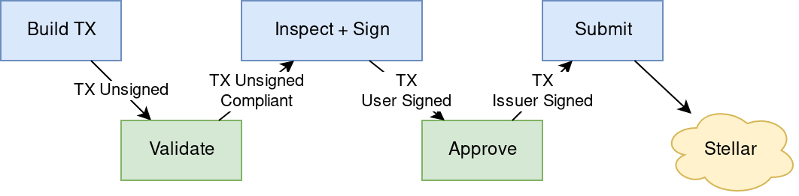

## Preamble

```
SEP: 0008
Title: Regulated Assets
Author: Lightyear.io
Status: Draft
Created: 2018-08-22
Version 1.0.0
```

## Simple Summary

Regulated Assets provide ecosystem support for assets that require an issuer’s approval (or a delegated third party’s approval, such as a licensed securities exchange) on a per-transaction basis. It standardizes the identification of such assets as well as defines the protocol for performing compliance checks and requesting issuer approval. 

**Target Audience**: Asset Issuers and Wallet developers

## Motivation

Stellar aims to be an ideal platform for issuing securities. As such, it must provide tools to comply with various regulatory requirements. Regulation often requires asset issuers to monitor and approve every transaction involving the issued asset and to enforce an assortment of constraints. This SEP provides support for these requirements.

## Overview

Implementing a Regulated Asset consists of these parts:
- **Stellar.toml**: Issuers will advertise the existence of an Approval Service and the approval criteria via their stellar.toml file.
- **Validation Server**: HTTP endpoint for transaction compliance checks. 
- **Approval Server**: HTTP protocol for transaction signing. 
- **Account Setup**: Wallets will have to work with accounts that are controlled or at least partially controlled (via multisig) by asset issuers, rather than the wallet end user.<br/> 
**Note**: this step may not be required once the proposed [protocol change](https://github.com/stellar/stellar-protocol/issues/146) allowing for protocol-level per-transaction approval is implemented. 

## Regulated Assets Flow

The following illustrates a simple transaction submission flow for regulated assets.



## Stellar.toml
Issuers will advertise the existence of an Approval Service through their stellar.toml file. This is done in the [[CURRENCIES]] section as different assets can have different requirements.

### Fields:

- `regulated` is a boolean indicating whether or not this is a regulated asset.
- `validaton_server` is the url of a validations service that performs compliance checks on transactions and if necessary, modifies them to enforce compliance.
- `approval_server` is the url of an approval service that signs validated transactions.
- `approval_criteria` is a human readable string that explains the issuer's requirements for validating and signing transactions.

### Example

```toml
[[CURRENCIES]]
code="GOAT"
issuer="GD5T6IPRNCKFOHQWT264YPKOZAWUMMZOLZBJ6BNQMUGPWGRLBK3U7ZNP"
regulated=true
validation_server="https://goat.io/tx_validate"
approval_server="https://goat.io/tx_auth"
approval_criteria= “The goat approval server will ensure that transactions are compliant with NFO regulation”
```

## Validation Server
The transaction validation server receives unsigned transactions and checks for compliance. It can choose to accept the transaction, modify it to fit compliance, or reject it. 

### Request 

*HTTP POST request is encoded as `application/json`.*


Parameters:

Name | Data Type | Description
-----|-----------|------------
tx|string|Unsigned Transaction XDR, Base64 encoded. This transaction will be tested for compliance.

### Responses

*HTTP responses are encoded as application/json*

#### Success (*status code 200*)

A successful response means that the transaction is compliant or the validation service was able to modify it to meet compliance.

Parameters:

Name | Data Type | Description
-----|-----------|------------
tx|string|Unsigned Transaction XDR, Base64 encoded. This transaction is compliant.
message|string|A human readable string containing information about the changes made to the transaction in order to make it compliant (optional).

#### Pending (*status code 202*)

A pending response means that the issuer needs to asynchronously validate the transaction. The user should resubmit the transaction after a given timeout. 

Parameters:

Name | Data Type | Description
-----|-----------|------------
timeout|integer|Number of milliseconds to wait before submitting the same transaction
message|string|A human readable string containing information about the reason 

#### Rejected (*status code 400*)

A rejection response means that the transaction is not compliant and could not be made compliant.

Parameters:

Name | Data Type | Description
-----|-----------|------------
error|string|A human readable string explaining why the transaction is not compliant and could not be made compliant.

### Best practices

- ALWAYS explain the changes that were made to a transaction through the message parameter.
- Core operations shouldn't be modified as that can be confusing and misleading. For example, if the user wishes to put an offer for 1000 GOATS but due to velocity limits they can only put an offer for 500 GOATS, it is better to error with a message than to change the amount.
- Adding an upper timebound to a transaction can help the issuer ensure that their view of the world does not get out of sync.
- Issuers can enforce additional fees by adding additional operations. For example, any transaction involving goats, will also send 0.1 GOAT to Boris’ account. 

## Approval Server

The transaction approval server receives a transaction, verifies compliance and either signs or rejects it. 

### Request 

*HTTP POST request is encoded as application/json.*

Parameters :

Name | Data Type | Description
-----|-----------|------------
tx|string|Transaction XDR, Base64 encoded. Signed by account holder/s

### Responses
HTTP responses are encoded as application/json

#### Success (*status code 200*)
A successful response means that:
The transaction is compliant
The existing signatures are verified

Parameters :

Name | Data Type | Description
-----|-----------|------------
tx|string|Transaction XDR, Base64 encoded. Signed by account holder/s and issuer.

#### Rejected (*status code 400*)

A rejection response means that the transaction is not compliant. The user should take the unsigned transaction back to the transaction validation server.

Parameters :

Name | Data Type | Description
-----|-----------|------------
error|string|A human readable string explaining why the transaction is not compliant and could not be made compliant.

### Best Practices

- Once a transaction has been signed, the issuer should mark it as pending and take it into account, as long as it hasn’t been timed out, so that they can have a accurate view of the world. 

## Account Setup

Implementing Regulated Assets requires the participating accounts to be “managed” by the issuer. This is achieved by having the issuer a co-signer on the account, such that a medium threshold operation cannot be submitted without the issuer’s approval. 

In the future, this requirement can be replaced by introducing protocol level [CoSigned assets](https://github.com/stellar/stellar-protocol/issues/146).

## Discussion

### Should my asset be a regulated asset ? 

Ideally, No. Implementing Regulated Assets should only be used when absolutely necessary, such as for regulatory reasons. It comes with a substantial operational overhead, added complexity, and burden for users. Issuers should only go down this route if it absolutely required.
Alternatively, some other available options are to utilize [SEP006](https://github.com/stellar/stellar-protocol/blob/master/ecosystem/sep-0006.md) in order to perform KYC on deposit and withdraw, and/or use [AUTHORIZATION_REQUIRED](https://www.stellar.org/developers/guides/issuing-assets.html#requiring-or-revoking-authorization)` which allows issuers to whitelist specific accounts to hold their issued assets. 

### Why are the validation and approval servers separated?

Validation and Approval have different inputs and outputs. Validation requires an unsigned transaction that can be augmented, while the approval service needs a signed transaction in order to mark a transaction as pending, which gives it an accurate view of the state of the world.
It’s possible to merge these two functionalities into the same service, but will then require multiple trips to the same service, which might be confusing.

### Why doesn’t the approval service submit transactions to the network?

- Separation of concerns between signing transactions and submitting them.
- Transactions might require more signatures from further regulated asset issuers. 

