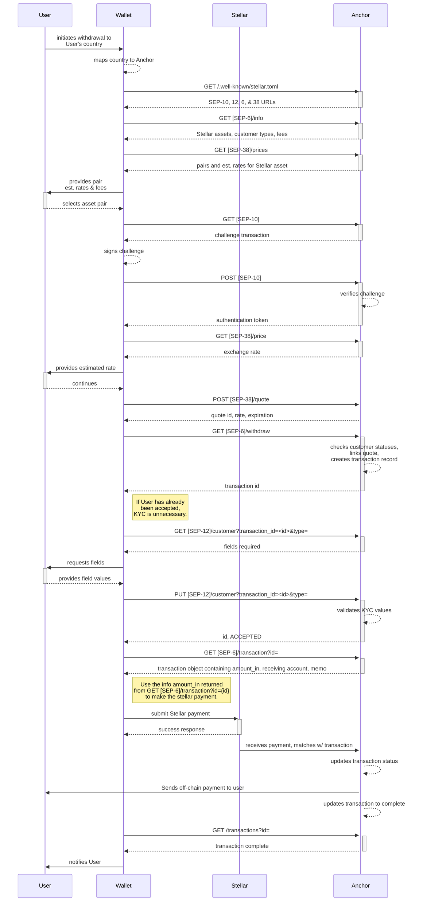

## Preamble

```
SEP: 0006
Title: Deposit and Withdrawal API
Author: SDF
Status: Active (Interactive components are deprecated in favor of SEP-24)
Created: 2017-10-30
Updated: 2024-05-07
Version 4.1.0
```

## Simple Summary

This SEP defines the standard way for anchors and wallets to interact on behalf of users. This improves user experience
by allowing wallets and other clients to interact with anchors directly without the user needing to leave the wallet to
go to the anchor's site.

Please note that this SEP provides a normalized interface specification that allows wallets and other services to
interact with anchors _programmatically_. [SEP-24](sep-0024.md) was created to support use cases where the anchor may
want to interact with users _interactively_ using a popup opened within the wallet application.

## Abstract

This proposal defines a standard protocol enabling the following features directly within a wallet or other Stellar
client:

- Deposit external assets with an anchor
- Withdraw assets from an anchor
- Execute deposit/withdraw between non-equivalent assets.
- Communicate deposit & withdrawal fee structure for an anchor to the user
- Handle anchor KYC needs, including transmitting KYC information about the user to the anchor via [SEP-12](sep-0012.md)
- Check the status of ongoing deposits or withdrawals involving the user
- View history of deposits and withdrawals involving the user

To support this protocol an anchor acts as a server and implements the specified REST API endpoints, while a wallet
implements a client that consumes the API. The goal is interoperability, so a wallet implements a single client
according to the protocol, and will be able to interact with any compliant anchor. Similarly, an anchor that implements
the API endpoints according to the protocol will work with any compliant wallet.

## Diagrams

The diagrams provided offer a detailed view of various flows that are possible using this protocol. Note that these
diagrams are opinionated. Variations of the these flows may also be sufficient.

### Completing a Withdrawal Transaction with a Firm Quote

This diagram demonstrates the interactions between the entities involved in a successful transaction. Specifically it
uses the [Asset Conversions Using a Firm Quote](#asset-conversions-using-a-firm-quote) strategy.



## Prerequisites

- An anchor must define the location of their `TRANSFER_SERVER` in their [`stellar.toml`](sep-0001.md). This is how a
  wallet knows where to find the anchor's server.
- Anchors and clients may support [SEP-10](sep-0010.md) web authentication to enable authenticated deposits,
  withdrawals, or transaction history lookups.
- If the Anchor supports [SEP-38], `ANCHOR_QUOTE_SERVER` must be defined in their [`stellar.toml`](sep-0001.md).

## API Endpoints

- [`GET /deposit`](#deposit-2): required
- [`GET /withdraw`](#withdraw-2): required
- [`GET /deposit-exchange`](#deposit-exchange): optional
- [`GET /withdraw-exchange`](#withdraw-exchange): optional
- [`GET /info`](#info): required

* [`GET /fee`](#fee): **deprecated** optional (only needed for complex fee structures).

- [`GET /transactions`](#transaction-history): required
- [`GET /transaction`](#single-historical-transaction): required

## Authentication

Anchors may support [SEP-10](sep-0010.md) web authentication to enable authenticated deposits, withdrawals, or
transaction history lookups. In cases where authentication is required:

1. anchors must set the `authentication_required` field in their [info endpoint](#info)
1. clients must submit the JWT previously obtained from the anchor via the [SEP-10](sep-0010.md) authentication flow to
   all API endpoints.

The JWT should be included in all requests as request header:

```
Authorization: Bearer <JWT>
```

It is highly recommended to require authentication for all endpoints other than `/info` (and optionally `/fee`). Some
functionality, including the [Shared Accounts](#shared-omnibus-or-pooled-accounts) functionality described in the
section below, may only be possible through the use of SEP-10.

### Shared, Omnibus, or Pooled Accounts

Client applications can use a single Stellar account to hold multiple users' funds. To distinguish users that use the
same Stellar account, the decoded SEP-10 JWT's `sub` value may contain a memo value after the Stellar account
(`G...:2810101841641761712`) OR the `sub` value will be a [Muxed Account (`M...`)](../core/cap-0027.md). The anchor
should use the `sub` attribute in their data model to identify unique users.

This document will refer to these accounts as shared accounts. See the [SEP-10 Memos](sep-0010.md#memos) and
[Muxed Accounts](sep-0010.md#muxed-accounts) sections for more information.

Note that Stellar accounts are either shared or they are not. This means anchors should ensure that a Stellar account
previously authenticated with a memo should not be authenticated later without a memo. Conversely, an account that was
previously authenticated without a memo should not be later authenticated as a shared account.

### Source and Destination Accounts

Note that both the source account of a withdrawal payment and the destination account of a deposit can be different than
the account authenticated via SEP-10.

## Cross-Origin Headers

Valid CORS headers are necessary to allow web clients from other sites to use the endpoints. The following HTTP header
must be set for all transfer server responses, including error responses.

```
Access-Control-Allow-Origin: *
```

## HTTPS Only

This protocol involves the transfer of value, and so HTTPS is required for all endpoints for security. Wallets and
anchors should refuse to interact with any insecure HTTP endpoints.

## Callback signature

This protocol involves the optional use of callbacks that the Anchor can issue to update the wallet on `status` of a
transaction. In order to validate the integrity and provenance of the callback, the Anchor MUST include a signature in
the HTTP Header `Signature` or `X-Stellar-Signature` (**Deprecated**).

Wallets should support both headers until the `X-Stellar-Signature` header is removed from the specification.

These headers MUST follow the specification: `t=<timestamp>, s=<base64 signature>` where:

- **timestamp** is the current Unix timestamp (number of seconds since epoch) at the time the callback is sent. This is
  used to assure the freshness of the request and to prevent this request to be replayed in the future.
- **base64 signature** is the base64 encoding of the request signature. We explain below how to compute and verify this
  signature. The signature is computed using the Stellar private key linked to the `SIGNING_KEY` field of the anchor's
  [`stellar.toml`](sep-0001.md). Note that the timestamp and the Wallet hostname will be part of the signature to
  prevent replay and relay attacks.

It is the wallet's responsibility to:

- Verify the signature using the corresponding Stellar `SIGNING_KEY` field of the anchor's
  [`stellar.toml`](sep-0001.md).
- Verify the freshness of the request by comparing the `timestamp` in the request with the current timestamp at the time
  of the reception and discard every request above a threshold of few seconds (1 or 2 minute(s) maximum).
- Send a working callback URL (parameter `on_change_callback`) to the anchor.

### VERIFY signature

- Check that callback request has `Signature` or `X-Stellar-Signature` (**Deprecated**) header
- Parse the header and extract:
  - Key `t`: **timestamp**
  - Key `s`: **base64 signature**
- Verify the request freshness: _current timestamp_ - **timestamp** < few seconds (1-2 minute(s) max)
- Extract the **body** of the request
- Base64 decode the **base64 signature** to get the **signature**
- Prepare the payload to verify the signature:
  - The **timestamp** (as a string)
  - The character `.`
  - The wallet host to send the callback request to
  - The character `.`
  - The **body**
- Verify the signature using the correct `SIGNING_KEY`

### COMPUTE signature

- Prepare the callback
- Prepare the payload to sign:
  - Current timestamp (as a string)
  - The character `.`
  - The wallet host to send the callback request to
  - The character `.`
  - The callback request body
- Sign the payload `<timestamp>.<host>.<body>` using the Anchor private key
- Base64 encode the signature
- Build the `Signature` or `X-Stellar-Signature` (**Deprecated**) header:
  - `Signature: t=<current timestamp>, s=<base64 encoded signature>`
  - `X-Stellar-Signature: t=<current timestamp>, s=<base64 encoded signature>`

## Asset Exchanges

This protocol was originally designed to provide conversions between off-chain and on-chain equivalent assets – for
instance `BRL <> BRLT`, `USD <> USDC`, `NGN <> NGNT`, etc. – but it also describes how to make exchanges between
off-chain and on-chain non-equivalent assets like `BRL <> USDC`.

To enable the conversion of non-equivalent assets, the Anchor must implement endpoints
[`GET /deposit-exchange`](#deposit-exchange) and [`GET /withdraw-exchange`](#withdraw-exchange), and the
[SEP-38 Anchor RFQ API](sep-0038.md) that enables the Anchor to provide quotes to the Wallet.

### Asset Conversions Using the Market Rate

To convert at the market rate, clients get an
[indicative quote](https://www.investopedia.com/terms/i/indicativequote.asp) with [SEP-38] and then proceed to calling
the [`GET /deposit-exchange`](#deposit-exchange) or [`GET /withdraw-exchange`](#withdraw-exchange) endpoints. Market
rate conversions executed in this way do not provide a guarantee of the final price to be paid for the asset. Here is
how this kind of conversion should happen in deposits and withdrawals for an asset pair like `BRL <> USDC`:

#### Deposit:

Considering the user will be making a bank deposit of fiat `BRL` in exchange for `USDC` in the Stellar network:

1. The Wallet checks the assets' market conversion rate with [`SEP-38 GET /price`](sep-0038.md#get-price) and shows the
   estimated price to the user.
1. The Wallet initiates a [`GET /deposit-exchange`](#deposit-exchange) using the parameters `source_asset` and
   `destination_asset`.
1. The user proceeds with the off-chain deposit, sending `BRL` to the Anchor's bank account.
1. Upon receiving the off-chain deposit funds, the Anchor converts it to `USDC` using the market rate and sends the
   resulting amount to the user's Stellar account.

#### Withdraw:

Considering the user will be making a Stellar payment of `USDC` in exchange for withdrawing `BRL` in the bank account:

1. The Wallet checks the assets' market conversion rate with [`SEP-38 GET /price`](sep-0038.md#get-price) and shows the
   estimated price to the user.
1. The Wallet initiates a [`GET /withdraw-exchange`](#withdraw-exchange) using the parameters `source_asset` and
   `destination_asset`.
1. The user proceeds with the on-chain payment, sending `USDC` to the Anchor's Stellar account.
1. Upon receiving the on-chain withdraw funds, the Anchor converts it to `BRL` using the market rate and sends the
   resulting amount to the user's bank account.

### Asset Conversions Using a Firm Quote

With firm quotes, users are guaranteed an asset price they will pay if they submit the payment before the quote
expiration. Here is how the conversion should happen in deposits and withdrawals for an asset pair like `USDC <> BRL`:

#### Deposit:

Considering the user will be making a bank deposit of fiat `BRL` in exchange for `USDC` in the Stellar network:

1. The Wallet gets a firm conversion rate in [`SEP-38 POST /quote`](sep-0038.md#post-quote) and shows the price and
   expiration date to the user.
1. The Wallet initiates a [`GET /deposit-exchange`](#deposit-exchange) using the parameter `quote_id` returned from the
   previous step, as well as `asset_code` and `destination_asset`.
1. The user proceeds with the off-chain deposit, sending `BRL` to the Anchor's bank account before the quote expires.
1. Upon receiving the off-chain deposit funds, the Anchor converts it to `USDC` according with the agreed quote and
   sends the resulting amount to the user's Stellar account.
1. If the user sends the funds after the quote expiration, the Anchor can proceed according with its own policy.

#### Withdraw:

Considering the user will be making a Stellar payment of `USDC` in exchange for withdrawing `BRL` in her bank account:

1. The Wallet gets a firm conversion rate in [`SEP-38 POST /quote`](sep-0038.md#post-quote) and shows the price and
   expiration date to the user.
1. The Wallet initiates a [`GET /withdraw-exchange`](#withdraw-exchange) using the parameter `quote_id` returned from
   the previous step, as well as `asset_code` and `destination_asset`.
1. The user proceeds with the on-chain payment, sending `USDC` to the Anchor's Stellar account before the quote expires.
1. Upon receiving the on-chain withdraw funds, the Anchor converts it to `BRL` according with the agreed quote and sends
   the resulting amount to the user's bank account.
1. If the user sends the funds after the quote expiration, the Anchor can proceed according with its own policy.

## Recommendations

SEP-6 lays out many options for how deposit and withdrawal can work. These are recommendations for getting a wallet or
anchor implementation working with minimal effort while providing a great user experience.

**Note:** Both wallets and anchors should implement a sandbox mode for testing that uses the Stellar testnet.

### Basic Wallet Implementation

- Identify anchors you want to support manually, and test them with your wallet to be sure they work before allowing
  them to be used with your wallet. We encourage you to support as many anchors as possible.
- For each anchor, use information from its [`stellar.toml`](sep-0001.md) file and its [`/info`](#info) endpoint to
  display useful information to the user about the asset they've picked.
- Provide an interface that allows users to pick an asset, anchor, and amount to use for deposit or withdraw. The
  interface should display the asset's fee structure (if possible) as well as information such as the address of the
  anchor and description of the asset from the `stellar.toml` file.
- **Use the `/info` endpoint**
  - Determine which anchor endpoints will require authentication
  - Fetch the asset's deposit & withdrawal fee structure: if `fee_fixed` and `fee_percent` are provided, show this to
    the user early in the process so they're fully informed.
  - If the `/fee` endpoint is enabled, use it for computing fees when you need to show them to the user.
  - While `/info` allows an anchor to communicate fields that are needed for `/deposit` or `/withdraw`, Anchors are
    recommended not to collect these through request parameters, but rather through [SEP-12](sep-0012.md) to avoid
    leaking sensitive information through URLs. If the anchor requires fields to be provided through request parameters,
    the wallet can hard-code any extra fields on a per-anchor basis to ensure those fields are passed in correctly.
- **Authentication**
  - If needed, perform [authentication](#authentication) via SEP-10 before hitting those endpoints
- **Make a request to `/deposit` or `/withdraw`.**
  - Before making the payment, make a request to `[SEP-6]/transaction?id=<transaction_id>` to get the amount_in details.
    Some anchors may use additive fees, which would produce an `amount_in` different from the wallet's proposed amount.
- **For `/deposit`**
  - If the anchor's `/deposit` endpoint immediately returns success:
    - display the deposit info that came back from the endpoint to the user, including fee. You're done! The user will
      execute the deposit externally using the instructions if they want to.
  - Handle the [special cases](#special-cases), they're relatively common.
- **For `/withdraw`**
  - If the anchor's `/withdraw` endpoint immediately returns success:
    - Provide an interface to the user that allows them to view the withdrawal details including the computed fee. The
      user can confirm and then the wallet will initiate the withdrawal by sending the Stellar payment to the address
      provided by the issuer.
  - Some wallets might exchange currencies only once they're ready to send the withdrawal payment, so exchange rate
    fluctuations might require withdrawal values to slightly vary from the originally provided `amount`. Anchors are
    instructed to accept a variation of ±10% between the informed `amount` and the actual value sent to the anchor's
    Stellar account. The withdrawn amount will be adjusted accordingly.
- **Transaction history**
  - It provides a better experience for users to show deposits or withdrawals they've completed in the past via the
    `/transactions` endpoint, but it's not strictly necessary.

### Basic Anchor Implementation

- Provide a full-featured implementation of [`/info`](#info) using SEP-12 to collect any KYC or financial account
  information from the user.
- Decide which endpoints, if any, need to be [authenticated](#authentication), and declare that properly in the `/info`
  endpoint.
- Pick your approach to [fees](https://github.com/stellar/stellar-protocol/blob/master/ecosystem/sep-0006.md#fee). We
  recommend using `/info` to express fees as it provides a better user experience (the user can see the fee structure in
  the wallet early in the process).
- **For both deposit and withdrawal**:
  - Include the `id` field in your response so the wallet can check up on the status of the transaction if it wants.
  - We recommend you use [SEP-10 authentication](#authentication) for all endpoints other than `/info`. Anchors may want
    to allow clients to access the `/fee` endpoint as well.
- **Providing transaction status**
  - Provide the `/transaction` endpoint. The wallet may rely on it to complete interactive withdrawals.
  - Provide the `/transactions` endpoint. Users like to see transaction histories.

## Deposit

A deposit is when a user sends an external token (BTC via Bitcoin, USD via bank transfer, etc...) to an address held by
an anchor. In return, the anchor sends an equal amount of an equivalent token on the Stellar network (minus fees) to the
user's Stellar account.

If the anchor supports [SEP-38] quotes, it can also provide a bridge between non-equivalent tokens. For example, the
anchor can receive ARS via bank transfer and in return send the equivalent value (minus fees) as USDC on the Stellar
network to the user's Stellar account. That kind of deposit is covered in [`GET /deposit-exchange`](#deposit-exchange).

The `/deposit` endpoint allows a wallet to get deposit information from an anchor, so a user has all the information
needed to initiate a deposit. It also lets the anchor specify additional information (if desired) that the user must
submit via [SEP-12](sep-0012.md) to be able to deposit.

If the given account does not exist, or if the account doesn't have a trust line for that specific asset, see the
[Special Cases](#special-cases) section below.

### Request

```
GET TRANSFER_SERVER/deposit
```

Request Parameters:

| Name                          | Type                    | Description                                                                                                                                                                                                                                                                                                                                                                                                                                                           |
| ----------------------------- | ----------------------- | --------------------------------------------------------------------------------------------------------------------------------------------------------------------------------------------------------------------------------------------------------------------------------------------------------------------------------------------------------------------------------------------------------------------------------------------------------------------- |
| `asset_code`                  | string                  | The code of the on-chain asset the user wants to get from the Anchor after doing an off-chain deposit. The value passed must match one of the codes listed in the [/info](#info) response's deposit object.                                                                                                                                                                                                                                                           |
| `account`                     | `G...` or `M...` string | The stellar or muxed account ID of the user that wants to deposit. This is where the asset token will be sent. Note that the account specified in this request could differ from the account authenticated via SEP-10.                                                                                                                                                                                                                                                |
| `memo_type`                   | string                  | (optional) Type of memo that the anchor should attach to the Stellar payment transaction, one of `text`, `id` or `hash`.                                                                                                                                                                                                                                                                                                                                              |
| `memo`                        | string                  | (optional) Value of memo to attach to transaction, for `hash` this should be base64-encoded. Because a memo can be specified in the SEP-10 JWT for [Shared Accounts](#shared-omnibus-or-pooled-accounts), this field as well as `memo_type` can be different than the values included in the SEP-10 JWT. For example, a client application could use the value passed for this parameter as a reference number used to match payments made to `account`.              |
| `email_address`               | string                  | (optional) Email address of depositor. If desired, an anchor can use this to send email updates to the user about the deposit.                                                                                                                                                                                                                                                                                                                                        |
| `type`                        | string                  | (optional) Type of deposit. If the anchor supports multiple deposit methods (e.g. `SEPA` or `SWIFT`), the wallet should specify `type`. This field may be necessary for the anchor to determine which KYC fields to collect.                                                                                                                                                                                                                                          |
| `wallet_name`                 | string                  | (**deprecated**,optional) In communications / pages about the deposit, anchor should display the wallet name to the user to explain where funds are going. However, anchors should use client_domain (for non-custodial) and `sub` value of JWT (for custodial) to determine wallet information.                                                                                                                                                                      |
| `wallet_url`                  | string                  | (**deprecated**,optional) Anchor should link to this when notifying the user that the transaction has completed. However, anchors should use client_domain (for non-custodial) and `sub` value of JWT (for custodial) to determine wallet information.                                                                                                                                                                                                                |
| `lang`                        | string                  | (optional) Defaults to `en` if not specified or if the specified language is not supported. Language code specified using [RFC 4646]. `error` fields and other human readable messages in the response should be in this language.                                                                                                                                                                                                                                    |
| `on_change_callback`          | string                  | (optional) A URL that the anchor should `POST` a JSON message to when the `status` property of the transaction created as a result of this request changes. The JSON message should be identical to the response format for the [/transaction](#single-historical-transaction) endpoint. The callback needs to be signed by the anchor and the signature needs to be verified by the wallet according to the [callback signature specification](#callback-signature). |
| `amount`                      | string                  | (optional) The amount of the asset the user would like to deposit with the anchor. This field may be necessary for the anchor to determine what KYC information is necessary to collect.                                                                                                                                                                                                                                                                              |
| `country_code`                | string                  | (optional) The [ISO 3166-1 alpha-3](https://en.wikipedia.org/wiki/ISO_3166-1_alpha-3) code of the user's current address. This field may be necessary for the anchor to determine what KYC information is necessary to collect.                                                                                                                                                                                                                                       |
| `claimable_balance_supported` | string                  | (optional) `true` if the client supports receiving deposit transactions as a claimable balance, `false` otherwise.                                                                                                                                                                                                                                                                                                                                                    |
| `customer_id`                 | string                  | (optional) id of an off-chain account (managed by the anchor) associated with this user's Stellar account (identified by the JWT's `sub` field). If the anchor supports [SEP-12], the `customer_id` field should match the [SEP-12] customer's id. `customer_id` should be passed only when the off-chain id is know to the client, but the relationship between this id and the user's Stellar account is not known to the Anchor.                                   |
| `location_id`                 | string                  | (optional) optional) id of the chosen location to drop off cash                                                                                                                                                                                                                                                                                                                                                                                                       |

The request parameters also must include the required fields from the `/info` endpoint.

Example:

```
GET https://api.example.com/deposit?asset_code=ETH&account=GACW7NONV43MZIFHCOKCQJAKSJSISSICFVUJ2C6EZIW5773OU3HD64VI
```

### Response

There are several possible kinds of response, depending on whether the anchor needs more information about the user, how
it should be sent to the anchor, and if there are any errors.

The first response, the success response, is explained below. The other possible responses are shared with the
withdrawal endpoint, and are explained in the
[Deposit and Withdraw shared responses](#deposit-and-withdraw-shared-responses) section below.

#### 1. Success: no additional information needed

Response code: `200 OK`

This is the correct response if the deposit request is valid and the anchor is beginning to process the deposit. The
anchor may need additional information about the user, before the deposit can be completed. If the anchor needs
additional information, it will be communicated to the user via the [`/transaction`](#single-historical-transaction)
endpoint.

The response body should be a JSON object with the following fields:

| Name           | Type   | Description                                                                                                                                                                                                                                                                                                                                       |
| -------------- | ------ | ------------------------------------------------------------------------------------------------------------------------------------------------------------------------------------------------------------------------------------------------------------------------------------------------------------------------------------------------- |
| `how`          | string | (**Deprecated**, use `instructions` instead) Terse but complete instructions for how to deposit the asset. In the case of most cryptocurrencies it is just an address to which the deposit should be sent.                                                                                                                                        |
| `instructions` | object | (optional) JSON object containing the [SEP-9 financial account fields](sep-0009.md#financial-account-fields) that describe how to complete the off-chain deposit. If the anchor cannot provide this information in the response, the wallet should query the [`/transaction`](#single-historical-transaction) endpoint to get this asynchonously. |
| `id`           | string | (optional) The anchor's ID for this deposit. The wallet will use this ID to query the [`/transaction`](#single-historical-transaction) endpoint to check status of the request.                                                                                                                                                                   |
| `eta`          | int    | (optional) Estimate of how long the deposit will take to credit in seconds.                                                                                                                                                                                                                                                                       |
| `min_amount`   | float  | (optional) Minimum amount of an asset that a user can deposit.                                                                                                                                                                                                                                                                                    |
| `max_amount`   | float  | (optional) Maximum amount of asset that a user can deposit.                                                                                                                                                                                                                                                                                       |
| `fee_fixed`    | float  | (optional) Fixed fee (if any). In units of the deposited asset.                                                                                                                                                                                                                                                                                   |
| `fee_percent`  | float  | (optional) Percentage fee (if any). In units of percentage points.                                                                                                                                                                                                                                                                                |
| `extra_info`   | object | (optional) JSON object with additional information about the deposit process.                                                                                                                                                                                                                                                                     |

`instructions` fields:

An object with SEP-9 financial account fields as keys and its values are objects with the following fields:

| Name          | Type   | Description                                                                                                                                                |
| ------------- | ------ | ---------------------------------------------------------------------------------------------------------------------------------------------------------- |
| `value`       | string | The value of the field.                                                                                                                                    |
| `description` | string | A human-readable description of the field. This can be used to provide any additional information about fields that are not defined in the SEP-9 standard. |

`extra_info` fields:

| Name      | Type   | Description                                              |
| --------- | ------ | -------------------------------------------------------- |
| `message` | string | (optional) Additional details about the deposit process. |

##### Examples

Bank payment example:

```json
{
  "id": "9421871e-0623-4356-b7b5-5996da122f3e",
  "instructions": {
    "organization.bank_number": {
      "value": "121122676",
      "description": "US bank routing number"
    },
    "organization.bank_account_number": {
      "value": "13719713158835300",
      "description": "US bank account number"
    }
  },
  "how": "Make a payment to Bank: 121122676 Account: 13719713158835300"
}
```

Bitcoin response example:

```json
{
  "id": "9421871e-0623-4356-b7b5-5996da122f3e",
  "instructions": {
    "organization.crypto_address": {
      "value": "1Nh7uHdvY6fNwtQtM1G5EZAFPLC33B59rB",
      "description": "Bitcoin address"
    }
  },
  "how": "Make a payment to Bitcoin address 1Nh7uHdvY6fNwtQtM1G5EZAFPLC33B59rB",
  "fee_fixed": 0.0002
}
```

Ripple response example:

```json
{
  "id": "9421871e-0623-4356-b7b5-5996da122f3e",
  "instructions": {
    "organization.crypto_address": {
      "value": "rNXEkKCxvfLcM1h4HJkaj2FtmYuAWrHGbf",
      "description": "Ripple address"
    },
    "organization.crypto_memo": {
      "value": "88",
      "description": "Ripple tag"
    }
  },
  "how": "Make a payment to Ripple address rNXEkKCxvfLcM1h4HJkaj2FtmYuAWrHGbf with tag 88",
  "eta": 60,
  "fee_percent": 0.1,
  "extra_info": {
    "message": "You must include the tag. If the amount is more than 1000 XRP, deposit will take 24h to complete."
  }
}
```

Mexican peso (MXN) response example:

```json
{
  "id": "9421871e-0623-4356-b7b5-5996da122f3e",
  "instructions": {
    "organization.clabe_number": {
      "value": "646180111803859359",
      "description": "CLABE number"
    }
  },
  "how": "Make a payment to Bank: STP Account: 646180111803859359",
  "eta": 1800
}
```

### Special Cases

#### Stellar account does not exist

If the given Stellar `account` does not exist, on receipt of the deposit, the anchor should use the `CreateAccount`
operation to create the account with at least enough XLM for the minimum reserve and a trust line to the requested asset
(2.01 XLM is recommended). To indicate that account creation is not supported, set the `account_creation` attribute
within `GET /info`'s `features` object to `false`, otherwise clients will assume account creation is supported.

The Anchor can add this minimal funding amount to the service fee, but this requires calculating the worth of the
minimum funding amount in units of the requested asset.

Since the anchor doesn't have the user account's secret key, the user must create a trust line to the anchor's asset
before the anchor can send the requested asset tokens to the user's account. The anchor should listen for the user to
establish this trust line. Once the trust line is there, the anchor should send the requested asset tokens to the
account in Stellar to complete the deposit.

If the anchor does not support creating new accounts for users and `account` doesn't exist yet, the anchor should return
a `400 Bad Request` error in the [deposit](#deposit-2) response. The response body should be a JSON object containing an
`error` field that explains why the request failed.

#### Stellar account doesn't trust asset

Unless [Claimable Balances](#claimable-balances) are supported by both the wallet and anchor, the deposit flow can only
be fulfilled if the Stellar `account` has established a trust line for the given asset. To ensure this is accomplished,
when initiating the deposit flow, `Wallet` should check if the `account` has a trust line for the given asset. If it
doesn't:

1. `Wallet` checks if `account` has enough XLM to create a trust line. If it does, skip to step `4`.
2. If `account` doesn't have enough XLM, `Wallet` starts listening for transactions to the given `account`, waiting for
   it to have enough XLM for a trust line.
3. When asked for a deposit, `Anchor` detects if `account` has enough XLM to create a trust line. If it doesn't,
   `Anchor` sends the needed amount of XLM to the `Account` for creating a trust line. `Anchor` may charge a service fee
   to cover the cost of the XLM, but this must be communicated to the user.
4. `Anchor` updates the transaction's `status` to `pending_trust`, signaling to `Wallet` that it is waiting for a
   trustline to be established.
5. `Wallet` detects that the transactions status is `pending_trust`, confirms the arrival of XLM in the `account`, and
   establishes a trust line.
6. `Anchor` detects the trust line creation in the `account`. If the asset is `AUTH_REQUIRED`, `Anchor` approves the new
   trust line.
7. `Anchor` proceeds with the deposit flow.

#### Claimable Balances

[Claimable Balances](https://github.com/stellar/stellar-protocol/blob/master/core/cap-0023.md) are an optional feature
that enable payments to accounts that do not have a trustline for the asset being deposited. This feature splits a
payment into two separate parts: the creation of a balance, and the claiming of a balance. A claimable balance can be
claimed by the designated claimant (user) after it has been created by the anchor.

Using this feature, anchors will no longer have to wait until the user's Stellar account has a trustline to the asset
before sending funds. Instead, anchors can make the payment using a
[CreateClaimableBalance](https://developers.stellar.org/api/resources/operations/object/create-claimable-balance/)
operation and the user's Stellar account can claim the funds at their own convenience using a
[ClaimClaimableBalance](https://developers.stellar.org/api/resources/operations/object/claim-claimable-balance/)
operation.

**NOTE**: Supporting this feature will be made mandatory in the future. Therefore, it is highly recommended for wallets
to implement this functionality now.

**Wallets**: To support claimable balances wallets must

- Send the additional `claimable_balance_supported=true` request parameter in the `GET /deposit` request.
- Periodically poll for account's available claimable balances.
- Provide a UI that allows users to claim claimable balances.

**Anchors**: To support claimable balances anchors must

- Set the `claimable_balances` attribute within `GET /info`'s `features` object to `true`
- Accept the `claimable_balance_supported` request parameter in `GET /deposit` requests
- Submit deposit transactions using `CreateClaimableBalance` operations to Stellar accounts that don't yet have a
  trustline to the asset requested.
- Add the `claimable_balance_id` attribute to `GET /transaction(s)` deposit records

**Anchors and Wallets**: Both anchors and wallets still must support the aforementioned
[Stellar account doesn't trust asset](#stellar-account-doesnt-trust-asset) flow. Wallets need to be interoperable with
anchors that have not adopted the claimable balance feature and vice versa.

##### Wallet Claimable Balance Flow

1. Make a request to `/deposit` and provide the `claimable_balance_supported=true` request parameter.
2. Register the user's KYC information with the anchor via [SEP-12](sep-0012.md) if requested and resubmit the deposit
   request.
3. Once a successful deposit request has been made and the transaction's status is `pending_user_transfer_start`, the
   user must send the required payment as described by the `instructions` attribute in the deposit success response,
   using the `amount_in` returned from the `GET [SEP-6]/transaction?id=<transaction_id>` request.
4. If the anchor doesn't support claimable balances, the anchor's `/transaction(s)` endpoint will contain the
   `pending_trust` status. In this case, use the flow described [above](#stellar-account-doesnt-trust-asset).
5. Otherwise, detect the `claimable_balance_id` value populated in the anchor's `/transaction(s)` endpoint or poll
   Horizon's [/claimable_balances](https://developers.stellar.org/api/resources/claimablebalances/) endpoint for
   outstanding claimable balances. When a claimable balance is detected using either method, the transaction status
   should be `completed`.
6. Claim the balance using the value via the `ClaimClaimableBalance` operation. See the
   ["Claiming Claimable Balances"](#claiming-claimable-balances) section to learn more about how to claim a balance.

##### Claiming Claimable Balances

In order to claim a balance of an asset, the Stellar accounts must establish a trustline to the asset. Adding a
trustline only needs to happen once per asset sent.

Below is an example of how to claim a claimable balance. Omitted from the example is the
[Change Trust](https://developers.stellar.org/docs/start/list-of-operations/#change-trust) operation required if the
Stellar account does not have a trustline.

```javascript
const transaction = new TransactionBuilder(account, {
  fee: 100,
  networkPassphrase: this.network_passphrase,
})
  .addOperation(Operation.claimClaimableBalance({ balanceId }))
  .setTimeout(0)
  .build();
transaction.sign(keypair);
const result = await this.server.submitTransaction(transaction);
```

##### Anchor Claimable Balance Flow

1. Wallets make a request to `/deposit` providing the `claimable_balance_supported` request parameter.
2. Anchors update their internal database record of the transaction to indicate the wallet supports receiving a
   claimable balance.
3. Users send the external asset to the anchor's off-chain account.
4. Anchors detect that the user's Stellar account doesn't have a trustline.
5. Anchors submits a Stellar transaction containing a claimable balance operation.
6. Anchors update the `/transaction(s)` attributes `status` to `completed` and `claimable_balance_id` to the ID returned
   in the Horizon response.

##### Claimable Balance Claimants and Predicates

Predicates are one of the
[claimable balance parameters](https://developers.stellar.org/docs/glossary/claimable-balance/#parameters) used to craft
a Claimable Balance transaction. They are conditions that must be satisfied in order for the recipient to claim the
balance. Anchors are free to set whichever predicates they feel are necessary in order to claim the balance. If there
are no predicate preferences, `UNCONDITIONAL` allows accounts to claim balances at anytime.

## Withdraw

A withdraw is when a user redeems an asset currently on the Stellar network for its equivalent off-chain asset via the
Anchor. For instance, a user redeeming their NGNT in exchange for fiat NGN.

If the anchor supports [SEP-38] quotes, it can also provide a bridge between non-equivalent tokens. For example, the
anchor can receive USDC from the Stellar network and in return send the equivalent value (minus fees) as NGN to the
user's bank account. That kind of withdrawal is covered in [`GET /withdraw-exchange`](#withdraw-exchange).

The `/withdraw` endpoint allows a wallet to get withdrawal information from an anchor, so a user has all the information
needed to initiate a withdrawal. It also lets the anchor specify additional information (if desired) that the user must
submit via [SEP-12](sep-0012.md) to be able to withdraw.

### Request

```
GET TRANSFER_SERVER/withdraw
```

Request parameters:

| Name                 | Type                    | Description                                                                                                                                                                                                                                                                                                                                                                                                                                                           |
| -------------------- | ----------------------- | --------------------------------------------------------------------------------------------------------------------------------------------------------------------------------------------------------------------------------------------------------------------------------------------------------------------------------------------------------------------------------------------------------------------------------------------------------------------- |
| `asset_code`         | string                  | Code of the on-chain asset the user wants to withdraw. The value passed must match one of the codes listed in the [/info](#info) response's withdraw object.                                                                                                                                                                                                                                                                                                          |
| `type`               | string                  | Type of withdrawal. Can be: `crypto`, `bank_account`, `cash`, `mobile`, `bill_payment` or other custom values. This field may be necessary for the anchor to determine what KYC information is necessary to collect.                                                                                                                                                                                                                                                  |
| `dest`               | string                  | (**Deprecated**, [see note below](#dest--dest_extra-parameters)) The account that the user wants to withdraw their funds to. This can be a crypto account, a bank account number, IBAN, mobile number, or email address.                                                                                                                                                                                                                                              |
| `dest_extra`         | string                  | (**Deprecated**, [see note below](#dest--dest_extra-parameters), optional) Extra information to specify withdrawal location. For crypto it may be a memo in addition to the `dest` address. It can also be a routing number for a bank, a BIC, or the name of a partner handling the withdrawal.                                                                                                                                                                      |
| `account`            | `G...` or `M...` string | (optional) The Stellar or muxed account the client will use as the source of the withdrawal payment to the anchor. If SEP-10 authentication is not used, the anchor can use `account` to look up the user's KYC information. Note that the account specified in this request could differ from the account authenticated via SEP-10.                                                                                                                                  |
| `memo`               | string                  | (optional) This field should only be used if SEP-10 authentication is not. It was originally intended to distinguish users of the same Stellar account. However if SEP-10 is supported, the anchor should use the `sub` value included in the decoded SEP-10 JWT instead. See the [Shared Account Authentication](#shared-omnibus-or-pooled-accounts) section for more information.                                                                                   |
| `memo_type`          | string                  | (**Deprecated**, optional) Type of `memo`. One of `text`, `id` or `hash`. Deprecated because memos used to identify users of the same Stellar account should always be of type of `id`.                                                                                                                                                                                                                                                                               |
| `wallet_name`        | string                  | (**deprecated**,optional) In communications / pages about the withdrawal, anchor should display the wallet name to the user to explain where funds are coming from. However, anchors should use client_domain (for non-custodial) and `sub` value of JWT (for custodial) to determine wallet information.                                                                                                                                                             |
| `wallet_url`         | string                  | (**deprecated**,optional) Anchor can show this to the user when referencing the wallet involved in the withdrawal (ex. in the anchor's transaction history). However, anchors should use client_domain (for non-custodial) and `sub` value of JWT (for custodial) to determine wallet information.                                                                                                                                                                    |
| `lang`               | string                  | (optional) Defaults to `en` if not specified or if the specified language is not supported. Language code specified using [RFC 4646]. `error` fields and other human readable messages in the response should be in this language.                                                                                                                                                                                                                                    |
| `on_change_callback` | string                  | (optional) A URL that the anchor should `POST` a JSON message to when the `status` property of the transaction created as a result of this request changes. The JSON message should be identical to the response format for the [/transaction](#single-historical-transaction) endpoint. The callback needs to be signed by the anchor and the signature needs to be verified by the wallet according to the [callback signature specification](#callback-signature). |
| `amount`             | string                  | (optional) The amount of the asset the user would like to withdraw. This field may be necessary for the anchor to determine what KYC information is necessary to collect.                                                                                                                                                                                                                                                                                             |
| `country_code`       | string                  | (optional) The [ISO 3166-1 alpha-3](https://en.wikipedia.org/wiki/ISO_3166-1_alpha-3) code of the user's current address. This field may be necessary for the anchor to determine what KYC information is necessary to collect.                                                                                                                                                                                                                                       |
| `refund_memo`        | string                  | (optional) The memo the anchor must use when sending refund payments back to the user. If not specified, the anchor should use the same memo used by the user to send the original payment. If specified, `refund_memo_type` must also be specified.                                                                                                                                                                                                                  |
| `refund_memo_type`   | string                  | (optional) The type of the `refund_memo`. Can be `id`, `text`, or `hash`. See the [memos](https://developers.stellar.org/docs/encyclopedia/memos) documentation for more information. If specified, `refund_memo` must also be specified.                                                                                                                                                                                                                             |
| `customer_id`        | string                  | (optional) id of an off-chain account (managed by the anchor) associated with this user's Stellar account (identified by the JWT's `sub` field). If the anchor supports [SEP-12], the `customer_id` field should match the [SEP-12] customer's id. `customer_id` should be passed only when the off-chain id is know to the client, but the relationship between this id and the user's Stellar account is not known to the Anchor.                                   |
| `location_id`        | string                  | (optional) id of the chosen location to pick up cash                                                                                                                                                                                                                                                                                                                                                                                                                  |

The request parameters also must include the required fields from the `/info` endpoint.

##### `dest` & `dest_extra` parameters:

These have been deprecated as sending personally identifiable information through request parameters is a security risk
due to web server request logging.

Financial account information should be sent via the [SEP-12](sep-0012.md#customer-put). To maintain backwards
compatibility with Anchors expecting these fields, these parameters should be set only if the withdrawal type fields
include `dest` and/or `dest_extra` in the `/info` response.

Example:

```
GET https://api.example.com/withdraw?asset_code=ETH&dest=0xde0B295669a9FD93d5F28D9Ec85E40f4cb697BAe
```

### Response

There are several possible kinds of response, depending on whether the anchor needs more information about the user, how
it should be sent to the anchor, and if there are any errors.

The first response, the success response, is explained below. The other possible responses are shared with the deposit
endpoint, and are explained in the [Deposit and Withdraw shared responses](#deposit-and-withdraw-shared-responses)
section directly below.

#### 1. Success: no additional information needed

Response code: `200 OK`

This is the correct response if the withdrawal request is valid and the anchor is beginning to process the withdrawal.
The anchor may need additional information about the user, before the withdrawal can be completed. If the anchor needs
additional information, it will be communicated to the user via the [`/transaction`](#single-historical-transaction)
endpoint.

The response body should be a JSON object with the following fields:

| Name         | Type          | Description                                                                                                                                                        |
| ------------ | ------------- | ------------------------------------------------------------------------------------------------------------------------------------------------------------------ |
| `account_id` | `G...` string | (optional) The account the user should send its token back to. This field can be omitted if the anchor cannot provide this information at the time of the request. |

In this case, the wallet should query the [`/transaction`](#single-historical-transaction) endpoint to get this
asynchonously.

| name          | type   | description                                                                                                                                                                                                               |
| ------------- | ------ | ------------------------------------------------------------------------------------------------------------------------------------------------------------------------------------------------------------------------- |
| `memo_type`   | string | (optional) Type of memo to attach to transaction, one of `text`, `id` or `hash`.                                                                                                                                          |
| `memo`        | string | (optional) Value of memo to attach to transaction, for `hash` this should be base64-encoded. The anchor should use this memo to match the Stellar transaction with the database entry associated created to represent it. |
| `id`          | string | (optional) The anchor's ID for this withdrawal. The wallet will use this ID to query the [`/transaction`](#single-historical-transaction) endpoint to check status of the request.                                        |
| `eta`         | int    | ( Estimate of how long the withdrawal will take to credit in seconds.                                                                                                                                                     |
| `min_amount`  | float  | (optional) Minimum amount of an asset that a user can withdraw.                                                                                                                                                           |
| `max_amount`  | float  | (optional) Maximum amount of asset that a user can withdraw.                                                                                                                                                              |
| `fee_fixed`   | float  | (optional) If there is a fee for withdraw. In units of the withdrawn asset.                                                                                                                                               |
| `fee_percent` | float  | (optional) If there is a percent fee for withdraw.                                                                                                                                                                        |
| `extra_info`  | object | (optional) Any additional data needed as an input for this withdraw, example: Bank Name.                                                                                                                                  |

Example:

```json
{
  "account_id": "GCIBUCGPOHWMMMFPFTDWBSVHQRT4DIBJ7AD6BZJYDITBK2LCVBYW7HUQ",
  "memo_type": "id",
  "memo": "123",
  "id": "9421871e-0623-4356-b7b5-5996da122f3e"
}
```

## Deposit Exchange

If the anchor supports [SEP-38] quotes, it can provide a deposit that makes a bridge between non-equivalent tokens by
receiving, for instance BRL via bank transfer and in return sending the equivalent value (minus fees) as USDC to the
user's Stellar account.

The `/deposit-exchange` endpoint allows a wallet to get deposit information from an anchor when the user intends to make
a conversion between non-equivalent tokens. With this endpoint, a user has all the information needed to initiate a
deposit and it also lets the anchor specify additional information (if desired) that the user must submit via
[SEP-12](sep-0012.md).

### Request

```curl
GET TRANSFER_SERVER/deposit-exchange
```

Request Parameters:

| Name                          | Type                    | Description                                                                                                                                                                                                                                                                                                                                                                                                                                                           |
| ----------------------------- | ----------------------- | --------------------------------------------------------------------------------------------------------------------------------------------------------------------------------------------------------------------------------------------------------------------------------------------------------------------------------------------------------------------------------------------------------------------------------------------------------------------- |
| `destination_asset`           | string                  | The code of the on-chain asset the user wants to get from the Anchor after doing an off-chain deposit. The value passed must match one of the codes listed in the [/info](#info) response's `deposit-exchange` object.                                                                                                                                                                                                                                                |
| `source_asset`                | string                  | The off-chain asset the Anchor will receive from the user. The value must match one of the `asset` values included in a [`SEP-38 GET /prices?buy_asset=stellar:<destination_asset>:<asset_issuer>`](sep-0038.md#get-prices) response using [SEP-38 Asset Identification Format](sep-0038.md#asset-identification-format).                                                                                                                                             |
| `quote_id`                    | string                  | (optional) The `id` returned from a `SEP-38 POST /quote` response. If this parameter is provided and the user delivers the deposit funds to the Anchor before the quote expiration, the Anchor should respect the conversion rate agreed in that quote. If the values of `destination_asset`, `source_asset` and `amount` conflict with the ones used to create the [SEP-38] quote, this request should be rejected with a `400`.                                     |
| `amount`                      | string                  | The amount of the `source_asset` the user would like to deposit to the anchor's off-chain account. This field may be necessary for the anchor to determine what KYC information is necessary to collect. Should be equals to `quote.sell_amount` if a `quote_id` was used.                                                                                                                                                                                            |
| `account`                     | `G...` or `M...` string | The stellar or muxed account ID of the user that wants to deposit. This is where the asset token will be sent. Note that the account specified in this request could differ from the account authenticated via SEP-10.                                                                                                                                                                                                                                                |
| `memo_type`                   | string                  | (optional) Type of memo that the anchor should attach to the Stellar payment transaction, one of `text`, `id` or `hash`.                                                                                                                                                                                                                                                                                                                                              |
| `memo`                        | string                  | (optional) Value of memo to attach to transaction, for `hash` this should be base64-encoded. Because a memo can be specified in the SEP-10 JWT for [Shared Accounts](#shared-omnibus-or-pooled-accounts), this field as well as `memo_type` can be different than the values included in the SEP-10 JWT. For example, a client application could use the value passed for this parameter as a reference number used to match payments made to `account`.              |
| `email_address`               | string                  | (optional) Email address of depositor. If desired, an anchor can use this to send email updates to the user about the deposit.                                                                                                                                                                                                                                                                                                                                        |
| `type`                        | string                  | (optional) Type of deposit. If the anchor supports multiple deposit methods (e.g. `SEPA` or `SWIFT`), the wallet should specify `type`. This field may be necessary for the anchor to determine which KYC fields to collect.                                                                                                                                                                                                                                          |
| `wallet_name`                 | string                  | (**deprecated**,optional) In communications / pages about the deposit, anchor should display the wallet name to the user to explain where funds are going. However, anchors should use client_domain (for non-custodial) and `sub` value of JWT (for custodial) to determine wallet information.                                                                                                                                                                      |
| `wallet_url`                  | string                  | (**deprecated**,optional) Anchor should link to this when notifying the user that the transaction has completed. However, anchors should use client_domain (for non-custodial) and `sub` value of JWT (for custodial) to determine wallet information.                                                                                                                                                                                                                |
| `lang`                        | string                  | (optional) Defaults to `en` if not specified or if the specified language is not supported. Language code specified using [RFC 4646]. `error` fields and other human readable messages in the response should be in this language.                                                                                                                                                                                                                                    |
| `on_change_callback`          | string                  | (optional) A URL that the anchor should `POST` a JSON message to when the `status` property of the transaction created as a result of this request changes. The JSON message should be identical to the response format for the [/transaction](#single-historical-transaction) endpoint. The callback needs to be signed by the anchor and the signature needs to be verified by the wallet according to the [callback signature specification](#callback-signature). |
| `country_code`                | string                  | (optional) The [ISO 3166-1 alpha-3](https://en.wikipedia.org/wiki/ISO_3166-1_alpha-3) code of the user's current address. This field may be necessary for the anchor to determine what KYC information is necessary to collect.                                                                                                                                                                                                                                       |
| `claimable_balance_supported` | string                  | (optional) `true` if the client supports receiving deposit transactions as a claimable balance, `false` otherwise.                                                                                                                                                                                                                                                                                                                                                    |
| `customer_id`                 | string                  | (optional) id of an off-chain account (managed by the anchor) associated with this user's Stellar account (identified by the JWT's `sub` field). If the anchor supports [SEP-12], the `customer_id` field should match the [SEP-12] customer's id. `customer_id` should be passed only when the off-chain id is know to the client, but the relationship between this id and the user's Stellar account is not known to the Anchor.                                   |
| `location_id`                 | string                  | (optional) optional) id of the chosen location to drop off cash                                                                                                                                                                                                                                                                                                                                                                                                       |

Examples:

```curl
GET https://api.example.com/deposit-exchange?destination_asset=USDC&source_asset=iso4217:BRL&account=GACW7NONV43MZIFHCOKCQJAKSJSISSICFVUJ2C6EZIW5773OU3HD64VI
```

```curl
GET https://api.example.com/deposit-exchange?destination_asset=USDC&source_asset=iso4217:BRL&account=GACW7NONV43MZIFHCOKCQJAKSJSISSICFVUJ2C6EZIW5773OU3HD64VI&quote_id=asdf1234
```

### Response

The expected response as well as the special cases are the same ones covered in the [Deposit](#deposit-2) section.

## Withdraw Exchange

If the anchor supports [SEP-38] quotes, it can provide a withdraw that makes a bridge between non-equivalent tokens by
receiving, for instance USDC from the Stellar network and in return sending the equivalent value (minus fees) as NGN to
the user's bank account.

The `/withdraw-exchange` endpoint allows a wallet to get withdraw information from an anchor when the user intends to
make a conversion between non-equivalent tokens. With this endpoint, a user has all the information needed to initiate a
withdraw and it also lets the anchor specify additional information (if desired) that the user must submit via
[SEP-12](sep-0012.md).

### Request

```
GET TRANSFER_SERVER/withdraw-exchange
```

Request parameters:

| Name                 | Type                    | Description                                                                                                                                                                                                                                                                                                                                                                                                                                                                                                                                                        |
| -------------------- | ----------------------- | ------------------------------------------------------------------------------------------------------------------------------------------------------------------------------------------------------------------------------------------------------------------------------------------------------------------------------------------------------------------------------------------------------------------------------------------------------------------------------------------------------------------------------------------------------------------ |
| `source_asset`       | string                  | Code of the on-chain asset the user wants to withdraw. The value passed must match one of the codes listed in the [/info](#info) response's `withdraw-exchange` object.                                                                                                                                                                                                                                                                                                                                                                                            |
| `destination_asset`  | string                  | The off-chain asset the Anchor will deliver to the user's account. The value must match one of the `asset` values included in a [`SEP-38 GET /prices?sell_asset=stellar:<source_asset>:<asset_issuer>`](sep-0038.md#get-prices) response using [SEP-38 Asset Identification Format](sep-0038.md#asset-identification-format).                                                                                                                                                                                                                                      |
| `quote_id`           | string                  | (optional) The `id` returned from a `SEP-38 POST /quote` response. If this parameter is provided and the Stellar transaction used to send the asset to the Anchor has a [`created_at`](https://developers.stellar.org/api/resources/transactions/object/) timestamp earlier than the quote's `expires_at` attribute, the Anchor should respect the conversion rate agreed in that quote. If the values of `destination_asset`, `source_asset` and `amount` conflict with the ones used to create the [SEP-38] quote, this request should be rejected with a `400`. |
| `amount`             | string                  | The amount of the on-chain asset (`source_asset`) the user would like to send to the anchor's Stellar account. This field may be necessary for the anchor to determine what KYC information is necessary to collect. Should be equals to `quote.sell_amount` if a `quote_id` was used.                                                                                                                                                                                                                                                                             |
| `type`               | string                  | Type of withdrawal. Can be: `crypto`, `bank_account`, `cash`, `mobile`, `bill_payment` or other custom values. This field may be necessary for the anchor to determine what KYC information is necessary to collect.                                                                                                                                                                                                                                                                                                                                               |
| `dest`               | string                  | (**Deprecated**, [see note](#dest--dest_extra-parameters)) The account that the user wants to withdraw their funds to. This can be a crypto account, a bank account number, IBAN, mobile number, or email address.                                                                                                                                                                                                                                                                                                                                                 |
| `dest_extra`         | string                  | (**Deprecated**, [see note](#dest--dest_extra-parameters), optional) Extra information to specify withdrawal location. For crypto it may be a memo in addition to the `dest` address. It can also be a routing number for a bank, a BIC, or the name of a partner handling the withdrawal.                                                                                                                                                                                                                                                                         |
| `account`            | `G...` or `M...` string | (optional) The Stellar or muxed account of the user that wants to do the withdrawal. This is only needed if the anchor requires KYC information for withdrawal and SEP-10 authentication is not used. Instead, the anchor can use `account` to look up the user's KYC information. Note that the account specified in this request could differ from the account authenticated via SEP-10.                                                                                                                                                                         |
| `memo`               | string                  | (optional) This field should only be used if SEP-10 authentication is not. It was originally intended to distinguish users of the same Stellar account. However if SEP-10 is supported, the anchor should use the `sub` value included in the decoded SEP-10 JWT instead. See the [Shared Account Authentication](#shared-omnibus-or-pooled-accounts) section for more information.                                                                                                                                                                                |
| `memo_type`          | string                  | (**Deprecated**, optional) Type of `memo`. One of `text`, `id` or `hash`. Deprecated because memos used to identify users of the same Stellar account should always be of type of `id`.                                                                                                                                                                                                                                                                                                                                                                            |
| `wallet_name`        | string                  | (**deprecated**,optional) In communications / pages about the withdrawal, anchor should display the wallet name to the user to explain where funds are coming from. However, anchors should use client_domain (for non-custodial) and `sub` value of JWT (for custodial) to determine wallet information.                                                                                                                                                                                                                                                          |
| `wallet_url`         | string                  | (**deprecated**,optional) Anchor can show this to the user when referencing the wallet involved in the withdrawal (ex. in the anchor's transaction history). However, anchors should use client_domain (for non-custodial) and `sub` value of JWT (for custodial) to determine wallet information.                                                                                                                                                                                                                                                                 |
| `lang`               | string                  | (optional) Defaults to `en` if not specified or if the specified language is not supported. Language code specified using [RFC 4646]. `error` fields and other human readable messages in the response should be in this language.                                                                                                                                                                                                                                                                                                                                 |
| `on_change_callback` | string                  | (optional) A URL that the anchor should `POST` a JSON message to when the `status` property of the transaction created as a result of this request changes. The JSON message should be identical to the response format for the [/transaction](#single-historical-transaction) endpoint. The callback needs to be signed by the anchor and the signature needs to be verified by the wallet according to the [callback signature specification](#callback-signature).                                                                                              |
| `country_code`       | string                  | (optional) The [ISO 3166-1 alpha-3](https://en.wikipedia.org/wiki/ISO_3166-1_alpha-3) code of the user's current address. This field may be necessary for the anchor to determine what KYC information is necessary to collect.                                                                                                                                                                                                                                                                                                                                    |
| `refund_memo`        | string                  | (optional) The memo the anchor must use when sending refund payments back to the user. If not specified, the anchor should use the same memo used by the user to send the original payment. If specified, `refund_memo_type` must also be specified.                                                                                                                                                                                                                                                                                                               |
| `refund_memo_type`   | string                  | (optional) The type of the `refund_memo`. Can be `id`, `text`, or `hash`. See the [memos](https://developers.stellar.org/docs/encyclopedia/memos) documentation for more information. If specified, `refund_memo` must also be specified.                                                                                                                                                                                                                                                                                                                          |
| `customer_id`        | string                  | (optional) id of an off-chain account (managed by the anchor) associated with this user's Stellar account (identified by the JWT's `sub` field). If the anchor supports [SEP-12], the `customer_id` field should match the [SEP-12] customer's id. `customer_id` should be passed only when the off-chain id is know to the client, but the relationship between this id and the user's Stellar account is not known to the Anchor.                                                                                                                                |
| `location_id`        | string                  | (optional) id of the chosen location to pick up cash                                                                                                                                                                                                                                                                                                                                                                                                                                                                                                               |

Example:

```curl
GET https://api.example.com/withdraw-exchange?source_asset=USDC&destination_asset=iso4217:NGN&dest=0xde0B295669a9FD93d5F28D9Ec85E40f4cb697BAe
```

```curl
GET https://api.example.com/withdraw-exchange?source_asset=USDC&destination_asset=iso4217:NGN&dest=0xde0B295669a9FD93d5F28D9Ec85E40f4cb697BAe&quote_id=asdf1234
```

### Response

The expected response as well as the special cases are the same ones covered in the [Withdraw](#withdraw-2) section.

## Deposit and Withdraw shared responses

### Customer information needed (non-interactive)

#### Deprecated

This response branch has been deprecated. Anchors should return 200 with transaction status set to
`pending_customer_info_update`

Response code: `403 Forbidden`

If the anchor needs more information about the customer and all the information can be received non-interactively via
[SEP-12](sep-0012.md), this is the correct response. Once the user / wallet transmits information via SEP-12, they can
retry the deposit or withdraw endpoint to see if the anchor is ready to execute the deposit or withdrawal.

The response body should be a JSON object with the following fields:

| Name     | Type            | Description                                                                              |
| -------- | --------------- | ---------------------------------------------------------------------------------------- |
| `type`   | string          | Always set to `non_interactive_customer_info_needed`.                                    |
| `fields` | list of strings | A list of field names that need to be transmitted via SEP-12 for the deposit to proceed. |

The field names specified in `fields` must be drawn from the list defined in [SEP-9](sep-0009.md).

Example:

```json
{
  "type": "non_interactive_customer_info_needed",
  "fields": ["family_name", "given_name", "address", "tax_id"]
}
```

### 3. Customer Information Status

### Deprecated

This response branch has been deprecated. Anchors should return 200 with transaction status set to
`pending_customer_info_update`

Response code: `403 Forbidden`

An anchor should use this response if customer information was submitted for the `account`, but the information is
either still being processed or was not accepted.

| Name            | Type   | Description                                                                                                                                                                                                   |
| --------------- | ------ | ------------------------------------------------------------------------------------------------------------------------------------------------------------------------------------------------------------- |
| `type`          | string | Always set to `customer_info_status`.                                                                                                                                                                         |
| `status`        | string | Status of customer information processing. One of: `pending`, `denied`.                                                                                                                                       |
| `more_info_url` | string | (optional) A URL the user can visit if they want more information about their account / status. If `lang` was passed in the request, a `lang` query parameter should be added to the URL with the same value. |
| `eta`           | int    | (optional) Estimated number of seconds until the customer information status will update.                                                                                                                     |

If the anchor decides that more customer information is needed after receiving some information and processing it, it
can respond again with a response of type `non_interactive_customer_info_needed`. In the case of a `denied` request, an
anchor can use the `more_info_url` to explain to the user the issue with their request and give them a way to rectify it
manually. A wallet should show the `more_info_url` to the user when explaining that the request was denied.

Note: this status response should never be used in the case that the user's KYC request succeeds. In that case, the
anchor should respond with a deposit / withdrawal address as described by those endpoints.

Example:

```json
{
  "type": "customer_info_status",
  "status": "denied",
  "more_info_url": "https://api.example.com/kycstatus?account=GACW7NONV43MZIFHCOKCQJAKSJSISSICFVUJ2C6EZIW5773OU3HD64VI"
}
```

### Guidance for wallets: completing a transaction

#### Transaction Polling

Once the deposit or withdraw request has been made and KYC information has been passed to the anchor via
[SEP-12](sep-0012.md), the wallet will need to detect that the anchor has completed flow by checking the `status` field
of the transaction.

The wallet can either provide the anchor with an `on_change_callback` and check the `status` property of the transaction
object passed in the callback request, or the wallet can poll the anchor's `GET /transactions` endpoints and match the
transaction object using the `memo` and `memo_type` used in the deposit request or withdraw success response.

If transaction response object has a JSON `status` field set to `incomplete`, it means the user still needs to be KYC'ed
using [SEP-12](sep-0012.md). In this case, the wallet should collect the fields with either:

1. Calling `GET /customer` request with an appropriate `transaction_id` set in the request, and providing fields via
   `PUT /customer`. For more information, refer to [pending customer info update](pending-customer-info-update) section.
2. **Deprecated** approach of using fields requested in the `non_interactive_customer_info_needed` response and send
   them back to the anchor.

The wallet must use the response fields in the following way to complete the withdrawal:

- `status`: `pending_user_transfer_start` means the user has given all necessary info to the anchor, and the ball is
  back in the wallet's court.
- `status`: `pending_user_transfer_complete` means the Stellar payment has been successfully received by the anchor and
  the off-chain funds are available for the customer to pick up. Instructions to pick up the funds should be provided to
  the customer either through the `more_info_url` url or another method such as email.
- `withdraw_anchor_account`: send the withdrawal payment to this Stellar account.
- `withdraw_memo`: (if specified) use this memo in the payment transaction to the anchor.
- `withdraw_memo_type`: use this as the memo type.
- `amount_in`: the amount expected in the Stellar payment.

The next step is for the wallet to display a confirmation screen summarizing the withdrawal to the user, and then send a
Stellar payment to `withdraw_anchor_account`. The wallet should show the following info to the user:

- `to`: show the user what external account they will be withdrawing to.
- `external_extra_text`: show the bank name or store name that the user will be withdrawing their funds to.
- `more_info_url`: tell the user they can visit this URL for more info about their transaction as it processes.

The anchor may chose to replace most of the digits in the `to` account number with `*`s to keep it confidential.

#### Completing a deposit

When a user initiates a deposit, the wallet must kick off a background process to handle the case where the account
[has no trustline](#stellar-account-doesnt-trust-asset).

After that, the wallet displays everything the user needs to do to complete that deposit in-app or externally (for
example by initiating a SEPA transfer). The wallet must track the status of the deposit in the fashion as described in
the above section, and may show that information to the user.

If the wallet displays information to the user, it can display any of the fields that may be useful to the user, such as
`more_info_url`, `status`, and `amount_in`.

### 5. Authentication required

Response code: `403 Forbidden`

This endpoint requires [authentication](#authentication).

```json
{
  "type": "authentication_required"
}
```

### 6. Error

Every other HTTP status code will be considered an error. The body should contain a string indicating the error details.
This error is in a human readable format in the language indicated in the request and is intended to be displayed by the
wallet. For example:

```json
{
  "error": "This anchor doesn't support the given currency code: ETH"
}
```

## Info

Allows an anchor to communicate basic info about what their `TRANSFER_SERVER` supports to wallets and clients.

### Request

```
GET TRANSFER_SERVER/info
```

Request parameters:

| Name   | Type   | Description                                                                                                                                                                                                                        |
| ------ | ------ | ---------------------------------------------------------------------------------------------------------------------------------------------------------------------------------------------------------------------------------- |
| `lang` | string | (optional) Defaults to `en` if not specified or if the specified language is not supported. Language code specified using [RFC 4646]. `error` fields and other human readable messages in the response should be in this language. |

### Response

The response should be a JSON object like:

```js
{
  "deposit": {
    "USD": {
      "enabled": true,
      "authentication_required": true,
      "min_amount": 0.1,
      "max_amount": 1000,
      "fields": {
        "email_address" : {
          "description": "your email address for transaction status updates",
          "optional": true
        },
        "amount" : {
          "description": "amount in USD that you plan to deposit"
        },
        "country_code": {
          "description": "The ISO 3166-1 alpha-3 code of the user's current address",
          "choices": ["USA", "PRI"]
        },
        "type" : {
          "description": "type of deposit to make",
          "choices": ["SEPA", "SWIFT", "cash"]
        }
      }
    },
    "ETH": {
      "enabled": true,
      "authentication_required": false,
    }
  },
  "deposit-exchange": {
    "USD": {
      "authentication_required": true,
      "fields": {
        "email_address" : {
          "description": "your email address for transaction status updates",
          "optional": true
        },
        "amount" : {
          "description": "amount in USD that you plan to deposit"
        },
        "country_code": {
          "description": "The ISO 3166-1 alpha-3 code of the user's current address",
          "choices": ["USA", "PRI"]
        },
        "type" : {
          "description": "type of deposit to make",
          "choices": ["SEPA", "SWIFT", "cash"]
        }
      }
    }
  },
  "withdraw": {
    "USD": {
      "enabled": true,
      "authentication_required": true,
      "min_amount": 0.1,
      "max_amount": 1000,
      "types": {
        "bank_account": {
          "fields": {
              "dest": {"description": "your bank account number" },
              "dest_extra": { "description": "your routing number" },
              "bank_branch": { "description": "address of your bank branch" },
              "phone_number": { "description": "your phone number in case there's an issue" },
              "country_code": {
                "description": "The ISO 3166-1 alpha-3 code of the user's current address",
                "choices": ["USA", "PRI"]
              }
          }
        },
        "cash": {
          "fields": {
            "dest": {
              "description": "your email address. Your cashout PIN will be sent here. If not provided, your account's default email will be used",
              "optional": true
            }
          }
        }
      }
    },
    "ETH": {
      "enabled": false
    }
  },
  "withdraw-exchange": {
    "USD": {
      "authentication_required": true,
      "min_amount": 0.1,
      "max_amount": 1000,
      "types": {
        "bank_account": {
          "fields": {
              "dest": {"description": "your bank account number" },
              "dest_extra": { "description": "your routing number" },
              "bank_branch": { "description": "address of your bank branch" },
              "phone_number": { "description": "your phone number in case there's an issue" },
              "country_code": {
                "description": "The ISO 3166-1 alpha-3 code of the user's current address",
                "choices": ["USA", "PRI"]
              }
          }
        },
        "cash": {
          "fields": {
            "dest": {
              "description": "your email address. Your cashout PIN will be sent here. If not provided, your account's default email will be used",
              "optional": true
            }
          }
        }
      }
    }
  },
  "fee": {
    "enabled": false,
    "description": "Fees vary from 3 to 7 percent based on the the assets transacted and method by which funds are delivered to or collected by the anchor."
  },
  "transactions": {
    "enabled": true,
    "authentication_required": true
  },
  "transaction": {
    "enabled": false,
    "authentication_required": true
  },
  "features": {
    "account_creation": true,
    "claimable_balances": true
  }
}
```

The JSON object contains an entry for each Stellar asset that the anchor supports for SEP-6 deposit and/or withdrawal.

#### Response attributes for deposit assets

All assets listed in a `deposit` and `deposit-exchange` can contain these attributes:

- `enabled`: `true` if SEP-6 deposit for this asset is supported
- `authentication_required`: Optional. `true` if client must be [authenticated](#authentication) before accessing the
  deposit endpoint for this asset. `false` if not specified.
- `fields` (**Deprecated**, Accepting personally identifiable information through request parameters is a security risk
  due to web server request logging. KYC information should be supplied to the Anchor via SEP-12) `fields` object is
  explained below.

Deposit assets listed in the `deposit` object can also contain the attributes:

- `fee_fixed`: Optional fixed (flat) fee for deposit, in units of the Stellar asset. Leave blank if there is no fee or
  the fee schedule is complex.
- `fee_percent`: Optional percentage fee for deposit, in percentage points of the Stellar asset. Leave blank if there is
  no fee or the fee schedule is complex.
- `min_amount`: Optional minimum amount. No limit if not specified.
- `max_amount`: Optional maximum amount. No limit if not specified.

#### Response attributes for withdrawal assets

All assets listed in a `withdraw` and `withdraw-exchange` can contain these attributes:

- `enabled`: `true` if SEP-6 withdrawal for this asset is supported
- `authentication_required`: Optional. `true` if client must be [authenticated](#authentication) before accessing the
  withdraw endpoint for this asset. `false` if not specified.
- `types`: a field with each type of withdrawal supported for that asset as a key. Each type can specify a `fields`
  object as below explaining what fields are needed and what they do. Anchors are encouraged to use
  [SEP-9 financial account fields](sep-0009.md#financial-account-fields), but can also define custom fields if
  necessary. If a `fields` object is not specified, the wallet should assume that no extra fields are needed for that
  type of withdrawal. In the case that the Anchor requires additional fields for a withdrawal, it should set the
  transaction status to `pending_customer_info_update`. The wallet can query the `/transaction` endpoint to get the
  fields needed to complete the transaction in `required_customer_info_updates` and then use
  [SEP-12](sep-0012.md#customer-put) to collect the information from the user.

Withdrawal assets listed in the `withdraw` object can also contain the attributes:

- `fee_fixed`: Optional fixed (flat) fee for withdraw, in units of the Stellar asset. Leave blank if there is no fee or
  the fee schedule is complex.
- `fee_percent`: Optional percentage fee for withdraw, in percentage points of the Stellar asset. Leave blank if there
  is no fee or the fee schedule is complex.
- `min_amount`: Optional minimum amount. No limit if not specified.
- `max_amount`: Optional maximum amount. No limit if not specified.

#### Fields

The `fields` object allows an anchor to describe fields that are passed into `/deposit`, `/withdraw`,
`/deposit-exchange` and/or `/withdraw-exchange`. It can explain standard fields like `dest` and `dest_extra` for
withdrawals, as well as extra fields that could be needed for all deposit and withdrawal endpoints such as an email
address or bank name. If a field is part of the KYC/AML flow handled by SEP-12 or the field is handled by the Anchor's
interactive deposit/withdrawal flow, there's no need to list it in `/info`. Only fields that are passed to `/deposit`,
`/withdraw`, `/deposit-exchange` or `/withdraw-exchange` need to appear here.

The `fields` object contains a key for each field name and an object with the following fields as the value:

- `description`: description of field to show to user.
- `optional`: if field is optional. Defaults to `false`.
- `choices`: list of possible values for the field.

The wallet should display a form to the user to fill out any fields with unknown values as part of the
deposit/withdrawal flow. Each field should be a text `input`, unless `choices` is specified, in which case a dropdown
should be used.

#### Endpoints

An anchor should also indicate in the `/info` response if they support the `GET /fee`, `GET /transactions`, and
`GET /transaction` endpoints, by providing the following fields for each:

- `enabled`: `true` if the endpoint is available.
- `authentication_required`: `true` if client must be [authenticated](#authentication) before accessing the endpoint.
- `description`: Optional and only for `GET /fee`. See the [Fee Info](#fee-info) section below for more information.

##### Fee Info

Anchors are encouraged to add a `description` field to the `fee` object returned in `GET /info` containing a short
explaination of how fees are calculated so client applications will be able to display this message to their users. This
is especially important if the `GET /fee` endpoint is not supported and fees cannot be models using fixed and percentage
values for each Stellar asset.

#### Feature Flags

The `features` object contains boolean values indicating whether or not specific features are supported by the anchor.
If the object or specific feature is not present in the response, the default value described below may be assumed. This
information enables wallets to adjust their behavior based on the feature set supported by the anchor.

| Name                 | Default | Description                                                                                                                                                                |
| -------------------- | ------- | -------------------------------------------------------------------------------------------------------------------------------------------------------------------------- |
| `account_creation`   | `true`  | Whether or not the anchor supports creating accounts for users requesting deposits.                                                                                        |
| `claimable_balances` | `false` | Whether or not the anchor supports sending deposit funds as claimable balances. This is relevant for users of Stellar accounts without a trustline to the requested asset. |

The default values for the features listed above have been selected based on the ecosystem's current support. Supporting
all features provided the best user experience.

## Fee

#### Deprecated

**This endpoint is deprecated. The [SEP-38] `GET /price` endpoint should be used to fetch fees instead.**

The fee endpoint allows an anchor to report the fee that would be charged when using the `/deposit` or `/withdraw`
endpoints.

This endpoint is important to allow an anchor to accurately report fees to a user even when the fee schedule is complex.
If a fee can be fully expressed with the `fee_fixed` and `fee_percent` fields in the `/info` response, then an anchor
should not implement this endpoint.

This endpoint only reports fees expressed in units of Stellar assets. Fetching fee amounts for transactions using both
on & off-chain assets (using either `/deposit-exchange` and `/withdraw-exchange`) is not supported unless fees are only
dependent on the amount of the Stellar asset transacted.

```
GET TRANSFER_SERVER/fee
```

Request parameters:

| Name         | Type   | Description                                                                        |
| ------------ | ------ | ---------------------------------------------------------------------------------- |
| `operation`  | string | Kind of operation (`deposit` or `withdraw`).                                       |
| `type`       | string | (optional) Type of deposit or withdrawal (`SEPA`, `bank_account`, `cash`, etc...). |
| `asset_code` | string | Stellar asset code.                                                                |
| `amount`     | float  | Amount of the asset that will be deposited/withdrawn.                              |

Example request:

```
GET https://api.example.com/fee?operation=withdraw&asset_code=ETH&amount=0.5
```

On success the endpoint should return `200 OK` HTTP status code and a JSON object with the following fields:

| Name  | Type  | Description                                                                                                                      |
| ----- | ----- | -------------------------------------------------------------------------------------------------------------------------------- |
| `fee` | float | The total fee (in units of the asset involved) that would be charged to deposit/withdraw the specified `amount` of `asset_code`. |

Example response:

```json
{
  "fee": 0.013
}
```

Every HTTP status code other than `200 OK` will be considered an error. The body should contain error details. For
example:

```json
{
  "error": "This anchor doesn't support the given currency code: ETH"
}
```

## Transaction History

The transaction history endpoint helps anchors enable a better experience for users using an external wallet. With it,
wallets can display the status of deposits and withdrawals while they process and a history of past transactions with
the anchor. It's only for transactions that are deposits to or withdrawals from the anchor.

If the decoded JWT's `sub` parameter also contains a memo, the anchor must only return transactions for the user
identified by a combination of the account and memo. The anchor must not return all transactions for the Stellar account
because that would include transactions for other memos.

```
GET TRANSFER_SERVER/transactions
```

Request parameters:

| Name            | Type                | Description                                                                                                                                                                                                                        |
| --------------- | ------------------- | ---------------------------------------------------------------------------------------------------------------------------------------------------------------------------------------------------------------------------------- |
| `asset_code`    | string              | The code of the asset of interest. E.g. BTC, ETH, USD, INR, etc.                                                                                                                                                                   |
| `account`       | string              | The stellar account ID involved in the transactions. If the service requires SEP-10 authentication, this parameter must match the authenticated account.                                                                           |
| `no_older_than` | UTC ISO 8601 string | (optional) The response should contain transactions starting on or after this date & time.                                                                                                                                         |
| `limit`         | int                 | (optional) The response should contain at most `limit` transactions.                                                                                                                                                               |
| `kind`          | string              | (optional) A list containing the desired transaction kinds. The possible values are `deposit`, `deposit-exchange`, `withdrawal` and `withdrawal-exchange`.                                                                         |
| `paging_id`     | string              | (optional) The response should contain transactions starting prior to this ID (exclusive).                                                                                                                                         |
| `lang`          | string              | (optional) Defaults to `en` if not specified or if the specified language is not supported. Language code specified using [RFC 4646]. `error` fields and other human readable messages in the response should be in this language. |

Example request:

```
GET https://api.example.com/transactions?asset_code=USD&kind=deposit&kind=deposit-exchange&account=GACW7NONV43MZIFHCOKCQJAKSJSISSICFVUJ2C6EZIW5773OU3HD64VI
```

On success the endpoint should return `200 OK` HTTP status code and a JSON object with the following fields:

| Name           | Type  | Description                                                                       |
| -------------- | ----- | --------------------------------------------------------------------------------- |
| `transactions` | array | List of transactions as requested by the client, sorted in time-descending order. |

Each object in the `transactions` array should have the following fields:

| Name                      | Type                | Description                                                                                                                                                                                                                                                                                                                                                                                                                                                                                                                                                                                                                    |
| ------------------------- | ------------------- | ------------------------------------------------------------------------------------------------------------------------------------------------------------------------------------------------------------------------------------------------------------------------------------------------------------------------------------------------------------------------------------------------------------------------------------------------------------------------------------------------------------------------------------------------------------------------------------------------------------------------------ |
| `id`                      | string              | Unique, anchor-generated id for the deposit/withdrawal.                                                                                                                                                                                                                                                                                                                                                                                                                                                                                                                                                                        |
| `kind`                    | string              | `deposit`, `deposit-exchange`, `withdrawal` or `withdrawal-exchange`.                                                                                                                                                                                                                                                                                                                                                                                                                                                                                                                                                          |
| `status`                  | string              | Processing status of deposit/withdrawal.                                                                                                                                                                                                                                                                                                                                                                                                                                                                                                                                                                                       |
| `status_eta`              | number              | (optional) Estimated number of seconds until a status change is expected.                                                                                                                                                                                                                                                                                                                                                                                                                                                                                                                                                      |
| `more_info_url`           | string              | (optional) A URL the user can visit if they want more information about their account / status.                                                                                                                                                                                                                                                                                                                                                                                                                                                                                                                                |
| `amount_in`               | string              | (optional) Amount received by anchor at start of transaction as a string with up to 7 decimals. Excludes any fees charged before the anchor received the funds. Should be equals to `quote.sell_asset` if a `quote_id` was used.                                                                                                                                                                                                                                                                                                                                                                                               |
| `amount_in_asset`         | string              | (optional) The asset received or to be received by the Anchor. Must be present if the deposit/withdraw was made using quotes. The value must be in [SEP-38 Asset Identification Format](sep-0038.md#asset-identification-format).                                                                                                                                                                                                                                                                                                                                                                                              |
| `amount_out`              | string              | (optional) Amount sent by anchor to user at end of transaction as a string with up to 7 decimals. Excludes amount converted to XLM to fund account and any external fees. Should be equals to `quote.buy_asset` if a `quote_id` was used.                                                                                                                                                                                                                                                                                                                                                                                      |
| `amount_out_asset`        | string              | (optional) The asset delivered or to be delivered to the user. Must be present if the deposit/withdraw was made using quotes. The value must be in [SEP-38 Asset Identification Format](sep-0038.md#asset-identification-format).                                                                                                                                                                                                                                                                                                                                                                                              |
| `amount_fee`              | string              | (**deprecated**, optional) Amount of fee charged by anchor. Should be equals to `quote.fee.total` if a `quote_id` was used.                                                                                                                                                                                                                                                                                                                                                                                                                                                                                                    |
| `amount_fee_asset`        | string              | (**deprecated**, optional) The asset in which fees are calculated in. Must be present if the deposit/withdraw was made using quotes. The value must be in [SEP-38 Asset Identification Format](sep-0038.md#asset-identification-format). Should be equals to `quote.fee.asset` if a `quote_id` was used.                                                                                                                                                                                                                                                                                                                       |
| `fee_details`             | object              | Description of fee charged by the anchor. The schema for this object is defined in the [Fee Details Object Schema](#fee-details-object-schema) section below. If `quote_id` is present, it should match the referenced quote's `fee` object.                                                                                                                                                                                                                                                                                                                                                                                   |
| `quote_id`                | string              | (optional) The ID of the quote used to create this transaction. Should be present if a `quote_id` was included in the `POST /transactions` request. Clients should be aware though that the `quote_id` may not be present in older implementations.                                                                                                                                                                                                                                                                                                                                                                            |
| `from`                    | string              | (optional) Sent from address (perhaps BTC, IBAN, or bank account in the case of a deposit, Stellar address in the case of a withdrawal).                                                                                                                                                                                                                                                                                                                                                                                                                                                                                       |
| `to`                      | string              | (optional) Sent to address (perhaps BTC, IBAN, or bank account in the case of a withdrawal, Stellar address in the case of a deposit).                                                                                                                                                                                                                                                                                                                                                                                                                                                                                         |
| `external_extra`          | string              | (optional) Extra information for the external account involved. It could be a bank routing number, BIC, or store number for example.                                                                                                                                                                                                                                                                                                                                                                                                                                                                                           |
| `external_extra_text`     | string              | (optional) Text version of `external_extra`. This is the name of the bank or store.                                                                                                                                                                                                                                                                                                                                                                                                                                                                                                                                            |
| `deposit_memo`            | string              | (optional) If this is a deposit, this is the memo (if any) used to transfer the asset to the `to` Stellar address                                                                                                                                                                                                                                                                                                                                                                                                                                                                                                              |
| `deposit_memo_type`       | string              | (optional) Type for the `deposit_memo`.                                                                                                                                                                                                                                                                                                                                                                                                                                                                                                                                                                                        |
| `withdraw_anchor_account` | string              | (optional) If this is a withdrawal, this is the anchor's Stellar account that the user transferred (or will transfer) their issued asset to.                                                                                                                                                                                                                                                                                                                                                                                                                                                                                   |
| `withdraw_memo`           | string              | (optional) Memo used when the user transferred to `withdraw_anchor_account`.                                                                                                                                                                                                                                                                                                                                                                                                                                                                                                                                                   |
| `withdraw_memo_type`      | string              | (optional) Memo type for `withdraw_memo`.                                                                                                                                                                                                                                                                                                                                                                                                                                                                                                                                                                                      |
| `started_at`              | UTC ISO 8601 string | (optional) Start date and time of transaction.                                                                                                                                                                                                                                                                                                                                                                                                                                                                                                                                                                                 |
| `updated_at`              | UTC ISO 8601 string | (optional) The date and time of transaction reaching the current status.                                                                                                                                                                                                                                                                                                                                                                                                                                                                                                                                                       |
| `completed_at`            | UTC ISO 8601 string | (optional) Completion date and time of transaction.                                                                                                                                                                                                                                                                                                                                                                                                                                                                                                                                                                            |
| `user_action_required_by` | UTC ISO 8601 string | (optional) The date and time by when the user action is required. In certain statuses, such as `pending_user_transfer_start` or `incomplete`, anchor waits for the user action and `user_action_required_by` field should be used to show the time anchors gives for the user to make an action before transaction will automatically be moved into a different status (such as `expired` or to be `refunded`). `user_action_required_by` should only be specified for statuses where user action is required, and omitted for all other. Anchor should specify the action waited on using message or `more_info_url`.         |
| `stellar_transaction_id`  | string              | (optional) transaction_id on Stellar network of the transfer that either completed the deposit or started the withdrawal.                                                                                                                                                                                                                                                                                                                                                                                                                                                                                                      |
| `external_transaction_id` | string              | (optional) ID of transaction on external network that either started the deposit or completed the withdrawal.                                                                                                                                                                                                                                                                                                                                                                                                                                                                                                                  |
| `message`                 | string              | (optional) Human readable explanation of transaction status, if needed.                                                                                                                                                                                                                                                                                                                                                                                                                                                                                                                                                        |
| `refunded`                | boolean             | (**deprecated**, optional) This field is deprecated in favor of the `refunds` object. True if the transaction was refunded in full. False if the transaction was partially refunded or not refunded. For more details about any refunds, see the `refunds` object.                                                                                                                                                                                                                                                                                                                                                             |
| `refunds`                 | object              | (optional) An object describing any on or off-chain refund associated with this transaction. The schema for this object is defined in the [Refunds Object Schema](#refunds-object-schema) section below.                                                                                                                                                                                                                                                                                                                                                                                                                       |
| `required_info_message`   | string              | (optional) A human-readable message indicating any errors that require updated information from the user.                                                                                                                                                                                                                                                                                                                                                                                                                                                                                                                      |
| `required_info_updates`   | object              | (optional) A set of fields that require update from the user described in the same format as [/info](#info). This field is only relevant when `status` is `pending_transaction_info_update`.                                                                                                                                                                                                                                                                                                                                                                                                                                   |
| `instructions`            | object              | (optional) JSON object containing the [SEP-9 financial account fields](sep-0009.md#financial-account-fields) that describe how to complete the off-chain deposit in the same format as the [/deposit](#deposit) response. This field should be present if the `instructions` were provided in the [/deposit](#deposit) response or if it could not have been previously provided synchronously. This field should only be present once the status becomes `pending_user_transfer_start`, not while the transaction has any statuses that precede it such as `incomplete`, `pending_anchor`, or `pending_customer_info_update`. |
| `claimable_balance_id`    | string              | (optional) ID of the Claimable Balance used to send the asset initially requested. Only relevant for deposit transactions.                                                                                                                                                                                                                                                                                                                                                                                                                                                                                                     |

`status` should be one of:

- `completed` -- deposit/withdrawal fully completed.
- `pending_external` -- deposit/withdrawal has been submitted to external network, but is not yet confirmed. This is the
  status when waiting on Bitcoin or other external crypto network to complete a transaction, or when waiting on a bank
  transfer.
- `pending_anchor` -- deposit/withdrawal is being processed internally by anchor.
- `on_hold` -- deposit/withdrawal is currently on hold for additional checks after receiving user's funds. Anchor may
  use this status to indicate to the user that transaction is being reviewed (for example, for compliance reasons). Once
  this status cleared, transaction should follow the regular flow.
- `pending_stellar` -- deposit/withdrawal operation has been submitted to Stellar network, but is not yet confirmed.
- `pending_trust` -- the user must add a trust-line for the asset for the deposit to complete.
- `pending_user` -- the user must take additional action before the deposit / withdrawal can complete.
- `pending_user_transfer_start` -- the user has not yet initiated their transfer to the anchor. This is the necessary
  first step in any deposit or withdrawal flow.
- `pending_user_transfer_complete` means the Stellar payment has been successfully received by the anchor and the
  off-chain funds are available for the customer to pick up. Only used for withdrawal transactions.
- `pending_customer_info_update` -- certain pieces of information need to be updated by the user. See the
  [pending customer info update](#pending-customer-info-update) section.
- `pending_transaction_info_update` -- certain pieces of information need to be updated by the user. See the
  [pending transaction info update](#pending-transaction-info-update) section
- `incomplete` -- there is not yet enough information for this transaction to be initiated. Perhaps the user has not yet
  entered necessary info in an interactive flow.
- `expired` -- funds were never received by the anchor and the transaction is considered abandoned by the user. If a
  SEP-38 quote was specified when the transaction was initiated, the transaction should expire when the quote expires,
  otherwise anchors are responsible for determining when transactions are considered expired.
- `no_market` -- could not complete deposit because no satisfactory asset/XLM market was available to create the
  account.
- `too_small` -- deposit/withdrawal size less than `min_amount`.
- `too_large` -- deposit/withdrawal size exceeded `max_amount`.
- `error` -- catch-all for any error not enumerated above.
- `refunded` -- the deposit/withdrawal is fully refunded.

### Refunds Object Schema

| Name              | Type   | Description                                                                                                                                                                            |
| ----------------- | ------ | -------------------------------------------------------------------------------------------------------------------------------------------------------------------------------------- |
| `amount_refunded` | string | The total amount refunded to the user, in units of `amount_in_asset`. If a full refund was issued, this amount should match `amount_in`.                                               |
| `amount_fee`      | string | The total amount charged in fees for processing all refund payments, in units of `amount_in_asset`. The sum of all `fee` values in the `payments` object list should equal this value. |
| `payments`        | array  | A list of objects containing information on the individual payments made back to the user as refunds. The schema for these objects is defined in the section below.                    |

#### Refund Payment Object Schema

| Name      | Type   | Description                                                                                                                                                                                                                                                          |
| --------- | ------ | -------------------------------------------------------------------------------------------------------------------------------------------------------------------------------------------------------------------------------------------------------------------- |
| `id`      | string | The payment ID that can be used to identify the refund payment. This is either a Stellar transaction hash or an off-chain payment identifier, such as a reference number provided to the user when the refund was initiated. This id is not guaranteed to be unique. |
| `id_type` | string | `stellar` or `external`.                                                                                                                                                                                                                                             |
| `amount`  | string | The amount sent back to the user for the payment identified by `id`, in units of `amount_in_asset`.                                                                                                                                                                  |
| `fee`     | string | The amount charged as a fee for processing the refund, in units of `amount_in_asset`.                                                                                                                                                                                |

### Fee Details Object Schema

| Name      | Type   | Description                                                                                                                                                           |
| --------- | ------ | --------------------------------------------------------------------------------------------------------------------------------------------------------------------- |
| `total`   | string | The total amount of fee applied.                                                                                                                                      |
| `asset`   | string | The asset in which the fee is applied, represented through the [Asset Identification Format](sep-0038.md#asset-identification-format).                                |
| `details` | array  | (optional) An array of objects detailing the fees that were used to calculate the conversion price. This can be used to datail the price components for the end-user. |

#### Fee Details Details Object Schema

| Name          | Type   | Description                                                                                                                                |
| ------------- | ------ | ------------------------------------------------------------------------------------------------------------------------------------------ |
| `name`        | string | The name of the fee, for example `ACH fee`, `Brazilian conciliation fee`, `Service fee`, etc.                                              |
| `description` | string | (optional) A text describing the fee.                                                                                                      |
| `amount`      | string | The amount of asset applied. If `fee_details.details` is provided, `sum(fee_details.details.amount)` should be equals `fee_details.total`. |

### Amount Formulas

The following should hold true for all transaction records, assuming `amount_in_asset` and `amount_out_asset` are the
same. If they are different, the following should still hold true after converting all amounts to units of one of the
assets.

```
amount_out = amount_in - amount_fee - refunds.amount_refunded - refunds.amount_fee
```

```
refunds.amount_refunded = sum(refunds.payments[].amount)
```

```
refunds.amount_fee = sum(refunds.payments[].fee)
```

Example response:

```js
{
  "transactions": [
    {
      "id": "82fhs729f63dh0v4",
      "kind": "deposit",
      "status": "pending_external",
      "status_eta": 3600,
      "external_transaction_id": "2dd16cb409513026fbe7defc0c6f826c2d2c65c3da993f747d09bf7dafd31093",
      "amount_in": "18.34",
      "amount_out": "18.24",
      "amount_fee": "0.1",
      "started_at": "2017-03-20T17:05:32Z"
    },
    {
      "id": "52fys79f63dh3v2",
      "kind": "deposit-exchange",
      "status": "pending_anchor",
      "status_eta": 3600,
      "external_transaction_id": "2dd16cb409513026fbe7defc0c6f826c2d2c65c3da993f747d09bf7dafd31093",
      "amount_in": "500",
      "amount_in_asset": "iso4217:BRL",
      "amount_out": "100",
      "amount_out_asset": "stellar:USDC:GA5ZSEJYB37JRC5AVCIA5MOP4RHTM335X2KGX3IHOJAPP5RE34K4KZVN",
      "amount_fee": "0.1",
      "amount_fee_asset": "iso4217:BRL",
      "started_at": "2021-06-11T17:05:32Z"
    },
    {
      "id": "82fhs729f63dh0v4",
      "kind": "withdrawal",
      "status": "completed",
      "amount_in": "510",
      "amount_out": "490",
      "amount_fee": "5",
      "started_at": "2017-03-20T17:00:02Z",
      "completed_at": "2017-03-20T17:09:58Z",
      "stellar_transaction_id": "17a670bc424ff5ce3b386dbfaae9990b66a2a37b4fbe51547e8794962a3f9e6a",
      "external_transaction_id": "1238234",
      "withdraw_anchor_account": "GBANAGOAXH5ONSBI2I6I5LHP2TCRHWMZIAMGUQH2TNKQNCOGJ7GC3ZOL",
      "withdraw_memo": "186384",
      "withdraw_memo_type": "id",
      "refunds": {
        "amount_refunded": "10",
        "amount_fee": "5",
        "payments": [
          {
            "id": "b9d0b2292c4e09e8eb22d036171491e87b8d2086bf8b265874c8d182cb9c9020",
            "id_type": "stellar",
            "amount": "10",
            "fee": "5"
          }
        ]
      }
    },
    {
      "id": "72fhs729f63dh0v1",
      "kind": "deposit",
      "status": "completed",
      "amount_in": "510",
      "amount_out": "490",
      "amount_fee": "5",
      "started_at": "2017-03-20T17:00:02Z",
      "completed_at": "2017-03-20T17:09:58Z",
      "stellar_transaction_id": "17a670bc424ff5ce3b386dbfaae9990b66a2a37b4fbe51547e8794962a3f9e6a",
      "external_transaction_id": "1238234",
      "from": "AJ3845SAD",
      "to": "GBITQ4YAFKD2372TNAMNHQ4JV5VS3BYKRK4QQR6FOLAR7XAHC3RVGVVJ",
      "refunds": {
        "amount_refunded": "10",
        "amount_fee": "5",
        "payments": [
          {
            "id": "104201",
            "id_type": "external",
            "amount": "10",
            "fee": "5"
          }
        ]
      }
    },
    {
      "id": "52fys79f63dh3v1",
      "kind": "withdrawal",
      "status": "pending_transaction_info_update",
      "amount_in": "750.00",
      "amount_out": null,
      "amount_fee": null,
      "started_at": "2017-03-20T17:00:02Z",
      "required_info_message": "We were unable to send funds to the provided bank account. Bank error: 'Account does not exist'. Please provide the correct bank account address.",
      "required_info_updates": {
        "transaction": {
          "dest": {"description": "your bank account number" },
          "dest_extra": { "description": "your routing number" }
        }
      }
    },
    {
      "id": "52fys79f63dh3v2",
      "kind": "withdrawal-exchange",
      "status": "pending_anchor",
      "status_eta": 3600,
      "stellar_transaction_id": "17a670bc424ff5ce3b386dbfaae9990b66a2a37b4fbe51547e8794962a3f9e6a",
      "amount_in": "100",
      "amount_in_asset": "stellar:USDC:GA5ZSEJYB37JRC5AVCIA5MOP4RHTM335X2KGX3IHOJAPP5RE34K4KZVN",
      "amount_out": "500",
      "amount_out_asset": "iso4217:BRL",
      "amount_fee": "0.1",
      "amount_fee_asset": "stellar:USDC:GA5ZSEJYB37JRC5AVCIA5MOP4RHTM335X2KGX3IHOJAPP5RE34K4KZVN",
      "started_at": "2021-06-11T17:05:32Z"
    },
  ]
}
```

Every HTTP status code other than `200 OK` will be considered an error. An empty transaction list is _not_ an error. The
body should contain error details. For example:

```json
{
  "error": "This anchor doesn't support the given currency code: ETH"
}
```

## Single Historical Transaction

The transaction endpoint enables clients to query/validate a specific transaction at an anchor.

Anchors must ensure that the SEP-10 JWT included in the request contains the Stellar account and optional memo value
used when making the original deposit or withdraw request that resulted in the transaction requested using this
endpoint.

```
GET TRANSFER_SERVER/transaction
```

Request parameters:

| Name                      | Type   | Description                                                                                                                                                                                                                        |
| ------------------------- | ------ | ---------------------------------------------------------------------------------------------------------------------------------------------------------------------------------------------------------------------------------- |
| `id`                      | string | (optional) The id of the transaction.                                                                                                                                                                                              |
| `stellar_transaction_id`  | string | (optional) The stellar transaction id of the transaction.                                                                                                                                                                          |
| `external_transaction_id` | string | (optional) The external transaction id of the transaction.                                                                                                                                                                         |
| `lang`                    | string | (optional) Defaults to `en` if not specified or if the specified language is not supported. Language code specified using [RFC 4646]. `error` fields and other human readable messages in the response should be in this language. |

One of `id`, `stellar_transaction_id` or `external_transaction_id` is required.

On success the endpoint should return `200 OK` HTTP status code and a JSON object with the following fields:

| Name          | Type   | Description                                       |
| ------------- | ------ | ------------------------------------------------- |
| `transaction` | object | The transaction that was requested by the client. |

The `transaction` object should be of the same form as the objects returned by the `TRANSFER_SERVER/transactions`
endpoint.

Example response:

```json
{
  "transaction": {
    "id": "82fhs729f63dh0v4",
    "kind": "deposit",
    "status": "pending_external",
    "status_eta": 3600,
    "external_transaction_id": "2dd16cb409513026fbe7defc0c6f826c2d2c65c3da993f747d09bf7dafd31093",
    "amount_in": "18.34",
    "amount_out": "18.24",
    "amount_fee": "0.1",
    "started_at": "2017-03-20T17:05:32Z"
  }
}
```

If the transaction cannot be found, the endpoint should return a `404 NOT FOUND` result.

Every HTTP status code other than `200 OK` will be considered an error and in that case, the body should contain error
details. For example:

```json
{
  "error": "This anchor doesn't support the given currency code: ETH"
}
```

## Pending Customer Info Update

In certain cases the anchor may need updated customer information from the user. For example, the bank could tell the
anchor that the account address does not match the user's name or other identifying information. Since this information
was sent via SEP-12, the transaction should go into the `pending_customer_info_update` status until the sender makes
another `PUT /customer` request to update by providing the list of fields from `GET /customer` (with setting appropriate
`transaction_id` in the request) The process of providing information to the anchor looks as follows:

1. `GET /transaction` and verify transaction status is `pending_customer_info_update`
2. Get required fields via [SEP-12] `GET /customer` request. Note, that you must pass `transaction_id` as part of the
   request.
3. Collect user input for the required fields and use [SEP-12] `PUT /customer` endpoint to transfer the data
4. Repeat steps 2-3 until customer's response status becomes `ACCEPTED`
5. `GET /transaction` should transition into `pending_user_transfer_start` status.

## Pending Transaction Info Update

Another possibility is that information described in the anchor's `/info` `fields` object was incorrect. Since this
information was sent via a `GET /deposit` or `GET /withdraw` request, the transaction should go into the
`pending_transaction_info_update` state until the sender makes a request to the endpoint outlined below.

## Update

```
PATCH TRANSFER_SERVER/transactions/:id
```

This endpoint should only be used when the anchor requests more info via the `pending_transaction_info_update` status.
The `required_info_updates` transaction field should contain the fields required for the update. If the wallet tries to
update at a time when no info is requested, the anchor should reject the update and return a 400 error.

| Name          | Type   | Description                                                                                                                 |
| ------------- | ------ | --------------------------------------------------------------------------------------------------------------------------- |
| `transaction` | object | An object containing the values requested to be updated by the anchor in the same format as a `GET /transactions` response. |

```
PATCH TRANSFER_SERVER/transactions/82fhs729f63dh0v4

{
  "transaction": {
     "dest": "12345678901234",
     "dest_extra": "021000021"
  }
}
```

### Response

#### Success 200 OK

If the information was successfully updated, respond with a 200 status code, and return the transaction JSON in the
body. The transaction should return to `pending_anchor` status, though it is possible that the information could still
need to be updated again.

#### Not Found 404

If the transaction specified by "id" does not exist, return a 404 response.

#### Error 400

If the information was malformed, or if the sender tried to update data that isn't updatable, return a 400 with an
object containing an error message.

```json
{
  "error": "Supplied fields do not allow updates, please only try to updates the fields requested"
}
```

## Implementations

- iOS and macOS SDK:
  https://github.com/Soneso/stellar-ios-mac-sdk/blob/master/README.md#6-anchor-client-interoperability
- Flutter SDK: https://github.com/Soneso/stellar_flutter_sdk/blob/master/documentation/sdk_examples/sep-0006-transfer.md
- PHP SDK: https://github.com/Soneso/stellar-php-sdk/blob/main/examples/sep-0006-transfer.md

[SEP-12]: sep-0012.md
[SEP-38]: sep-0038.md

## Changelog

- `v4.1.0` Add `user_action_required_by` field to transaction responses and add new `on_hold` status
  ([#1484](https://github.com/stellar/stellar-protocol/pull/1484/))
- `v4.0.0`: Update flow to delegate getting KYC fields to SEP-12
  ([#1432](https://github.com/stellar/stellar-protocol/pull/1432))
- `v3.26.0`: Add `location_id` to deposit/withdrawal requests
  ([#1433](https://github.com/stellar/stellar-protocol/pull/1433))
- `v3.25.0` Add `fee_details` field to the transaction object
  [#1429](https://github.com/stellar/stellar-protocol/pull/1429)
- `v3.24.1`: Get required KYC fields from transaction object only
  ([#1420](https://github.com/stellar/stellar-protocol/pull/1420))
- `v3.24.0`: Make `account_id` optional in withdraw response
  ([#1417](https://github.com/stellar/stellar-protocol/pull/1417))
- `v3.23.0`: Add `customer_id` field to deposit and withdrawal requests
  ([#1410](https://github.com/stellar/stellar-protocol/pull/1410))
- `v3.22.0`: Deprecate the `wallet_name` and `wallet_url` parameters of `deposit` and `withdraw` requests
  ([#1393](https://github.com/stellar/stellar-protocol/pull/1393))

* `v3.21.0`: Accept financial information via SEP-12. ([#1379](https://github.com/stellar/stellar-protocol/pull/1380/))
* `v3.20.0`: Add support for asynchronous deposit instructions.
  ([#1379](https://github.com/stellar/stellar-protocol/pull/1379/))
* `v3.19.0`: Deprecate `/fee` endpoint.([#1381](https://github.com/stellar/stellar-protocol/pull/1381))
* `v3.18.1`: Fix the missing types of the `withdraw` request parameters and some typo.
  ([#1365](https://github.com/stellar/stellar-protocol/pull/1365))
* `v3.18.0`: Added `refunded` status and `updated_at` transaction fields to match other SEPs (24, 31)
  ([#1336](https://github.com/stellar/stellar-protocol/pull/1336))
* `v3.17.1`: Allow anchors to omit the deprecated `X-Stellar-Signature` header
  ([#1335](https://github.com/stellar/stellar-protocol/pull/1335))
* `v3.17.0`: Deprecate `X-Stellar-Signature` in favor of `Signature`
  ([#1333](https://github.com/stellar/stellar-protocol/pull/1333))
* `v3.16.0`: Add `refund_memo` and `refund_memo_type` to requests initiating transactions.
  ([#1321](https://github.com/stellar/stellar-protocol/pull/1321))
* `v3.15.0`: Add `lang` to `/transactions` & `/transaction` parameters, update format to [RFC 4646].
  ([#1320](https://github.com/stellar/stellar-protocol/pull/1320))
* `v3.14.0`: Add `quote_id` to the transaction object schema.
  ([#1268](https://github.com/stellar/stellar-protocol/pull/1268))
* `v3.13.0`: Add callback signature requirement. ([#1262](https://github.com/stellar/stellar-protocol/pull/1262))
* `v3.12.0`: Add `expired` transaction status. ([#1233](https://github.com/stellar/stellar-protocol/pull/1233))
* `v3.11.1`: Add information about how a SEP-6 transaction should populate the `amount_in`, `amount_out`, `amount_fee`
  and `amount_fee_asset` fields when a `quote_id` is used.
  ([#1204](https://github.com/stellar/stellar-protocol/pull/1204))
* `v3.11.0`: Update instructions to enforce the Wallet needs to reach out to the `GET /transaction?id={id}` endpoint to
  get the payment `amount_in` before making the payment.
  ([#1203](https://github.com/stellar/stellar-protocol/pull/1203))
* `v3.10.1`: Add firm quote withdrawal sequence diagram.
  ([#1147](https://github.com/stellar/stellar-protocol/pull/1147))
* `v3.10.0`: Deprecate refunded boolean. Add refund object to transaction records.
  ([#1128](https://github.com/stellar/stellar-protocol/pull/1128))

[RFC 4646]: https://www.rfc-editor.org/rfc/rfc4646
