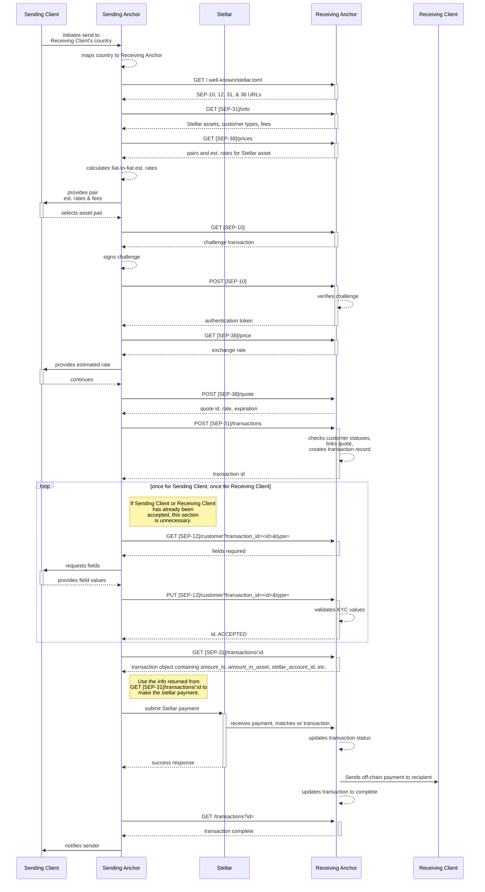

## Preamble

```
SEP: 0031
Title: Cross-Border Payments API
Author: SDF
Status: Active
Created: 2020-04-07
Updated: 2024-07-23
Version 3.0.0
```

## Simple Summary

This SEP defines a protocol for enabling payments between two financial accounts that exist outside the Stellar network.

## Abstract

The entities involved in a transaction are:

- A **Sending Client**: The owner of the origin financial account.
- A **Sending Anchor**: The business receiving funds from the Sending Client and delivering them to the Receiving Anchor
  for the Receiving Client. Must have a business relationship with the Receiving Anchor.
- A **Receiving Anchor**: The business receiving funds from the Sending Anchor and delivering them to the Receiving
  Client.
- A **Receiving Client**: The owner of the destination financial account.

At a high level, the following steps are performed to complete a transaction:

1. The Sending Client sends funds from their financial account to the Sending Anchor's financial account
   (off/on-Stellar)
2. The Sending Anchor sends the funds to the Receiving Anchor's Stellar account (on-Stellar)
3. The Receiving Anchor sends funds to the Receiving Client's financial account (off/on-Stellar)

Typically, the Sending and Receiving Clients reside in different regulatory jurisdictions and therefore a payment
between their financial accounts must be facilitated by two business entities, the Sending and Receiving Anchors, who
have the necessary licenses in their respective jurisdictions.

## Example

Alice in Nigeria wants to send money to Bob in Europe. Alice signs up with NigeriaPay to make this payment to send money
directly into Bob’s bank account. Bob doesn’t need to do anything, or know anything about this payment, besides letting
Alice know what his bank account information is. Alice only needs to deal with her anchor (NigeriaPay). Alice passes
this information and her money to NigeriaPay, and NigeriaPay sends those funds to the EuroPay Anchor service, and
Europay deposits those funds into Bob’s bank account.

## Diagrams

The diagrams provided offer a detailed view of various flows that are possible using this protocol. Note that these
diagrams are opinionated. Variations of the these flows may also be sufficient.

### Completing a Transaction with a Firm Quote

This diagram demonstrates the interactions between the entities involved in a successful transaction. Specifically it
uses the [Receiving Anchor Asset Conversion](#receiving-anchor-asset-conversion) strategy defined described later in the
document.



## Prerequisites

- The Receiving Anchor must define `DIRECT_PAYMENT_SERVER` in their [`stellar.toml`](sep-0001.md).
- The Sending and Receiving Anchors must create bi-lateral agreements to interoperate with each other.
- If the Receiving Anchor requires KYC information for the Sending or Receiving Clients, the Receiving Anchor must
  implement [SEP-12](sep-0012.md) and define a `KYC_SERVER` in their [stellar.toml](sep-0001.md).
- If the Receiving Anchor supports the [Receiving Anchor Asset Conversion](#receiving-anchor-asset-conversion) flow
  using [SEP-38](sep-0038.md), `ANCHOR_QUOTE_SERVER` must be defined in their [`stellar.toml`](sep-0001.md).

## Authentication

Sending Anchors must authenticate with Receiving Anchors via [SEP-10 Web Authentication](sep-0010.md). Sending Anchors
must provide the Stellar account they will authenticate with to their Receiving Anchors, and Receiving Anchors must
ensure that the authenticated Stellar account belongs to a Sending Anchor for which a bi-lateral agreement has been
made.

The SEP-10 JWT be included as a header in requests to all endpoints:

```
Authorization: Bearer <JWT>
```

Any API request that fails to meet proper authentication should return a 403 Forbidden response.

Note that the source account of payments made by Sending Anchors can differ from the account used to authenticate with
Receiving Anchors. **Only the payment transaction's memo should be used to match incoming payments with the transaction
record in the Receiving Anchor's database**.

## HTTPS Only

This protocol involves the transfer of value, and so HTTPS is required for all endpoints for security. Anchors should
refuse to interact with any insecure HTTP endpoints.

## Content Type

All endpoints accept in requests the following `Content-Type`s:

- `application/json`

All endpoints respond with content type:

- `application/json`

## Asset Conversions and Liquidity Strategies

This protocol is designed for the common case where the Sending Client provides the Sending Anchor with a particular
asset (the source asset) and the Receiving Client receives a different asset (the destination asset). It is possible to
use this protocol when the Sending and Receiving clients wish to send and receive the same asset, but that is not the
common use case it has been designed.

When the source asset and destination assets are different, the source asset must be converted into the receiving asset
at some point prior to delivering funds to the Receiving Client. This conversion must be done by either the Sending
Anchor, the Stellar Network, or the Receiving Anchor. The subsections below outline the strategies used for each method.

### Sending Anchor Asset Conversion

The Sending Anchor can collect the source asset from the Sending Client and send the destination asset to the Receiving
Anchor.

This approach requires the Sending Anchor to provide an exchange rate, or quote, to the Sending Client. It also requires
the Sending Anchor to hold a balance of the destination asset on Stellar. The Sending Anchor would use Payment
operations to send the quoted amount of the destination asset to the Receiving Anchor.

### Stellar Network Asset Conversion

Instead of holding a balance of the destination asset on Stellar, the Sending Anchor can use Path Payments to convert
the source asset to the destination asset on the Stellar Network.

This approach requires a sufficiently liquid market to exist between the source and destination assets on the Stellar
Decentralized Exchange (SDEX).

### Receiving Anchor Asset Conversion

Finally, the Receiving Anchor can receive payments of the source asset on Stellar and deliver payments of the
destination asset to the Receiving Client.

This requires the Receiving Anchor to implement the [SEP-38 Anchor RFQ API](sep-0038.md), which enables the Receiving
Anchor to provide quotes to the Sending Anchor. These quotes can be
[indicative](https://www.investopedia.com/terms/i/indicativequote.asp) or
[firm](https://www.investopedia.com/terms/f/firmquote.asp). If a firm quote is used, the Stellar transaction _must_ be
submitted to the Stellar network prior to the quote's expiration. More specifically, the `created_at` timestamp returned
in the [Horizon GET /transactions/:id](https://developers.stellar.org/api/resources/transactions/) request must be
earlier than the quote's expiration.

## API Endpoints

- [`GET /info`](#get-info)
- [`POST /transactions`](#post-transactions)
- [`GET /transactions/:id`](#get-transaction)
- [`PATCH /transactions/:id`](#patch-transaction)
- [`PUT /transactions/:id/callback`](#put-transaction-callback)

### Detailed Sending Anchor Flow

1. The Sending Client initiates a payment to the Receiving Client.
1. The Sending Anchor identifies the Receiving Anchor it will use for the payment based on the recipient's location.
1. The Sending Anchor makes a request to the Receiving Anchor's `GET /info` endpoint to collect asset information and
   the `transaction.fields` describing the transaction-related information required by the Receiving Anchor.
1. Optionally the Sending Anchor can pre-register clients using [SEP-12 PUT /customer](sep-0012.md#customer-put) and
   obtain the `id`s for each client.
1. If the Receiving Anchor supports the [SEP-38 Anchor RFQ API](sep-0038.md), the Sending Anchor can request a quote
   from the Receiving Anchor. See the [Receiving Anchor Asset Conversion](#receiving-anchor-asset-conversion) section
   for more information.
1. The Sending Anchor makes a `POST /transactions` request to create a transaction record with the Receiving Anchor.
   This request contains the `id`s returned by the `PUT /customer` requests, the `transaction.fields` values collected
   from the Sending Client, as well as the transaction information. The response will include a `id` that will be used
   to check the transaction data and status.
1. Optionally, the Sending Anchor makes a `PUT /transactions/:id/callback` request to register a URL that the Receiving
   Anchor will make requests to when the transaction's status changes.
1. The Sending Anchor makes `GET /customer/transaction_id=<id>&type=<customer_type>` request to the Receiving Anchor for
   each of the Sending and Receiving Client. The response includes the customer `status` and the [SEP-9] KYC attributes
   required for registering a client of the associated `type`.
1. If the customer `status` is not `ACCEPTED`, the Sending Anchor must collect the required KYC information from the
   Sending Client and make a `PUT /customer` request to the Receiving Anchor. Repeat until customer's response `status`
   becomes `ACCEPTED`
1. The Sending Anchor makes a `GET /transactions/:id` request to ensure the status is `pending_sender`. If it is not,
   the Sending Anchor must wait until it receives a callback request or poll the `GET /transactions/:id` endpoint until
   the status becomes `pending_sender`.
1. The Sending Anchor submits the payment transaction to Stellar using the information provided in the
   `GET /transactions/:id` response.
1. If a callback was not registered, the Sending Anchor makes `GET /transactions/:id` requests until the transaction's
   `status` is `completed`, `error`, `pending_customer_info_update`, or `pending_transaction_info_update`. Otherwise,
   the Sending Anchor will receive status updates from the Receiving Anchor at the registered callback URL.
1. If `completed`, the Sending Anchor should notify the Sending Client that funds have been delivered to the Receiving
   Client.
1. If `error`, the Receiving Anchor should be contacted to resolve the situation.
1. If `pending_transaction_info_update`, the `transaction.fields` values collected from the Sending Client were invalid
   and must be corrected by the Sending Client. See the
   [Pending Transaction Info Update](#pending-transaction-info-update) section for more information.
1. If `pending_customer_info_update`, the SEP-9 KYC values collected were invalid and must be corrected by the Sending
   Client. See the [Pending Customer Info Update](#pending-customer-info-update) section for more information.
1. After providing the Receiving Anchor with updated values, the status should ultimately change to `completed`.

### Detailed Receiving Anchor Flow

1. The Sending Anchor makes a request to the Receiving Anchor's `GET /info` endpoint.
1. The Sending Anchor makes a `SEP-12 GET /customer` request for the Sending and Receiving Clients if required.
1. The Sending Anchor makes a `SEP-12 PUT /customer` request for the Sending and Receiving Clients if required.
1. The Receiving Anchor must validate the KYC data provided and reject the request with useful error messages if
   invalid.
1. The Sending Anchor may request a quote using the `SEP-38 GET /price` or `SEP-38 POST /quote` endpoints.
1. The Sending Anchor makes a `POST /transactions` request.
1. The Receiving Anchor must ensure the `asset_code`, `amount`, transaction `fields`, and customers IDs are valid. The
   Sending Anchor may provide a `destination_asset` attribute if the Receiving Anchor supports the exchange of
   `asset_code` and `destination_asset` via [SEP-38](sep-0038.md), and if a firm quote was provided previously the
   Sending Anchor may provide the `quote_id` as well.
1. The Receiving Anchor must create a transaction record in their database and expose it via `GET /transactions/:id`.
1. Transactions should initially be `pending_sender`. If any preprocessing is required before receiving a payment, mark
   the transaction as `pending_receiver` until ready to receive funds.
1. The Receiving Anchor then waits to receive the payment identified by the `stellar_memo` included in the
   `POST /transactions` response.
1. Once the Stellar payment has been received and matched with the internal transaction record, the Receiving Anchor
   must attempt to transfer an equivalent amount of the asset (minus fees) off-chain to the Receiving Client using the
   KYC and rails data collected by the Sending Anchor.
1. If the off-chain payment succeeds, the transaction's status should be updated to `completed`.
1. If the off-chain payment cannot be received by the Receiving Client almost immediately, the transaction's status
   should be updated to `pending_external` until received.
1. If the off-chain payment fails, the Receiving Anchor must determine why, which is outside the scope of this document.
   Once determined, the Receiving Anchor must either correct it themselves (internal error) or receive updated values
   from the Sending Anchor for the fields that were discovered to be invalid.
1. If the invalid values were described in `GET /info`'s `transaction.fields` object, the transaction's status should be
   updated to `pending_transaction_info_update` and `required_info_updates` should contain an object describing the
   errors.
1. If the invalid values were described in `SEP-12 GET /customer` responses, the transaction's status should be updated
   to `pending_customer_info_update` and the invalid field names should be returned in the next `GET /customer?id=`
   request for each Client.
1. The Sending Anchor will detect the transaction's status and invalid fields, collect the info from the Sending Client,
   and make requests to the Receiving Anchor containing the updated information.
1. Once the provided information is validated, the Receiving Anchor should update the transaction's status to
   `pending_receiver` and retry the off-chain transfer. This loop of attempting the transfer and waiting for updated
   information should continue until the transfer is successful.
1. If the Receiving Anchor decides to refund the funds to the Sending Anchor, the transaction's status should be updated
   to `refunded` and the `refunds` field must be populated.

### GET Info

#### Request

```
GET DIRECT_PAYMENT_SERVER/info
```

Allows an anchor to communicate basic info about what currencies their `DIRECT_PAYMENT_SERVER` supports receiving from
partner anchors.

Request parameters:

| Name   | Type   | Description                                                                                                                                                                       |
| ------ | ------ | --------------------------------------------------------------------------------------------------------------------------------------------------------------------------------- |
| `lang` | string | (optional) Defaults to `en`. Language code specified using [ISO 639-1](https://en.wikipedia.org/wiki/ISO_639-1). `description` fields in the response should be in this language. |

#### Response

The response should be a JSON object like:

```json
{
  "receive": {
    "USDC": {
      "quotes_supported": true,
      "quotes_required": false,
      "fee_fixed": 5,
      "fee_percent": 1,
      "min_amount": 0.1,
      "max_amount": 1000,
      "sep12": {
        "sender": {
          "types": {
            "sep31-sender": {
              "description": "U.S. citizens limited to sending payments of less than $10,000 in value"
            },
            "sep31-large-sender": {
              "description": "U.S. citizens that do not have sending limits"
            },
            "sep31-foreign-sender": {
              "description": "non-U.S. citizens sending payments of less than $10,000 in value"
            }
          }
        },
        "receiver": {
          "types": {
            "sep31-receiver": {
              "description": "U.S. citizens receiving USD"
            },
            "sep31-foreign-receiver": {
              "description": "non-U.S. citizens receiving USD"
            }
          }
        }
      }
    }
  }
}
```

The JSON object contains an entry for each Stellar asset that the Receiving Anchor supports receiving from the Sending
Anchor.

If the Receiving Anchor supports [SEP-38](sep-0038.md), the Sending Client can check the
[`SEP-38 GET /prices`](sep-0038.md#get-prices) endpoint to determine which off-chain assets the Receiving Anchor can
deliver to recipients in exchange for an asset listed in the [`SEP-31 GET /info` response](#get-info). If the Receiving
Anchor does not provide exchange rates for an asset, it is assumed that the Stellar asset can be exchanged 1-for-1 with
the corresponding off-chain asset, after fees have been applied.

#### Asset Object Schema

| Name                  | Type    | Description                                                                                                                                                                                                                                             |
| --------------------- | ------- | ------------------------------------------------------------------------------------------------------------------------------------------------------------------------------------------------------------------------------------------------------- |
| `sep12`               | object  | An object containing `sender` and `receiver` keys.                                                                                                                                                                                                      |
| `min_amount`          | number  | (optional) Minimum amount. No limit if not specified.                                                                                                                                                                                                   |
| `max_amount`          | number  | (optional) Maximum amount. No limit if not specified.                                                                                                                                                                                                   |
| `fee_fixed`           | number  | (optional) A fixed fee in units of the Stellar asset. Leave blank if there is no fee or fee calculation cannot be modeled using a fixed and percentage fee.                                                                                             |
| `fee_percent`         | number  | (optional) A percentage fee in percentage points. Leave blank if there is no fee or fee calculation cannot be modeled using a fixed and percentage fee.                                                                                                 |
| `sender_sep12_type`   | string  | (**deprecated**, optional) The value of the `type` parameter the Sending Anchor should use for a `SEP-12 GET /customer` request. This field can be omitted if no KYC is necessary. Use a value from `sep12.sender.types` instead if any are present.    |
| `receiver_sep12_type` | string  | (**deprecated**, optional) The value of the `type` parameter the Sending Anchor should use for a `SEP-12 GET /customer` request. This field can be omitted if no KYC is necessary. Use a values from `sep12.receiver.types` instead if any are present. |
| `fields`              | object  | (**deprecated**, optional) An object containing the per-transaction parameters required in `POST /transactions` requests. Pass [SEP-9] fields via [SEP-12 PUT /customer](sep-0012.md#customer-put) instead.                                             |
| `quotes_supported`    | boolean | (optional) If true, the Receiving Anchor can deliver the off-chain assets listed in the [`SEP-38 GET /prices`](sep-0038.md#get-prices) response in exchange for receiving the Stellar asset.                                                            |
| `quotes_required`     | boolean | (optional) If true, the Receiving Anchor can only deliver an off-chain asset listed in the [`SEP-38 GET /prices`](sep-0038.md#get-prices) response in exchange for receiving the Stellar asset.                                                         |

#### `sep12` Object Schema

| Name       | Type   | Description                                                                                                  |
| ---------- | ------ | ------------------------------------------------------------------------------------------------------------ |
| `sender`   | object | An object containing a `types` key if KYC information is required for the Sending Client, empty otherwise.   |
| `receiver` | object | An object containing a `types` key if KYC information is required for the Receiving Client, empty otherwise. |

#### `types` Object Schema

| Name    | Type   | Description                                                                                                                                                                           |
| ------- | ------ | ------------------------------------------------------------------------------------------------------------------------------------------------------------------------------------- |
| `types` | object | (optional) An object containing the accepted values for the `type` parameter in [SEP-12](sep-0012.md) requests. Each key should map to an object with a human-readable `description`. |

If KYC is required for a Sending or Receiving client in some cases but not others, it is recommended to provide values
in the respective `types` object for all cases and return an empty `fields` object from
[SEP-12 GET /customer](https://github.com/stellar/stellar-protocol/blob/master/ecosystem/sep-0012.md#customer-get) for
the cases where no KYC is necessary.

#### `fields` Object Schema

| Name     | Type   | Description                                    |
| -------- | ------ | ---------------------------------------------- |
| `fields` | object | An object containing single `transaction` key. |

#### `transaction` Object Schema

| Name          | Type    | Description                                         |
| ------------- | ------- | --------------------------------------------------- |
| `description` | string  | A description of field to show to user.             |
| `choices`     | array   | (optional) A list of possible values for the field. |
| `optional`    | boolean | (optional) false if not specified.                  |

### POST Transactions

#### Request

This request initiates a payment. The Sending and Receiving Client must be registered via [SEP-12](sep-0012.md) if
required by the Receiving Anchor.

The following is an example request body if [Sending Anchor Asset Conversions](#sending-anchor-asset-conversion) or
[Stellar Network Asset Conversions](#stellar-network-asset-conversion) are used, and it will result in a 1-for-1 (minus
fees) conversion from USDC to USD.

```
POST DIRECT_PAYMENT_SERVER/transactions
Content-Type: application/json

{
  "amount": 100,
  "asset_code": "USDC",
  "asset_issuer": "GDRHDSTZ4PK6VI3WL224XBJFEB6CUXQESTQPXYIB3KGITRLL7XVE4NWV",
  "sender_id": "d2bd1412-e2f6-4047-ad70-a1a2f133b25c",
  "receiver_id": "137938d4-43a7-4252-a452-842adcee474c"
}
```

---

The following is an example request body if the Sending Anchor requested an _indicative_ quote from
[`SEP-38 GET /price`](sep-0038.md#get-price) and found the _estimated_ rate acceptable.

Note that the amount delivered to the Receiving Client in this scenario varies depending on the exchange rate used by
the Receiving Anchor, which may differ from the rate provided in the `GET /price` response.

```
POST DIRECT_PAYMENT_SERVER/transactions
Content-Type: application/json

{
  "amount": 100,
  "asset_code": "USDC",
  "asset_issuer": "GDRHDSTZ4PK6VI3WL224XBJFEB6CUXQESTQPXYIB3KGITRLL7XVE4NWV",
  "destination_asset": "iso4217:BRL",
  "sender_id": "d2bd1412-e2f6-4047-ad70-a1a2f133b25c",
  "receiver_id": "137938d4-43a7-4252-a452-842adcee474c"
}
```

---

The following is an example request body if the Sending Anchor requested a _firm_ quote from
[`SEP-38 POST /quote`](sep-0038.md#post-quote) and found the rate acceptable. In this case, the Receiving Anchor must
ensure that the information passed in the `POST /transactions` request matches the assets and amounts defined in the
`POST /quote` request and response.

```
POST DIRECT_PAYMENT_SERVER/transactions
Content-Type: application/json

{
  "amount": 100,
  "asset_code": "USDC",
  "asset_issuer": "GDRHDSTZ4PK6VI3WL224XBJFEB6CUXQESTQPXYIB3KGITRLL7XVE4NWV",
  "destination_asset": "iso4217:BRL",
  "quote_id": "2bc5b322-5117-413f-869f-e7ca494cb1a4",
  "sender_id": "d2bd1412-e2f6-4047-ad70-a1a2f133b25c",
  "receiver_id": "137938d4-43a7-4252-a452-842adcee474c"
}
```

##### Request Parameters

| Name                | Type                                                                                                                                                                                                                                                                                      | Description                                                                                                                                                                                                                                                                                                                                                                                                                                                                                       |
| ------------------- | ----------------------------------------------------------------------------------------------------------------------------------------------------------------------------------------------------------------------------------------------------------------------------------------- | ------------------------------------------------------------------------------------------------------------------------------------------------------------------------------------------------------------------------------------------------------------------------------------------------------------------------------------------------------------------------------------------------------------------------------------------------------------------------------------------------- |
| `amount`            | number                                                                                                                                                                                                                                                                                    | Amount of the Stellar asset sent to the Receiving Anchor.                                                                                                                                                                                                                                                                                                                                                                                                                                         |
| `asset_code`        | string                                                                                                                                                                                                                                                                                    | Code of the asset the Sending Anchor intends to send. This must match one of the entries listed in the receiving anchor's `GET /info` endpoint.                                                                                                                                                                                                                                                                                                                                                   |
| `asset_issuer`      | string                                                                                                                                                                                                                                                                                    | (optional) The issuer of the Stellar asset the Sending Anchor intends to send. If not specified, the asset sent must be issued by the Receiving Anchor.                                                                                                                                                                                                                                                                                                                                           |
| `destination_asset` | string                                                                                                                                                                                                                                                                                    | (optional) The off-chain asset the Receiving Anchor will deliver to the Receiving Client. The value must match one of the `asset` values included in a [`SEP-38 GET /prices?sell_asset=stellar:<asset_code>:<asset_issuer>`](sep-0038.md#get-prices) response using [SEP-38 Asset Identification Format](sep-0038.md#asset-identification-format). If neither this field nor `quote_id` are set, it's assumed that [Sending Anchor Asset Conversions](#sending-anchor-asset-conversion) was used. |
| `quote_id`          | string                                                                                                                                                                                                                                                                                    | (optional) The `id` returned from a `SEP-38 POST /quote` response. If this attribute is specified, the values for the fields defined above must match the values associated with the quote.                                                                                                                                                                                                                                                                                                       |
| `sender_id`         | `string`                                                                                                                                                                                                                                                                                  | (optional) The ID included in the [SEP-12 PUT /customer](https://github.com/stellar/stellar-protocol/blob/master/ecosystem/sep-0012.md#customer-put) response for the Sending Client. Required if the Receiving Anchor requires SEP-12 KYC on the Sending Client.                                                                                                                                                                                                                                 |
| `receiver_id`       | `string`                                                                                                                                                                                                                                                                                  | (optional) The ID included in the [SEP-12 PUT /customer](https://github.com/stellar/stellar-protocol/blob/master/ecosystem/sep-0012.md#customer-put) response for the Receiving Client. Required if the Receiving Anchor requires SEP-12 KYC on the Receiving Client.                                                                                                                                                                                                                             |
| `fields`            | object                                                                                                                                                                                                                                                                                    | (**deprecated**, optional) An object containing the values requested by the Receiving Anchor in the `GET /info` endpoint. Pass [SEP-9] fields via [SEP-12 PUT /customer](sep-0012.md#customer-put) instead.                                                                                                                                                                                                                                                                                       |
| `lang`              | string                                                                                                                                                                                                                                                                                    | (optional) Defaults to `en`. Language code specified using [ISO 639-1](https://en.wikipedia.org/wiki/ISO_639-1). Any human-readable error codes or field descriptions will be returned in this language.                                                                                                                                                                                                                                                                                          |
| `refund_memo`       | (optional) The memo the Receiving Anchor must use when sending refund payments back to the Sending Anchor. If not specified, the Receiving Anchor should use the same memo the Sending Anchor used to send the original payment. If specified, `refund_memo_type` must also be specified. |
| `refund_memo_type`  | (optional) The type of the `refund_memo`. Can be `id`, `text`, or `hash`. See the [memos](https://developers.stellar.org/docs/encyclopedia/memos) documentation for more information. If specified, `refund_memo` must also be specified.                                                 |

#### Responses

##### Success (201 Created)

This is the successful case where a Receiving Anchor either confirms that they can fulfill this payment as described or
that confirmation is pending.

Anchors must check for whether `stellar_account_id`, `stellar_memo`, & `stellar_memo_type` values are present in the
response.

If these values are not present, the Receiving Anchor is processing the information sent and determining if the
transaction can proceed. In this case, the transaction's status is `pending_receiver` and the Sending Anchor should use
monitor the transaction until it's status moves to `pending_sender` or `error`.

When the transaction status moves to `pending_sender`, the Stellar account & memo fields should be populated.

Sending Anchors can monitor the transaction's status by registering a callback URL via
[`PUT /transactions/:id/callback`](#put-transaction-callback) or by polling [`GET /transactions/:id`](#get-transaction).

| Name                 | Type   | Description                                                                             |
| -------------------- | ------ | --------------------------------------------------------------------------------------- |
| `id`                 | string | The persistent identifier to check the status of this payment transaction.              |
| `stellar_account_id` | string | (optional) The Stellar account to send payment to.                                      |
| `stellar_memo_type`  | string | (optional) The type of memo to attach to the Stellar payment (`text`, `hash`, or `id`). |
| `stellar_memo`       | string | (optional) The memo to attach to the Stellar payment.                                   |

##### Customer Info Needed (400 Bad Request)

In the case where the Sending Anchor didn't provide all the KYC information requested in `SEP-12 GET /customer`, or
where the Receiving Anchor requires additional KYC information after `amount`, the response should include a 400 status
code and the following body. The sender should then retry both the `SEP-12 GET /customer` request to collect the
additional fields and the `SEP-12 PUT /customer` request including all fields described in the `SEP-12 GET /customer`
response.

After the SEP-12 step is complete, the sender can then retry the `POST /transactions` request.

| Name    | Type   | Description                                                                                                                                                                                                                   |
| ------- | ------ | ----------------------------------------------------------------------------------------------------------------------------------------------------------------------------------------------------------------------------- |
| `error` | string | `customer_info_needed`                                                                                                                                                                                                        |
| `type`  | string | (optional) A string for the `type` URL argument the Sending Anchor should use when making the `SEP-12 GET /customer` request. The value should be included in the `sender.types` or `receiver.types` object from `GET /info`. |

##### Transaction Info Needed (400 Bad Request)

In the case where the Sending Anchor didn't provide all the information requested in `GET /info`, the response should
include a 400 status code the following body. The Sending Anchor should then retry the entire request including all the
previously sent fields plus the fields described in the response.

| Name     | Type   | Description                                                                                            |
| -------- | ------ | ------------------------------------------------------------------------------------------------------ |
| `error`  | string | `transaction_info_needed`                                                                              |
| `fields` | object | A key-value pair of missing fields in the same format as fields described in [`GET /info`](#get-info). |

##### Error (400 Bad Request)

In the case where the transaction cannot be completed, return an error response body containing an `error` key
describing the error in human-readable format in the language indicated in the request, for instance:

```json
{
  "error": "The amount was above the maximum limit"
}
```

\- or -

```json
{
  "error": "That bank account is restricted via AML laws"
}
```

### GET Transaction

The transaction endpoint enables Sending Clients to fetch information on a specific transaction with the Receiving
Anchor.

```
GET DIRECT_PAYMENT_SERVER/transactions/:id
```

Request parameters:

| Name | Type   | Description                |
| ---- | ------ | -------------------------- |
| `id` | string | The id of the transaction. |

On success the response should include a `200 OK` HTTP status code and the following body:

| Name          | Type   | Description                                       |
| ------------- | ------ | ------------------------------------------------- |
| `transaction` | object | The transaction that was requested by the client. |

`transaction` Object Schema

| Name                      | Type                | Description                                                                                                                                                                                                                                                                                                                                                        |
| ------------------------- | ------------------- | ------------------------------------------------------------------------------------------------------------------------------------------------------------------------------------------------------------------------------------------------------------------------------------------------------------------------------------------------------------------ |
| `id`                      | string              | The ID returned from the `POST /transactions` request that created this transaction record.                                                                                                                                                                                                                                                                        |
| `status`                  | string              | The status of the transaction. Values are outlined below.                                                                                                                                                                                                                                                                                                          |
| `status_eta`              | number              | (optional) The estimated number of seconds until a status change is expected.                                                                                                                                                                                                                                                                                      |
| `status_message`          | string              | (optional) A human-readable message describing the status of the transaction.                                                                                                                                                                                                                                                                                      |
| `amount_in`               | string              | (optional) The amount of the Stellar asset received or to be received by the Receiving Anchor. Excludes any fees charged after Receiving Anchor receives the funds. If a `quote_id` was used, the `amount_in` should be equals to both: (i) the `amount` value used in the [`POST /transactions`](#post-transactions) request; and (ii) the quote's `sell_amount`. |
| `amount_in_asset`         | string              | (optional) The asset received or to be received by the Receiving Anchor. Must be present if `quote_id` or `destination_asset` was included in the `POST /transactions` request. The value must be in [SEP-38 Asset Identification Format](sep-0038.md#asset-identification-format).                                                                                |
| `amount_out`              | string              | (optional) The amount sent or to be sent by the Receiving Anchor to the Receiving Client. When using a `destination_asset` in the [`POST /transactions`](#post-transactions) request, it's expected that this value is only populated after the Receiving Anchor receives the incoming payment. Should be equals to `quote.buy_amount` if a `quote_id` was used.   |
| `amount_out_asset`        | string              | (optional) The asset delivered to the Receiving Client. Must be present if `quote_id` or `destination_asset` was included in the `POST /transactions` request. The value must be in [SEP-38 Asset Identification Format](sep-0038.md#asset-identification-format).                                                                                                 |
| `amount_fee`              | string              | (**deprecated**, optional) The amount of fee charged by the Receiving Anchor. Should be equals `quote.fee.total` if a `quote_id` was used.                                                                                                                                                                                                                         |
| `amount_fee_asset`        | string              | (**deprecated**, optional) The asset in which fees are calculated in. Must be present if `quote_id` or `destination_asset` was included in the `POST /transactions` request. The value must be in [SEP-38 Asset Identification Format](sep-0038.md#asset-identification-format). Should be equals `quote.fee.asset` if a `quote_id` was used.                      |
| `fee_details`             | object              | Description of fee charged by the anchor. The schema for this object is defined in the [Fee Details Object Schema](#fee-details-object-schema) section below. If `quote_id` is present, it should match the referenced quote's `fee` object.                                                                                                                       |
| `quote_id`                | string              | (optional) The ID of the quote used to create this transaction. Should be present if a `quote_id` was included in the `POST /transactions` request. Clients should be aware though that the `quote_id` may not be present in older implementations.                                                                                                                |
| `stellar_account_id`      | string              | (optional) The Receiving Anchor's Stellar account that the Sending Anchor will be making the payment to.                                                                                                                                                                                                                                                           |
| `stellar_memo_type`       | string              | (optional) The type of memo to attach to the Stellar payment: `text`, `hash`, or `id`.                                                                                                                                                                                                                                                                             |
| `stellar_memo`            | string              | (optional) The memo to attach to the Stellar payment.                                                                                                                                                                                                                                                                                                              |
| `started_at`              | UTC ISO 8601 string | (optional) Start date and time of transaction.                                                                                                                                                                                                                                                                                                                     |
| `updated_at`              | UTC ISO 8601 string | (optional) The date and time of transaction reaching the current `status`.                                                                                                                                                                                                                                                                                         |
| `completed_at`            | UTC ISO 8601 string | (optional) Completion date and time of transaction.                                                                                                                                                                                                                                                                                                                |
| `stellar_transaction_id`  | string              | (optional) The transaction_id on Stellar network of the transfer that initiated the payment.                                                                                                                                                                                                                                                                       |
| `external_transaction_id` | string              | (optional) The ID of transaction on external network that completes the payment into the receivers account.                                                                                                                                                                                                                                                        |
| `refunded`                | boolean             | (**deprecated**, optional) This field is deprecated in favor of the `refunds` object. True if the transaction was refunded in full. False if the transaction was partially refunded or not refunded. For more details about any refunds, see the `refunds` object.                                                                                                 |
| `refunds`                 | object              | (optional) An object describing any on-chain refund associated with this transaction. The schema for this object is defined in the [Refunds Object Schema](#refunds-object-schema) section below.                                                                                                                                                                  |
| `required_info_message`   | string              | (optional) A human-readable message indicating any errors that require updated information from the sender.                                                                                                                                                                                                                                                        |
| `required_info_updates`   | object              | (optional) A set of fields that require update values from the Sending Anchor, in the same format as described in [GET /info](#get-info). This field is only relevant when `status` is `pending_transaction_info_update`.                                                                                                                                          |

`status` should be one of:

- `pending_sender` -- awaiting payment to be sent by Sending Anchor.
- `pending_stellar` -- transaction has been submitted to Stellar network, but is not yet confirmed.
- `pending_customer_info_update` -- certain pieces of information need to be updated by the Sending Anchor. See the
  [Pending Customer Info Update](#pending-customer-info-update) section for more information.
- `pending_transaction_info_update` -- certain pieces of information need to be updated by the Sending Anchor. See the
  [Pending Transaction Info Update](#pending-transaction-info-update) section for more information.
- `pending_receiver` -- payment is being processed by the Receiving Anchor.
- `pending_external` -- payment has been submitted to external network, but is not yet confirmed.
- `completed` -- funds have been delivered to the Receiving Client.
- `refunded` -- funds have been refunded to the Sending Anchor.
- `expired` -- funds were never received by the anchor and the transaction is considered abandoned by the Sending
  Client. If a SEP-38 quote was specified when the transaction was initiated, the transaction should expire when the
  quote expires, otherwise anchors are responsible for determining when transactions are considered expired.
- `error` -- catch-all for any error not enumerated above.


#### Refunds Object Schema

| Name              | Type   | Description                                                                                                                                                                            |
| ----------------- | ------ | -------------------------------------------------------------------------------------------------------------------------------------------------------------------------------------- |
| `amount_refunded` | string | The total amount refunded to the Sending Anchor, in units of `amount_in_asset`. If a full refund was issued, this amount should match `amount_in`.                                     |
| `amount_fee`      | string | The total amount charged in fees for processing all refund payments, in units of `amount_in_asset`. The sum of all `fee` values in the `payments` object list should equal this value. |
| `payments`        | array  | A list of objects containing information on the individual payments made back to the Sending Anchor as refunds. The schema for these objects is defined in the section below.          |

##### Refund Payment Object Schema

| Name     | Type   | Description                                                                                                               |
| -------- | ------ | ------------------------------------------------------------------------------------------------------------------------- |
| `id`     | string | The Stellar transaction hash of the transaction that included the refund payment. This id is not guaranteed to be unique. |
| `amount` | string | The amount sent back to the Sending Anchor for the payment identified by `id`, in units of `amount_in_asset`.             |
| `fee`    | string | The amount charged as a fee for processing the refund, in units of `amount_in_asset`.                                     |

#### Amount Formulas

The following should hold true for all transaction records, assuming `amount_in_asset` and `amount_out_asset` are the
same. If they are different, the following should still hold true after converting all amounts to units of one of the
assets.

```js
amount_out = amount_in - amount_fee - refunds.amount_refunded - refunds.amount_fee; // when `quote_id` is used, the price used to calculate the conversion between amounts is `quote.price` and not `quote.total_price`.
```

```js
refunds.amount_refunded = sum(refunds.payments[].amount)
```

```js
refunds.amount_fee = sum(refunds.payments[].fee)
```

If a `quote_id` was used in the request, the following should hold true.

```js
post_transaction.amount = get_transaction.amount_in = quote.sell_amount;
```

```js
get_transaction.amount_out = quote.buy_amount;
```

```js
amount_fee = sum(quote.fee.total);
```

```js
amount_fee_asset = quote.fee.asset;
```

#### Fee Details Object Schema

| Name      | Type   | Description                                                                                                                                                           |
| --------- | ------ | --------------------------------------------------------------------------------------------------------------------------------------------------------------------- |
| `total`   | string | The total amount of fee applied.                                                                                                                                      |
| `asset`   | string | The asset in which the fee is applied, represented through the [Asset Identification Format](sep-0038.md#asset-identification-format).                                |
| `details` | array  | (optional) An array of objects detailing the fees that were used to calculate the conversion price. This can be used to datail the price components for the end-user. |

##### Fee Details Details Object Schema

| Name          | Type   | Description                                                                                                                                |
| ------------- | ------ | ------------------------------------------------------------------------------------------------------------------------------------------ |
| `name`        | string | The name of the fee, for example `ACH fee`, `Brazilian conciliation fee`, `Service fee`, etc.                                              |
| `description` | string | (optional) A text describing the fee.                                                                                                      |
| `amount`      | string | The amount of asset applied. If `fee_details.details` is provided, `sum(fee_details.details.amount)` should be equals `fee_details.total`. |

#### Example response

Pending external (without quotes):

```json
{
  "transaction": {
    "id": "82fhs729f63dh0v4",
    "status": "pending_external",
    "status_eta": 3600,
    "status_message": "Payment has been initiated via ACH deposit.",
    "stellar_transaction_id": "b9d0b2292c4e09e8eb22d036171491e87b8d2086bf8b265874c8d182cb9c9020",
    "external_transaction_id": "ABCDEFG1234567890",
    "stellar_account_id": "GBRPYHIL2CI3FNQ4BXLFMNDLFJUNPU2HY3ZMFSHONUCEOASW7QC7OX2H",
    "stellar_memo": "123456789",
    "stellar_memo_type": "id",
    "amount_in": "18.34",
    "amount_out": "18.24",
    "amount_fee": "0.1",
    "started_at": "2017-03-20T17:05:32Z"
  }
}
```

---

Pending transaction info update:

```json
{
  "transaction": {
    "id": "82fhs729f63dh0v4",
    "status": "pending_transaction_info_update",
    "status_eta": 3600,
    "stellar_transaction_id": "b9d0b2292c4e09e8eb22d036171491e87b8d2086bf8b265874c8d182cb9c9020",
    "external_transaction_id": "ABCDEFG1234567890",
    "amount_in": "18.34",
    "amount_out": "18.24",
    "amount_fee": "0.1",
    "stellar_account_id": "GBRPYHIL2CI3FNQ4BXLFMNDLFJUNPU2HY3ZMFSHONUCEOASW7QC7OX2H",
    "stellar_memo": "123456789",
    "stellar_memo_type": "id",
    "started_at": "2017-03-20T17:05:32Z",
    "required_info_message": "The bank reported an incorrect account number for the receiver, please ensure the account matches legal documents",
    "required_info_updates": {
      "transaction": {
        "receiver_account_number": {
          "description": "The receiver's bank account number"
        }
      }
    }
  }
}
```

---

Completed:

```json
{
  "transaction": {
    "id": "82fhs729f63dh0v4",
    "status": "completed",
    "amount_in": "110",
    "amount_out": "90",
    "amount_fee": "5",
    "started_at": "2017-03-20T17:05:32Z",
    "stellar_transaction_id": "b9d0b2292c4e09e8eb22d036171491e87b8d2086bf8b265874c8d182cb9c9020",
    "stellar_account_id": "GBRPYHIL2CI3FNQ4BXLFMNDLFJUNPU2HY3ZMFSHONUCEOASW7QC7OX2H",
    "stellar_memo": "123456789",
    "stellar_memo_type": "id",
    "refunds": {
      "amount_refunded": "10",
      "amount_fee": "5",
      "payments": [
        {
          "id": "54321ab047a193c6fda1c47f5962cbcca8708d79b87089ababd57532c21c5402",
          "amount": "10",
          "fee": "5"
        }
      ]
    }
  }
}
```

Pending external (with `quote_id`):

```json
{
  "transaction": {
    "id": "82fhs729f63dh0v4",
    "amount_in": "100.00",
    "amount_in_asset": "stellar:USDC:GA5ZSEJYB37JRC5AVCIA5MOP4RHTM335X2KGX3IHOJAPP5RE34K4KZVN",
    "amount_out": "500.00",
    "amount_out_asset": "iso4217:BRL",
    "amount_fee": "10.00",
    "amount_fee_asset": "stellar:USDC:GA5ZSEJYB37JRC5AVCIA5MOP4RHTM335X2KGX3IHOJAPP5RE34K4KZVN",
    "quote_id": "de762cda-a193-4961-861e-57b31fed6eb3",
    "started_at": "2017-03-20T17:05:32Z",
    "status": "pending_external",
    "status_eta": 3600,
    "stellar_transaction_id": "b9d0b2292c4e09e8eb22d036171491e87b8d2086bf8b265874c8d182cb9c9020",
    "external_transaction_id": "ABCDEFG1234567890",
    "stellar_account_id": "GBRPYHIL2CI3FNQ4BXLFMNDLFJUNPU2HY3ZMFSHONUCEOASW7QC7OX2H",
    "stellar_memo": "123456789",
    "stellar_memo_type": "id"
  }
}
```

Response body of the quote used in the above SEP-31 transaction:

```js
{
  "id": "de762cda-a193-4961-861e-57b31fed6eb3",
  "expires_at": "2022-05-19T07:42:23",
  "total_price": "0.20",      // 100/500
  "price": "0.18",            // (100-10)/500
  "sell_amount": "100.00",
  "sell_asset": "stellar:USDC:GA5ZSEJYB37JRC5AVCIA5MOP4RHTM335X2KGX3IHOJAPP5RE34K4KZVN",
  "buy_amount": "500.00",
  "buy_asset": "iso4217:BRL",
  "fee": {
    "total": "10.00",
    "asset": "stellar:USDC:GA5ZSEJYB37JRC5AVCIA5MOP4RHTM335X2KGX3IHOJAPP5RE34K4KZVN",
    "details": [
      {
        "name": "Service fee",
        "amount": "8.00"
      },
      {
        "name": "BRL deposit fee",
        "amount": "2.00"
      }
    ]
  }
}
```

If the transaction cannot be found, the endpoint should return a `404 NOT FOUND` result.

#### Pending Customer Info Update

In certain cases the Receiving Anchor might need to request updated information from the Sending Anchor. For example, if
the bank tells the Receiving Anchor that the provided Receiving Client's name is incorrect or missing a middle initial.
Since this information was sent via SEP-12, the transaction should go into the `pending_customer_info_update` state
until the Sending Anchor makes another `SEP-12 PUT /customer` request to update. The Sending Anchor can check which
fields need to be updated by making a `SEP-12 GET /customer` request. The Receiving Anchor should respond with a
`NEEDS_INFO` status, a `provided_fields` including all provided fields, and a `fields` including all fields need to be
updated .

1. `GET /transaction` and verify transaction status is `pending_customer_info_update`.
2. Get required fields via [SEP-12] `GET /customer` request. It is recommended to use the combination of
   `transaction_id` and customer type `type` as part of the request.
3. Collect user input for the required fields and use [SEP-12] `PUT /customer` endpoint to transfer the data
4. Repeat steps 2-3 until customer's response status becomes `ACCEPTED`.
5. `GET /transaction` should transition into `pending_receiver` status.

#### Pending Transaction Info Update (Deprecated)

Another possibility is that the per-transaction information provided in the `POST /transactions` `fields` object was
later discovered to be invalid. In this case, the transaction should go into the `pending_transaction_info_update` state
until the Sending Anchor makes a request to the endpoint outlined below. This approach is deprecated in favor of using
per-customer fields provided via [SEP-9] fields in [SEP-12 PUT /customer](sep-0012.md#customer-put) requests.

### PATCH Transaction (Deprecated)

This endpoint should only be used when the Receiving Anchor needs more info via the `pending_transaction_info_update`
status from the Sending Anchor. The `required_info_updates` transaction field should contain the fields required for the
update. If the Sending Anchor tries to update at a time when no info is requested, the Receiving Anchor should fail with
an error response. This approach is deprecated in favor of using per-customer fields provided via [SEP-9] fields in
[SEP-12 PUT /customer](sep-0012.md#customer-put) requests.

```
PATCH DIRECT_PAYMENT_SERVER/transactions/:id
```

Request parameters:

| Name     | Type   | Description                                                                                                                                                                       |
| -------- | ------ | --------------------------------------------------------------------------------------------------------------------------------------------------------------------------------- |
| `id`     | string | The id of the transaction.                                                                                                                                                        |
| `fields` | object | A key-pair object containing the values requested to be updated by the receiving anchor in the same format as `fields` in the [`POST /transactions`](#post-transactions) request. |

#### Example

```
PATCH DIRECT_PAYMENT_SERVER/transactions/82fhs729f63dh0v4

{
   "fields": {
      "transaction": {
         "receiver_bank_account": "12345678901234",
         "receiver_routing_number": "021000021"
      }
   }
}
```

#### Success 200 OK

If the information was successfully updated and all fields required for the transaction are patched, respond with a 200
status code, and return a response body matching `GET /transactions/:id`. The transaction should return to
`pending_receiver`, though it is possible that the information could still need to be updated again.

#### Not Found 404

If the transaction specified by `"id"` does not exist, return a 404 response.

#### Error 400

If the information was malformed, or if the sender tried to update data that isn't updatable, return a 400 with an
object containing an error message.

```json
{
  "error": "Supplied fields do not allow updates, please only try to updates the fields requested"
}
```

### PUT Transaction Callback

This endpoint can be used by the Sending Anchor to register a callback URL that the Receiving Anchor will make
`application/json` POST requests to containing the transaction object defined in the response to
[`GET /transaction/:id`](#get-transaction) whenever the transaction's `status` value has changed. Note that a callback
does not need to be made for the initial status of the transaction, which in most cases is `pending_sender`.

This endpoint should also support replacing a previously provided callback URL for the transaction. Receiving Anchors
should only make callback requests to the most recently provided URL per-transaction.

If the Receiving Anchor does not support making callback requests, this endpoint should return `404 Not Found`.

```
PUT DIRECT_PAYMENT_SERVER/transactions/:id/callback
```

```json
{
  "url": "https://sendinganchor.com/statusCallback"
}
```

Request:

| Name  | Type   | Description                                                                                                                                        |
| ----- | ------ | -------------------------------------------------------------------------------------------------------------------------------------------------- |
| `url` | string | A valid URL that can accept POST requests containing the transaction obejct defined in the response to [`GET /transaction/:id`](#get-transaction). |

Response:

The Receiving Anchor should respond with a `204 No Content` HTTP status.

### Callback POST

#### Request

```
POST [url from PUT request]
```

See the response to [`GET /transaction/:id`](#get-transaction) for the POST request fields.

In order to validate the integrity and provenance of the request, the Receiving Anchor MUST include a signature in the
HTTP Header `Signature` or `X-Stellar-Signature` (deprecated). Sending Anchors should support both headers until the
`X-Stellar-Signature` header is removed from the specification.

These headers MUST follow the specification: `t=<timestamp>, s=<base64 signature>` where:

- **timestamp** is the current Unix timestamp (number of seconds since epoch) at the time the callback is sent. This is
  used to assure the freshness of the request and to prevent this request to be replayed in the future.
- **base64 signature** is the base64 encoding of the request signature. We explain below how to compute and verify this
  signature. The signature is computed using the Stellar private key linked to the `SIGNING_KEY` field of the Receiving
  Anchor's [`stellar.toml`](sep-0001.md). Note that the timestamp and the Sending Anchor hostname will be part of the
  signature to prevent replay and relay attacks.

It is the Sending Anchor's responsibility to:

- Verify the signature using the corresponding Stellar `SIGNING_KEY` field of the Receiving Anchor's
  [`stellar.toml`](sep-0001.md).
- Verify the freshness of the request by comparing the `timestamp` in the request with the current timestamp at the time
  of the reception and discard every request above a threshold of few seconds (1 or 2 minute(s) maximum).
- Send a working callback URL to the Receiving Anchor.

### VERIFY signature

- Check that callback request has `Signature` or `X-Stellar-Signature` (deprecated) header
- Parse the header and extract:
  - Key `t`: **timestamp**
  - Key `s`: **base64 signature**
- Verify the request freshness: _current timestamp_ - **timestamp** < few seconds (1-2 minute(s) max)
- Extract the **body** of the request
- Base64 decode the **base64 signature** to get the **signature**
- Prepare the payload to verify the signature:
  - The **timestamp** (as a string)
  - The character `.`
  - The Sending Anchor host to send the callback request to
  - The character `.`
  - The **body**
- Verify the signature using the correct `SIGNING_KEY`

### COMPUTE signature

- Prepare the callback body
- Prepare the payload to sign:
  - Current timestamp (as a string)
  - The character `.`
  - The Sending Anchor host to send the callback request to
  - The character `.`
  - The callback request body
- Sign the payload `<timestamp>.<host>.<body>` using the Receiving Anchor private key
- Base64 encode the signature
- Build the `Signature` or `X-Stellar-Signature` (deprecated) header:
  - `Signature: t=<current timestamp>, s=<base64 encoded signature>`
  - `X-Stellar-Signature : t=<current timestamp>, s=<base64 encoded signature>`

#### Response

The sending anchor must respond with a `2XX` (ex. `204 No Content`) HTTP response code as long as the signature is
correct, the transaction specified with `id` exists and the request body adheres to the transaction object schema.

If the request is invalid, either because the transaction specified doesn't exist, the request body is not valid or the
signature is invalid, return a `400 Bad Request` JSON response. Note that this is a bug on the the Receiving Anchor's
side, and they should be notified in this case.

It is important to note that the Receiving Anchor is not obligated, at least by default (SLAs can be defined between the
parties), to retry if an unexpected status code is returned by the Sending Anchor. If Sending Anchors experience
unexpected downtime, it is recommended to poll all in-progress transactions to fetch current status values.

[SEP-9]: sep-0009.md
[SEP-12]: sep-0012.md
[SEP-38]: sep-0038.md

## Changelog

- `v3.0.0`: Update SEP31 with async kyc flow ([#1502](https://github.com/stellar/stellar-protocol/pull/1502))
- `v2.6.0`: Add `fee_details` field to the transaction object
  ([#1429](https://github.com/stellar/stellar-protocol/pull/1429))
- `v2.5.0`: Deprecate and make optional the use of per-transaction `fields` objects
  ([#1387](https://github.com/stellar/stellar-protocol/pull/1387))
- `v2.4.0`: Add `updated_at` to `GET /transactions/:id` response
  ([#1336](https://github.com/stellar/stellar-protocol/pull/1336))
- `v2.3.1`: Allow anchors to omit the deprecated `X-Stellar-Signature` header
  ([#1335](https://github.com/stellar/stellar-protocol/pull/1335))
- `v2.3.0`: Deprecate `X-Stellar-Signature` in favor of `Signature`
  ([#1333](https://github.com/stellar/stellar-protocol/pull/1333))
- `v2.2.0`: Add `refund_memo` & `refund_memo_type` to `POST /transactions` request.
  ([#1321](https://github.com/stellar/stellar-protocol/pull/1321))
- `v2.1.0`: Add the `refunded` status and updated the Detailed Receiving Anchor Flow.
  ([#1311](https://github.com/stellar/stellar-protocol/pull/1311))
- `v2.0.0`: Make `stellar_account_id`, `stellar_memo`, & `stellar_memo_type` optional in the `POST /transactions`
  response. Add the `status_message` attribute to `GET /transactions/:id`.
  ([#1294](https://github.com/stellar/stellar-protocol/pull/1294))
- `v1.10.0`: Add `quote_id` to the transaction object schema.
  ([#1268](https://github.com/stellar/stellar-protocol/pull/1268))
- `v1.9.0`: Add callback signature requirement. ([#1264](https://github.com/stellar/stellar-protocol/pull/1264))
- `v1.8.0`: Add `expired` transaction status. ([#1233](https://github.com/stellar/stellar-protocol/pull/1233))
- `v1.7.0`: Add a `PUT /transactions/:id/callback` endpoint for Sending Anchors to request callback requests when a
  transaction's `status` value changes. ([#1214](https://github.com/stellar/stellar-protocol/pull/1214))
- `v1.6.1`: Add information about how a SEP-31 transaction should populate the `amount_in`, `amount_out`, `amount_fee`
  and `amount_fee_asset` fields when a `quote_id` is used.
  ([#1204](https://github.com/stellar/stellar-protocol/pull/1204))
- `v1.6.0`: Updated the "Sending Anchor Flow" so the Sending Anchor needs to reach the `GET /transactions/:id` endpoint
  to get the payment information before sending the payment to the Receiving Anchor.
  ([#1203](https://github.com/stellar/stellar-protocol/pull/1203))
- `v1.5.5`: Updated the description of `PATCH /transactions`.
  ([#1166](https://github.com/stellar/stellar-protocol/pull/1166))
- `v1.5.4`: Add the state diagram of a SEP-31 transaction.
  ([#1164](https://github.com/stellar/stellar-protocol/pull/1164))
- `v1.5.3`: Clarify when `sender_id` and `receiver_id` attributes are required for `POST /transactions` requests.
  ([#1158](https://github.com/stellar/stellar-protocol/pull/1158))
- `v1.5.2`: Add a use case when the receiving client may receive on-stellar asset.
  ([#1149](https://github.com/stellar/stellar-protocol/pull/1149))
- `v1.5.1`: Add a sequence diagram for successful transactions using firm quotes.
  ([#1145](https://github.com/stellar/stellar-protocol/pull/1145))
- `v1.5.0`: Deprecate refunded boolean. Add refund object to transaction records.
  ([#1128](https://github.com/stellar/stellar-protocol/pull/1128))
