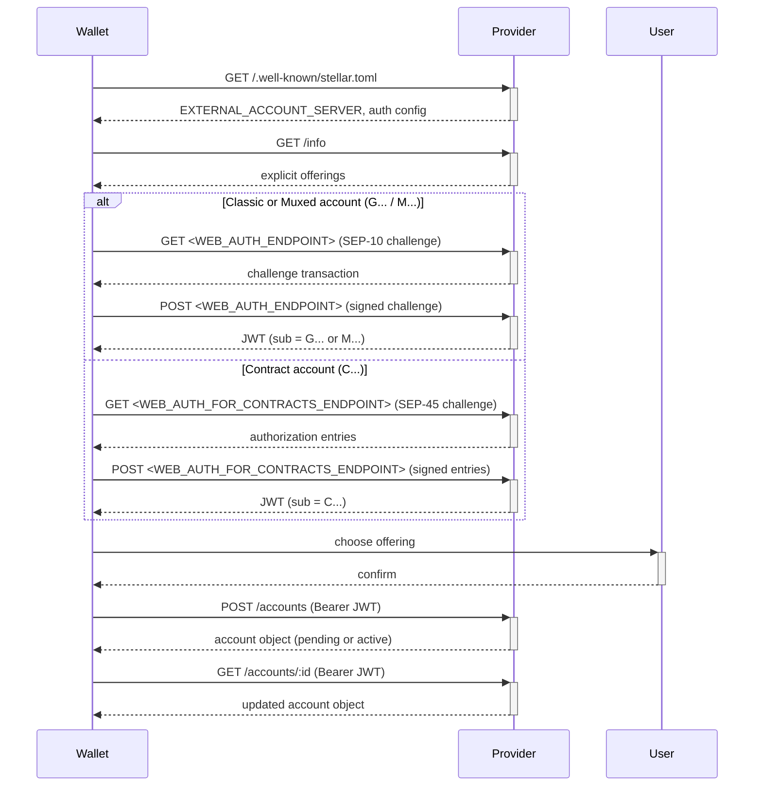

## Preamble

```
SEP: 0059
Title: External Account API
Author: Anthony Barker (@antb123)
Status: Draft
Created: 2026-03-19
Updated: 2026-05-15
Version: 0.4.0
Discussion: https://github.com/orgs/stellar/discussions/1902
```

## Summary

This SEP defines a standard API for wallets and other Stellar clients to
request provisioned inbound receiving instruments from a provider.

Examples include:

- crypto deposit addresses (e.g. Ethereum, Base, Arbitrum)
- virtual bank accounts (e.g. ACH virtual account, SEPA IBAN)
- bank account credentials (e.g. CLABE, SPEI)

The provisioned instrument is bound to the authenticated user's Stellar wallet
and is intended to receive off-chain or external-network deposits that settle
to that wallet.

This SEP uses bearer authentication obtained via [SEP-10](sep-0010.md) for
classic (G...) and muxed (M...) accounts, or [SEP-45](sep-0045.md) for contract
(C...) accounts. Providers supporting all Stellar account types must implement
both authentication protocols.

This SEP is independent from [SEP-6](sep-0006.md) and [SEP-24](sep-0024.md). It
provisions an account resource. It does not create a deposit transaction.

## Dependencies

- [SEP-1: stellar.toml](sep-0001.md) — service discovery
- [SEP-6: Deposit and Withdrawal API](sep-0006.md) — `instructions` payload
  shape, callback signature scheme
- [SEP-9: Standard KYC Fields](sep-0009.md) — credential field names
- [SEP-10: Stellar Web Authentication](sep-0010.md) — authentication for
  classic (G...) and muxed (M...) accounts
- [SEP-11: Txrep](sep-0011.md) — Stellar asset format
- [SEP-12: KYC API](sep-0012.md) — KYC remediation flow
- [SEP-45: Stellar Web Authentication for Contract Accounts](sep-0045.md) —
  authentication for contract (C...) accounts

## Motivation

[SEP-6](sep-0006.md) already allows anchors to return deposit instructions, but
those instructions are transaction-scoped: the wallet asks for instructions to
complete a specific deposit flow, and the anchor returns credentials for _that_
deposit. Many providers also need a standard way to provision reusable
receiving instruments outside a specific deposit or withdrawal flow.

This SEP standardizes that simpler object:

- discover what receiving instruments a provider supports
- request one for the authenticated user
- poll for its status
- retrieve the credentials needed to receive funds

The design stays close to existing Stellar conventions:

- discovery via [SEP-1](sep-0001.md)
- authentication via [SEP-10](sep-0010.md) or [SEP-45](sep-0045.md)
- credential fields via [SEP-9](sep-0009.md)
- credential payload shape and callback signing via [SEP-6](sep-0006.md)
- KYC remediation via [SEP-12](sep-0012.md)

### Why Not Extend SEP-6?

[SEP-6](sep-0006.md) models deposits as transactions. Each `GET /deposit` call
creates a new transaction with its own `id`, `status`, and lifecycle. Some
anchors have worked around this by returning the same deposit address across
multiple SEP-6 transactions
([stellar-protocol#1341](https://github.com/stellar/stellar-protocol/issues/1341)),
but this creates ambiguity: the client expects a transaction, the anchor
returns a reusable account, and reconciliation becomes unclear.

The core difference is resource identity:

| Concern             | SEP-6                                                        | SEP-59                                      |
| ------------------- | ------------------------------------------------------------ | ------------------------------------------- |
| Resource            | Transaction (one-time deposit flow)                          | Account (reusable receiving instrument)     |
| Lifecycle           | `incomplete` -> `pending_user_transfer_start` -> `completed` | `pending` -> `active` -> `deactivated`      |
| Credential scope    | Bound to one transaction                                     | Bound to one user, reusable across deposits |
| Idempotency         | Each call may create a new transaction                       | Same params return the same account         |
| `GET /transactions` | Lists deposit/withdrawal history                             | N/A -- accounts are not transactions        |

A SEP-6 extension
([stellar-protocol#1372](https://github.com/stellar/stellar-protocol/issues/1372))
could add async deposit instructions, but it would overload the transaction
model with account semantics. SEP-59 keeps both models clean: SEP-6 for
transactions, SEP-59 for accounts.

Providers may implement both. A provider can provision an account via SEP-59
and accept SEP-6 deposits into that same account. The `instructions` payload
uses the same [SEP-9](sep-0009.md) field names in both protocols.

If a provider needs transaction amount, quote context, flow-specific settlement
instructions, or any other transaction-scoped input before it can determine the
correct receiving instructions, the provider should use [SEP-6](sep-0006.md) or
[SEP-24](sep-0024.md) instead of SEP-59.

### Relationship to Stellar Account Types

Stellar supports three address types that may appear as authenticated subjects
and as settlement destinations in this SEP:

- **Classic accounts (G...)** are authenticated via [SEP-10](sep-0010.md). A
  classic account may optionally include a memo to identify a sub-account
  within a shared Stellar account.

- **Muxed accounts (M...)** are authenticated via [SEP-10](sep-0010.md). A
  muxed account (CAP-27) encodes a 64-bit sub-account ID directly in the
  address, solving Stellar-to-Stellar routing without on-chain memo
  coordination. A muxed account may appear directly as the `stellar_account` in
  a SEP-59 account object. When `stellar_account` is a muxed account, `memo`
  must be omitted.

- **Contract accounts (C...)** are authenticated via [SEP-45](sep-0045.md). A
  contract account is a Soroban smart contract that abstracts account
  ownership. Contract accounts are the sole authenticated subject in a SEP-45
  session. `memo` must not be used to encode ownership or sub-identity for a
  contract account; the contract account itself is the subject.

SEP-59 solves a different problem than any of these address types: provisioning
_off-chain_ or _external-network_ receiving instruments (bank accounts, crypto
addresses on other chains) that map to a Stellar destination. A muxed or
contract account may appear as the `stellar_account`, but neither can provision
an ACH virtual account number or an Ethereum deposit address on its own.

## Abstract

SEP-59 introduces an External Account API for provisioning reusable inbound
receiving instruments bound to an authenticated Stellar wallet. The API defines
a single resource (`account`) with a clean lifecycle (`pending` -> `active` ->
`deactivated`) and three endpoints: `GET /info` for discovering supported
offerings, `POST /accounts` for idempotent account creation, and
`GET /accounts/:id` for polling status and retrieving credentials. It reuses
existing Stellar infrastructure: discovery via SEP-1, authentication via SEP-10
(G.../M...) and SEP-45 (C...), credential fields via SEP-9, and KYC remediation
via SEP-12. The protocol is complementary to SEP-6, not a replacement.

## Out of Scope

This SEP does not define:

- cards or card references (PCI compliance makes these a distinct problem)
- payout instruments (this SEP is inbound-only)
- internal provider reconciliation or settlement timing
- [SEP-6](sep-0006.md) or [SEP-24](sep-0024.md) transaction creation
- a global registry of payment rails
- exchange rates or quotes (see [SEP-38](sep-0038.md))
- client-triggered deactivation (may be added in a future version)
- how providers validate bearer tokens internally (see
  [Token Validation](#token-validation))

## Definitions

- **Provider**: a server implementing this SEP (often an anchor, but not
  necessarily limited to anchors)
- **Account**: a provisioned inbound receiving instrument
- **Offering**: a specific supported combination a client may request
- **Authenticated subject**: the identity established by the bearer token. For
  SEP-10, this is the classic account (G...) with optional memo semantics, or
  the muxed account (M...). For SEP-45, this is the contract account (C...).

Account kinds:

- `crypto_address`: a blockchain deposit address
- `virtual_account`: a provider-provisioned inbound account mapped to the user
- `bank_account`: bank account credentials the provider instructs the client to
  use

## Design Rationale

### Design Principles

- One resource: `account`
- One discovery key: `EXTERNAL_ACCOUNT_SERVER`
- One canonical credential payload: `instructions`
- One obvious control path: authenticate, inspect offerings, create or fetch
  account, poll status
- Conservative reuse by default: providers should return an existing compatible
  account when possible
- Explicit support matrices: clients must not infer rail-country compatibility
  from separate lists

### Why a New SEP?

Existing SEPs model deposits as transactions. SEP-59 introduces a first-class
account resource because the problem is different: providers need to provision
reusable receiving instruments that persist across multiple deposits. Extending
SEP-6 would overload the transaction model with account semantics. A separate
SEP keeps both models clean and composable.

### Alternative Designs Considered

- **SEP-6 extension**
  ([stellar-protocol#1372](https://github.com/stellar/stellar-protocol/issues/1372)):
  Would add async deposit instructions to SEP-6, but conflates transaction and
  account lifecycles.
- **Reusing the same SEP-6 address across transactions**
  ([stellar-protocol#1341](https://github.com/stellar/stellar-protocol/issues/1341)):
  Works in practice for some anchors but creates reconciliation ambiguity since
  the client expects a transaction, not a reusable account.

## Specification

### Diagram



### Discovery

Providers implementing this SEP must publish an HTTPS endpoint in
[`stellar.toml`](sep-0001.md):

```toml
EXTERNAL_ACCOUNT_SERVER="https://api.example.com/sep59"
```

The key follows the descriptive naming convention used by other SEPs
(`TRANSFER_SERVER` for SEP-6, `ANCHOR_QUOTE_SERVER` for SEP-38). The endpoint
represents the root of this SEP's API.

`EXTERNAL_ACCOUNT_SERVER` discovers only the SEP-59 API root. Authentication is
discovered separately through SEP-1:

- Clients authenticating classic or muxed accounts discover SEP-10 via
  `WEB_AUTH_ENDPOINT` and `SIGNING_KEY` in `stellar.toml`.
- Clients authenticating contract accounts must also discover SEP-45 via
  `WEB_AUTH_FOR_CONTRACTS_ENDPOINT`, `WEB_AUTH_CONTRACT_ID`, and `SIGNING_KEY`
  in `stellar.toml`.

Providers supporting contract-account authentication must publish the SEP-45
authentication metadata required to obtain bearer tokens for C... accounts.

### Authentication

This SEP uses bearer authentication obtained via [SEP-10](sep-0010.md) or
[SEP-45](sep-0045.md):

- [SEP-10](sep-0010.md) authenticates classic (G...) and muxed (M...) accounts.
- [SEP-45](sep-0045.md) authenticates Soroban contract (C...) accounts.
- Providers supporting all Stellar account types must implement both.
- A provider may implement only SEP-10 or only SEP-45. If so, it should make
  that limitation clear in documentation and discovery. Providers claiming full
  account-type support must implement both.

`GET /info` may be accessed without authentication.

All other endpoints require:

```
Authorization: Bearer <jwt>
```

The bearer token may originate from either SEP-10 or SEP-45. SEP-59 does not
distinguish between the two at the endpoint level; it consumes a valid JWT and
relies on the issuing protocol to define how the token was minted and
validated. SEP-59 standardizes only the identity and authorization consequences
once a valid session exists.

#### Subject Binding Rules

The provisioned account must be bound to the authenticated subject. The binding
rules depend on the authentication protocol:

| Auth Protocol     | JWT Subject | Binding Rule                                                                                                      |
| ----------------- | ----------- | ----------------------------------------------------------------------------------------------------------------- |
| SEP-10 (classic)  | G...        | Bind to the classic account. If the JWT includes memo semantics per SEP-10, scope to that sub-identity.           |
| SEP-10 (muxed)    | M...        | Bind to the muxed identity. `memo` must be omitted in the account object.                                         |
| SEP-45 (contract) | C...        | Bind to the contract account. `memo` must not be used for sub-identity; the contract account is the sole subject. |

**Invariant**: `stellar_account` in the returned account object must represent
the same bound destination identity used for provisioning. A provider must not
return a `stellar_account` that differs from the authenticated subject's
intended settlement destination.

#### Client Domain Attribution

[SEP-45](sep-0045.md) supports optional `client_domain` verification and an
optional `client_domain` JWT claim. In the context of SEP-59:

- Providers may use verified `client_domain` information from a
  SEP-45-authenticated session for policy decisions, attribution, rate
  limiting, or analytics.
- Lack of `client_domain` must not change account ownership semantics.
- `client_domain` never changes the idempotency key or account owner; it is
  metadata about the client software, not about the authenticated subject.
- `client_domain` is not part of any SEP-59 request or response object.

### Content Type

All requests and responses use:

- `application/json`

### HTTPS Only

This protocol handles the movement of value. Providers and clients must use
HTTPS for all endpoints.

### CORS

Provider servers must implement
[CORS](https://developer.mozilla.org/en-US/docs/Web/HTTP/CORS) to allow
browser-based wallets to access the API. At minimum:

- `Access-Control-Allow-Origin: *` for `GET /info`
- Appropriate `Access-Control-Allow-Origin` headers for authenticated endpoints

This is consistent with the CORS expectations of [SEP-1](sep-0001.md) and
[SEP-6](sep-0006.md).

### Errors

Errors should return an appropriate HTTP status code and a JSON response body.

Common status codes:

| Status Code | Name              | Reason                                                           |
| ----------- | ----------------- | ---------------------------------------------------------------- |
| `400`       | Bad Request       | The request is invalid or cannot be satisfied as requested.      |
| `403`       | Permission Denied | Authentication is required or the token is not accepted.         |
| `404`       | Not Found         | The requested account does not exist for the authenticated user. |

`403` responses include but are not limited to:

- Missing bearer token.
- Token not accepted (expired, malformed, or signature invalid).
- SEP-10 token presented for a contract account that requires SEP-45
  authentication, or vice versa.
- SEP-45 token not valid for the requested contract subject.

Standard error body:

```json
{
  "error": "The requested offering is not supported."
}
```

If additional customer information is required, providers should respond with
`403` and a body following the non-interactive customer information pattern
used by [SEP-6](sep-0006.md) and [SEP-12](sep-0012.md):

```json
{
  "type": "non_interactive_customer_info_needed",
  "fields": ["birth_date", "address"]
}
```

Providers may also include `more_info_url` when they require an interactive
browser-based remediation flow:

```json
{
  "type": "non_interactive_customer_info_needed",
  "fields": ["birth_date", "address"],
  "more_info_url": "https://api.example.com/kyc/flow/abc123"
}
```

KYC requirements in this SEP must be derived only from:

- the authenticated subject
- the requested offering

If a provider needs transaction amount, quote context, or any other
transaction-scoped input to determine KYC requirements, the provider should use
[SEP-6](sep-0006.md) or [SEP-24](sep-0024.md) instead of SEP-59.

### Data Formats

#### Country Codes

`country_code` uses
[ISO 3166-1 alpha-2](https://www.iso.org/iso-3166-country-codes.html) codes
such as `US`, `MX`, and `DE`. This is consistent with the country code format
used by [SEP-6](sep-0006.md) and [SEP-38](sep-0038.md), and aligns with the
format used by most financial APIs (ISO 20022, SWIFT, IBAN).

Note: [SEP-9](sep-0009.md) uses alpha-3 for some KYC fields. This SEP uses
alpha-2 because it matches the convention already established by SEP-6 and
SEP-38 for API parameters, and because alpha-2 is the dominant format in
payment systems that providers and clients already integrate with.

#### Currency Codes

`currency` uses [ISO 4217](https://www.iso.org/iso-4217-currency-codes.html)
codes such as `USD`, `MXN`, and `EUR`.

#### Rail

`rail` is a provider-published string identifying the payment network used for
the receiving instrument. This SEP intentionally does not define a global rail
enum. Rails vary by region, provider capability, and regulatory context.

Rail values should be uppercase, stable, and recognizable. Providers must
publish actual supported combinations in `GET /info`.

Recommended values for common rails:

| Rail      | Description                          |
| --------- | ------------------------------------ |
| `ACH`     | US Automated Clearing House          |
| `SEPA`    | Single Euro Payments Area            |
| `SPEI`    | Mexico Sistema de Pagos Electronicos |
| `SWIFT`   | SWIFT international wire             |
| `PIX`     | Brazil instant payment system        |
| `FEDWIRE` | US Fedwire Funds Service             |

This table is non-normative. Providers may use other values for rails not
listed here.

#### Chain Identifiers

`chain_id` uses the [CAIP-2](https://chainagnostic.org/CAIPs/caip-2) format
(`namespace:reference`). CAIP-2 is used because SEP-59 provisions deposit
addresses on non-Stellar chains (Ethereum, Base, Arbitrum, etc.) where no
Stellar-native identifier exists. Providers must also include a human-readable
`network` string so clients do not need to interpret CAIP identifiers on their
own.

Examples:

| `chain_id`       | `network`        |
| ---------------- | ---------------- |
| `eip155:1`       | Ethereum Mainnet |
| `eip155:10`      | Optimism         |
| `eip155:8453`    | Base             |
| `eip155:56`      | BNB Smart Chain  |
| `eip155:42161`   | Arbitrum One     |
| `stellar:pubnet` | Stellar Mainnet  |

The Stellar namespace uses the identifiers defined in
[CAIP-28](https://chainagnostic.org/CAIPs/caip-28).

#### Stellar Asset Format

`stellar_asset` identifies the Stellar asset credited when funds received
through this account are settled on Stellar. The value uses the
[SEP-11](sep-0011.md) format:

- `native` for XLM
- `Code:Issuer` for issued assets (e.g.
  `USDC:GA5ZSEJYB37JRC5AVCIA5MOP4RHTM335X2KGX3IHOJAPP5RE34K4KZVN`)

#### Instructions

The `instructions` object reuses the credential payload shape defined by
[SEP-6](sep-0006.md): keys are [SEP-9](sep-0009.md) financial account fields
and values are objects with `value` and `description`.

This version of the SEP supports only receiving credentials that can be
expressed using [SEP-9](sep-0009.md) field names. Keys must use the field names
as defined in SEP-9, including the `organization.` prefix where the
corresponding field is defined that way.

| Name          | Type   | Description                                                                                                                                                |
| ------------- | ------ | ---------------------------------------------------------------------------------------------------------------------------------------------------------- |
| `value`       | string | The value of the field.                                                                                                                                    |
| `description` | string | A human-readable description of the field. This can be used to provide any additional information about fields that are not defined in the SEP-9 standard. |

Example (bank payment):

```json
{
  "organization.bank_account_number": {
    "value": "1234567890",
    "description": "Account number"
  },
  "organization.bank_number": {
    "value": "021000021",
    "description": "ACH routing number"
  }
}
```

Example (crypto address):

```json
{
  "organization.crypto_address": {
    "value": "0xAbCDef0123456789aBCdef0123456789abCDef01",
    "description": "Deposit address"
  }
}
```

Example (crypto address with memo):

```json
{
  "organization.crypto_address": {
    "value": "rN7hxPaEBfhCKjQhnGriWNsFbEyR7iMRrg",
    "description": "XRP deposit address"
  },
  "organization.crypto_memo": {
    "value": "1847203",
    "description": "Destination tag -- required"
  }
}
```

Example (Mexican CLABE):

```json
{
  "organization.clabe_number": {
    "value": "646180111803859359",
    "description": "CLABE number"
  }
}
```

### Endpoints

- [`GET /info`](#get-info)
- [`POST /accounts`](#post-accounts)
- [`GET /accounts`](#get-accounts)
- [`GET /accounts/:id`](#get-accountsid)

### GET /info

This endpoint describes what the provider can provision.

Providers must publish explicit offerings, not separate lists of countries,
currencies, and rails. Clients should never have to guess whether a rail
applies to a country or currency.

#### Authentication

Optional.

#### Request

No request arguments are required.

#### Response

A successful response returns `200 OK`.

| Name        | Type  | Description                             |
| ----------- | ----- | --------------------------------------- |
| `offerings` | array | A list of explicit supported offerings. |

Offering fields vary by `kind`.

Common offering fields:

| Name           | Type   | Description                                                                                                                                                                                                                                                             |
| -------------- | ------ | ----------------------------------------------------------------------------------------------------------------------------------------------------------------------------------------------------------------------------------------------------------------------- |
| `kind`         | string | One of `crypto_address`, `virtual_account`, or `bank_account`.                                                                                                                                                                                                          |
| `country_code` | string | Required for `virtual_account` and `bank_account`. ISO 3166-1 alpha-2.                                                                                                                                                                                                  |
| `currency`     | string | Required for `virtual_account` and `bank_account` (ISO 4217). Also required for `crypto_address` when the provider lists more than one currency on the same `chain_id`; otherwise optional. May be a token symbol such as `USDC` or `USDT`. Values SHOULD be uppercase. |
| `rail`         | string | Required for `virtual_account` and `bank_account`.                                                                                                                                                                                                                      |
| `chain_id`     | string | Required for `crypto_address`. CAIP-2 identifier.                                                                                                                                                                                                                       |
| `network`      | string | Required for `crypto_address`. Human-readable network name.                                                                                                                                                                                                             |

Providers may include additional provider-specific fields in each offering
object (e.g. `description`, `min_deposit`, `max_deposit`). Clients should
ignore fields they do not recognize.

Example:

```json
{
  "offerings": [
    {
      "kind": "virtual_account",
      "country_code": "US",
      "currency": "USD",
      "rail": "ACH"
    },
    {
      "kind": "virtual_account",
      "country_code": "DE",
      "currency": "EUR",
      "rail": "SEPA"
    },
    {
      "kind": "bank_account",
      "country_code": "MX",
      "currency": "MXN",
      "rail": "SPEI"
    },
    {
      "kind": "crypto_address",
      "chain_id": "eip155:1",
      "network": "Ethereum Mainnet",
      "currency": "USDC"
    },
    {
      "kind": "crypto_address",
      "chain_id": "eip155:1",
      "network": "Ethereum Mainnet",
      "currency": "USDT"
    },
    {
      "kind": "crypto_address",
      "chain_id": "eip155:8453",
      "network": "Base",
      "currency": "USDC"
    }
  ]
}
```

### POST /accounts

This endpoint creates or returns a provisioned account for the authenticated
user.

Providers should be conservative with account creation. If a compatible account
already exists in `active` status, the provider should return that account
instead of creating a new one. If a compatible account exists in `pending`
status, the provider may return that pending account instead of creating a
duplicate provisioning request.

Accounts in `deactivated` or `error` status must not satisfy a new provisioning
request. The provider must create a new account or return another compatible
account in `active` or `pending` status.

The client can detect whether a new account was created by inspecting the HTTP
status code (`200` vs `201`).

#### Authentication

Required. The bearer token may be obtained via [SEP-10](sep-0010.md) for
G.../M... accounts or [SEP-45](sep-0045.md) for C... accounts.

#### Request

The request must include `kind`.

For `virtual_account` and `bank_account`, the request must include:

- `country_code`
- `currency`

`rail` is optional. If omitted, the provider may choose a compatible rail but
must return the resolved `rail` in the response.

For `crypto_address`, the request must include:

- `chain_id`
- `currency` — required when the provider lists more than one currency on the
  same `chain_id` in `GET /info`. Optional otherwise. If omitted when only one
  currency is offered, the provider may choose that currency but must return
  the resolved `currency` in the response. Values SHOULD be uppercase.

Optional request fields:

| Name                 | Type   | Description                                                                  |
| -------------------- | ------ | ---------------------------------------------------------------------------- |
| `on_change_callback` | string | An HTTPS callback URL for account status changes. See [Webhooks](#webhooks). |

`on_change_callback` must be an HTTPS URL. Providers should reject non-HTTPS
callback URLs with a `400` response. This is consistent with the HTTPS
requirement for callback URLs in [SEP-6](sep-0006.md).

If `on_change_callback` is provided and the provider does not support webhooks,
the provider should ignore the field rather than reject the request.

Request examples:

```json
{
  "kind": "virtual_account",
  "country_code": "US",
  "currency": "USD"
}
```

```json
{
  "kind": "bank_account",
  "country_code": "MX",
  "currency": "MXN",
  "rail": "SPEI"
}
```

```json
{
  "kind": "crypto_address",
  "chain_id": "eip155:1",
  "currency": "USDC"
}
```

```json
{
  "kind": "crypto_address",
  "chain_id": "eip155:1",
  "currency": "USDT"
}
```

#### Response

If a new account is created, providers should return `201 Created`.

If an existing compatible account is returned, providers should return
`200 OK`.

The response body is wrapped in an `account` key:

```json
{
  "account": { ... }
}
```

See [Account Object](#account-object) for the full schema.

### GET /accounts

This endpoint lists accounts belonging to the authenticated user.

#### Authentication

Required. The bearer token may be obtained via [SEP-10](sep-0010.md) for
G.../M... accounts or [SEP-45](sep-0045.md) for C... accounts.

#### Request

Optional query parameter filters:

| Name           | Type   | Description             |
| -------------- | ------ | ----------------------- |
| `kind`         | string | Filter by account kind. |
| `country_code` | string | Filter by country code. |
| `status`       | string | Filter by status.       |

Example:

```
GET /accounts?kind=virtual_account&country_code=US
```

Pagination is not defined in this version. Providers serving users with many
accounts should return a reasonable default limit. A future version of this SEP
may standardize cursor-based pagination.

#### Response

A successful response returns `200 OK`.

```json
{
  "accounts": [
    {
      "id": "acc_123",
      "kind": "virtual_account",
      "status": "active",
      "country_code": "US",
      "currency": "USD",
      "rail": "ACH",
      "stellar_asset": "USDC:GA5ZSEJYB37JRC5AVCIA5MOP4RHTM335X2KGX3IHOJAPP5RE34K4KZVN",
      "stellar_account": "GABCD...",
      "memo": "123456789",
      "memo_type": "id",
      "instructions": {
        "organization.bank_account_number": {
          "value": "1234567890",
          "description": "Account number"
        },
        "organization.bank_number": {
          "value": "021000021",
          "description": "ACH routing number"
        }
      },
      "more_info_url": "https://api.example.com/accounts/acc_123",
      "created_at": "2026-03-19T10:00:00Z",
      "updated_at": "2026-03-19T10:00:00Z"
    }
  ]
}
```

### GET /accounts/:id

This endpoint returns a single account object for the authenticated user.

It is the primary polling endpoint for checking provisioning progress and
retrieving the final active credentials.

#### Authentication

Required. The bearer token may be obtained via [SEP-10](sep-0010.md) for
G.../M... accounts or [SEP-45](sep-0045.md) for C... accounts.

#### Request

No request body is required.

#### Response

A successful response returns `200 OK`.

Example `virtual_account` response (SEP-10 classic account):

```json
{
  "account": {
    "id": "acc_123",
    "kind": "virtual_account",
    "status": "active",
    "country_code": "US",
    "currency": "USD",
    "rail": "ACH",
    "stellar_asset": "USDC:GA5ZSEJYB37JRC5AVCIA5MOP4RHTM335X2KGX3IHOJAPP5RE34K4KZVN",
    "stellar_account": "GABCD...",
    "memo": "123456789",
    "memo_type": "id",
    "instructions": {
      "organization.bank_account_number": {
        "value": "1234567890",
        "description": "Account number"
      },
      "organization.bank_number": {
        "value": "021000021",
        "description": "ACH routing number"
      }
    },
    "more_info_url": "https://api.example.com/accounts/acc_123",
    "created_at": "2026-03-19T10:00:00Z",
    "updated_at": "2026-03-19T10:00:00Z"
  }
}
```

Example `crypto_address` response (SEP-10 classic account):

```json
{
  "account": {
    "id": "acc_456",
    "kind": "crypto_address",
    "status": "active",
    "chain_id": "eip155:1",
    "network": "Ethereum Mainnet",
    "currency": "USDC",
    "stellar_asset": "native",
    "stellar_account": "GABCD...",
    "memo": "123456789",
    "memo_type": "id",
    "instructions": {
      "organization.crypto_address": {
        "value": "0xAbCDef0123456789aBCdef0123456789abCDef01",
        "description": "Deposit address"
      }
    },
    "more_info_url": "https://api.example.com/accounts/acc_456",
    "created_at": "2026-03-19T10:00:00Z",
    "updated_at": "2026-03-19T10:00:00Z"
  }
}
```

Example `crypto_address` response (SEP-45 contract account):

```json
{
  "account": {
    "id": "acc_789",
    "kind": "crypto_address",
    "status": "active",
    "chain_id": "eip155:8453",
    "network": "Base",
    "currency": "USDC",
    "stellar_asset": "USDC:GA5ZSEJYB37JRC5AVCIA5MOP4RHTM335X2KGX3IHOJAPP5RE34K4KZVN",
    "stellar_account": "CCLHBURYO4B2JFU4YBZUQZKJQ2Z3723DPXTWU6YDPXN4TZ3KHVQ7NOUL",
    "instructions": {
      "organization.crypto_address": {
        "value": "0x9876543210AbCdEf9876543210aBcDeF98765432",
        "description": "Base deposit address"
      }
    },
    "more_info_url": "https://api.example.com/accounts/acc_789",
    "created_at": "2026-03-21T14:00:00Z",
    "updated_at": "2026-03-21T14:00:00Z"
  }
}
```

Note: The contract account example omits `memo` and `memo_type` because the
contract account (C...) is the sole authenticated subject. Sub-identity via
memo does not apply to contract accounts.

### Account Object

The `account` object is intentionally small. Providers should include only the
fields needed for the chosen kind plus the common lifecycle fields below.

#### Common Fields

| Name              | Type   | Required | Description                                                                                                                                                                                                                                                                 |
| ----------------- | ------ | -------- | --------------------------------------------------------------------------------------------------------------------------------------------------------------------------------------------------------------------------------------------------------------------------- |
| `id`              | string | Yes      | Stable provider identifier for the account.                                                                                                                                                                                                                                 |
| `kind`            | string | Yes      | One of `crypto_address`, `virtual_account`, or `bank_account`.                                                                                                                                                                                                              |
| `status`          | string | Yes      | One of `pending`, `active`, `deactivated`, or `error`.                                                                                                                                                                                                                      |
| `stellar_asset`   | string | Yes      | The Stellar asset credited when funds are settled. Uses [SEP-11](sep-0011.md) format: `native` for XLM, `Code:Issuer` for issued assets.                                                                                                                                    |
| `stellar_account` | string | Yes      | The Stellar destination identity bound to this external account. For SEP-10 sessions this is the authenticated classic (G...) or muxed (M...) destination per SEP-10 semantics. For SEP-45 sessions this is the authenticated contract account (C...).                      |
| `memo`            | string | No       | Memo used with the bound Stellar destination. Omit when `stellar_account` is a muxed account (M...). Omit when `stellar_account` is a contract account (C...) authenticated via SEP-45. `memo` must not be used to encode ownership or sub-identity for a contract account. |
| `memo_type`       | string | No       | One of `text`, `id`, or `hash`. Required when `memo` is present.                                                                                                                                                                                                            |
| `instructions`    | object | No       | Credential payload using [SEP-9](sep-0009.md) financial account fields. Present when `status` is `active`.                                                                                                                                                                  |
| `more_info_url`   | string | No       | URL for additional information or remediation.                                                                                                                                                                                                                              |
| `created_at`      | string | Yes      | ISO 8601 timestamp.                                                                                                                                                                                                                                                         |
| `updated_at`      | string | Yes      | ISO 8601 timestamp.                                                                                                                                                                                                                                                         |
| `message`         | string | No       | Human-readable message, useful when `status` is `pending` or `error`.                                                                                                                                                                                                       |

#### Additional Fields for `virtual_account` and `bank_account`

| Name           | Type   | Required | Description                         |
| -------------- | ------ | -------- | ----------------------------------- |
| `country_code` | string | Yes      | ISO 3166-1 alpha-2 country code.    |
| `currency`     | string | Yes      | ISO 4217 currency code.             |
| `rail`         | string | Yes      | Payment rail used for this account. |

#### Additional Fields for `crypto_address`

| Name       | Type   | Required | Description                                                                                                                                                               |
| ---------- | ------ | -------- | ------------------------------------------------------------------------------------------------------------------------------------------------------------------------- |
| `chain_id` | string | Yes      | CAIP-2 chain identifier.                                                                                                                                                  |
| `network`  | string | Yes      | Human-readable network name.                                                                                                                                              |
| `currency` | string | Yes      | ISO 4217 code or token symbol identifying the asset received at this address (e.g. `USDC`, `USDT`). Disambiguates offerings that share a `chain_id`. SHOULD be uppercase. |

#### Status Semantics

| Status        | Meaning                                                                                                                              |
| ------------- | ------------------------------------------------------------------------------------------------------------------------------------ |
| `pending`     | The provider has accepted the request but the account is not yet ready to receive funds. The client should poll `GET /accounts/:id`. |
| `active`      | The account is provisioned and ready to receive funds. `instructions` must be present.                                               |
| `deactivated` | The account should no longer be used for new deposits. Previously received funds are not affected.                                   |
| `error`       | The provider could not provision or maintain the account. Check `message` for details.                                               |

Providers must not expose usable receiving credentials before the account is
ready. `instructions` must be present only when `status` is `active`.

#### Status Transitions

```
pending -> active
pending -> error
active -> deactivated
active -> error
```

`deactivated` and `error` are terminal. Once an account reaches either status,
it must not transition back to `active` or `pending`. If the client needs a new
account, it must create one via `POST /accounts`.

This SEP does not define a client-triggered deactivation endpoint. Providers
may transition an account to `deactivated` due to internal policy, compliance,
or user action handled outside this SEP.

### Webhooks

Polling via `GET /accounts/:id` is the primary interoperability path.

Providers may optionally support webhooks for account status changes. If they
do:

1. The client provides `on_change_callback` in the `POST /accounts` request.
2. The provider sends an HTTP POST to the callback URL when the account status
   changes.
3. The callback body should contain the same account object as returned by
   `GET /accounts/:id`.

If a provider does not support webhooks, it should ignore `on_change_callback`
rather than reject the request.

#### Callback Signatures

Providers supporting webhooks must sign callback requests using the signature
scheme defined by [SEP-6](sep-0006.md):

- Include a `Signature` header with format:
  `t=<timestamp>, s=<base64 signature>`
- Sign the payload `<timestamp>.<wallet_host>.<body>` using the provider's
  Stellar private key corresponding to the `SIGNING_KEY` in their
  [`stellar.toml`](sep-0001.md).

Wallets receiving callbacks must:

- Verify the signature against the provider's `SIGNING_KEY`.
- Verify freshness by comparing the timestamp to the current time (reject
  requests older than 2 minutes).

## Security Concerns

- Providers must bind each account to the authenticated subject. When a memo or
  muxed account is present in a SEP-10 JWT, the account must be scoped to that
  specific sub-identity. When a contract account is present in a SEP-45 JWT,
  the contract account is the sole subject.
- Providers must treat a SEP-45-authenticated contract account as the sole
  authenticated subject for ownership and idempotency purposes. Providers must
  not conflate a contract account with any backing classic account that may
  participate in Soroban authorization.
- Providers must not infer memo-based sub-identity semantics for
  contract-account sessions. The contract account itself is the subject.
- If `client_domain` is present in a SEP-45 JWT, it is attribution metadata
  only and must not change account ownership, idempotency, or binding.
- Clients must not assume a rail applies to a country or currency unless that
  exact combination appears in `GET /info`.
- Providers must return only the fields necessary to receive funds.
- Providers must not expose receiving credentials before the account is ready
  (`instructions` only when `status` is `active`).
- Providers must not expose internal settlement details unless required for
  user operation.
- Providers must use HTTPS for all endpoints and callback URLs.
- Callback signatures prevent replay and relay attacks. Providers must not send
  callbacks to non-HTTPS URLs.

## Implementation Notes

### Conservative Reuse

Providers are encouraged to return existing compatible accounts rather than
creating new ones on each `POST /accounts` request. This simplifies
reconciliation for both providers and clients.

Only accounts in `active` or `pending` status are eligible for reuse. Accounts
in `deactivated` or `error` status must not be returned for a new provisioning
request.

The client can distinguish between a newly created account (`201`) and a reused
one (`200`).

### SEP-6 Interoperability

This SEP is intentionally independent from SEP-6. However, a provider may
choose to use the same underlying account for both SEP-59 provisioning and
SEP-6 deposit flows. In that case, the provider should ensure that the
`instructions` returned by both protocols are consistent.

### Idempotency

Providers should treat `POST /accounts` as naturally idempotent for the same
authenticated subject and offering parameters. If the client sends the same
request twice, the provider should return the same account rather than creating
a duplicate.

The idempotency key is the combination of the authenticated subject and the
fields that define the offering:

- For `virtual_account` and `bank_account`:
  `(authenticated_subject, kind, country_code, currency, rail)`
- For `crypto_address`: `(authenticated_subject, kind, chain_id, currency)`

The authenticated subject is defined as:

- **SEP-10 classic session**: the classic account (G...) plus any SEP-10
  sub-identity semantics (memo) if applicable.
- **SEP-10 muxed session**: the muxed identity (M...).
- **SEP-45 session**: the contract account (C...).

If `rail` is omitted, the provider should treat the resolved rail as part of
the key — a request without `rail` that resolves to ACH should return the same
account as a subsequent request explicitly specifying `rail: "ACH"`.

If `currency` is omitted on a `crypto_address` request and the provider offers
exactly one currency for the requested `chain_id`, the provider should treat
the resolved currency as part of the key — a request without `currency` that
resolves to `USDC` should return the same account as a subsequent request
explicitly specifying `currency: "USDC"`.

### KYC Integration

If a provider requires KYC information before provisioning, the recommended
flow is:

1. Client calls `POST /accounts`.
2. Provider returns `403` with `type: "non_interactive_customer_info_needed"`
   and the required `fields`.
3. Client submits KYC information via [SEP-12](sep-0012.md).
4. Client retries `POST /accounts`.

KYC requirements must be derivable from the authenticated subject (obtained via
SEP-10 or SEP-45) and the requested offering alone. For SEP-45-authenticated
sessions, the subject is the contract account identified by the JWT's `sub`
claim. If the provider requires transaction-scoped context to determine KYC
needs, it should use [SEP-6](sep-0006.md) or [SEP-24](sep-0024.md).

### Token Validation

SEP-59 consumes a bearer token and relies on [SEP-10](sep-0010.md) or
[SEP-45](sep-0045.md) to define how that token was minted and validated. This
SEP does not standardize how providers validate bearer tokens internally. It
standardizes only the identity and authorization consequences once a valid
session exists.

### Partial Auth Support

A provider may implement only [SEP-10](sep-0010.md) or only
[SEP-45](sep-0045.md). If so, the provider should make that limitation clear in
its documentation and `stellar.toml` discovery metadata. Providers claiming
full Stellar account-type support must implement both protocols.

### Adoption Context

This SEP addresses a gap observed in production anchor deployments. Providers
such as Bridge (liquidation addresses), MoneyGram Access (deposit account
provisioning), and on-chain ramp providers already offer reusable receiving
instruments but use proprietary APIs. SEP-59 standardizes the common pattern so
that wallets can integrate with multiple providers through a single interface.

### Future Work

The following items are intentionally **not** addressed in this version and
will be revisited as implementations mature:

- **SEP-45 contract-account refinements.** The contract-account paths in this
  SEP ([SEP-45](sep-0045.md) authentication, subject binding, idempotency,
  contract-account examples) are normative but have not yet been validated
  against a running implementation. Wording, examples, and edge cases (e.g. how
  `client_domain` interacts with contract-account ownership across multiple
  wallets controlling the same C... account) may be refined in a future version
  once contract-account anchors and wallets are in production.
- **[CAP-67: Unified Asset Events](../core/cap-0067.md).** Once CAP-67 is
  broadly deployed, providers will be able to observe inbound settlements on
  the Stellar side via a unified event stream rather than per-asset polling.
  Future versions of this SEP may reference CAP-67 events in webhook payloads
  or in guidance for providers reconciling SEP-59 accounts with on-chain
  credits.
- **`message` field on the KYC 403 body.** [SEP-12](sep-0012.md) defines a
  `message` field on the customer object for human-readable status. A future
  version may formalize the same shape on the
  `non_interactive_customer_info_needed` body for consistency. Today the 403
  body is restricted to `type`, `fields`, and `more_info_url` per
  [SEP-6](sep-0006.md).

## Changelog

- `v0.4.0`: Add `currency` to `crypto_address` offerings, `POST /accounts`
  requests, and the account object. Update the `crypto_address` idempotency key
  to `(authenticated_subject, kind, chain_id, currency)`. Motivation: real
  provider implementations (e.g. Bridge) list multiple receivable currencies on
  the same `chain_id` (USDC and USDT on `eip155:1`); without `currency`,
  wallets cannot select between them and providers cannot disambiguate
  idempotent requests. Add Future Work section noting deferred SEP-45 / CAP-67
  refinements and `message`-on-403 follow-up.
- `v0.3.0`: Add normative SEP-45 support throughout. Replace "Relationship to
  Muxed Accounts" with "Relationship to Stellar Account Types" covering G...,
  M..., and C... addresses. Add Subject Binding Rules table defining how each
  auth protocol maps to account ownership. Add Client Domain Attribution
  subsection. Expand sequence diagram to show SEP-10/SEP-45 auth branches.
  Expand Discovery section with SEP-45 prerequisite metadata
  (`WEB_AUTH_FOR_CONTRACTS_ENDPOINT`, `WEB_AUTH_CONTRACT_ID`, `SIGNING_KEY`).
  Add auth-mismatch 403 cases to Errors section. Update `stellar_account` field
  definition with binding semantics per auth protocol. Tighten `memo` /
  `memo_type` rules: must omit for muxed and contract accounts. Add C...
  contract-account example response. Replace `user` with
  `authenticated_subject` in Idempotency section with per-protocol definitions.
  Expand Security Considerations with contract-account-specific rules. Add
  Token Validation and Partial Auth Support implementation notes. Expand KYC
  Integration to reference both auth protocols. Define `authenticated_subject`
  term in Definitions. Add explicit auth-protocol description to each
  endpoint's Authentication subsection.
- `v0.2.2`: Define explicit idempotency key per kind. Require HTTPS for
  `on_change_callback` URLs, consistent with SEP-6 callback conventions.
- `v0.2.1`: Tighten reuse semantics -- only `active`/`pending` accounts are
  eligible for reuse, `deactivated`/`error` are terminal and must not satisfy
  new requests. Add pending-account reuse clause. Add webhook
  ignore-if-unsupported fallback. Add KYC scope constraint (only authenticated
  subject + offering). Add SEP-6 boundary sentence to "Why Not Extend SEP-6?"
  section. Add v1 instructions scoping to SEP-9 field names. Remove `PATCH`
  endpoint and `label` field (convenience, not interop). Use canonical
  `organization.` prefix in all instruction examples. Strengthen "should" to
  "must" where behavior is required for interoperability.
- `v0.2.0`: Add "Why Not Extend SEP-6?" and "Relationship to Muxed Accounts"
  sections addressing community review feedback. Rename discovery key from
  `SEP58_EXTERNAL_ACCOUNT_SERVER` to `EXTERNAL_ACCOUNT_SERVER` following
  established naming conventions. Add recommended rail values table with
  uppercase normalization guidance. Add CAIP-2 justification. Add alpha-2 vs
  alpha-3 rationale note. Frame PATCH deactivation scope. Add adoption context.
- `v0.1.0`: Initial draft.

## References

- [SEP-1: stellar.toml](sep-0001.md)
- [SEP-6: Deposit and Withdrawal API](sep-0006.md)
- [SEP-9: Standard KYC Fields](sep-0009.md)
- [SEP-10: Stellar Web Authentication](sep-0010.md)
- [SEP-11: Txrep -- Human-readable Stellar Transactions](sep-0011.md)
- [SEP-12: KYC API](sep-0012.md)
- [SEP-24: Hosted Deposit and Withdrawal](sep-0024.md)
- [SEP-38: Anchor RFQ API](sep-0038.md)
- [SEP-45: Stellar Web Authentication for Contract Accounts](sep-0045.md)
- [CAIP-2: Blockchain ID Specification](https://chainagnostic.org/CAIPs/caip-2)
- [CAIP-28: Blockchain Reference for Stellar](https://chainagnostic.org/CAIPs/caip-28)
- [ISO 3166-1 Country Codes](https://www.iso.org/iso-3166-country-codes.html)
- [ISO 4217 Currency Codes](https://www.iso.org/iso-4217-currency-codes.html)
