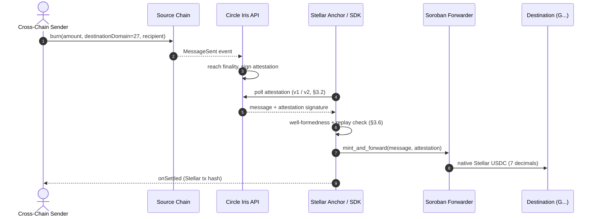

# SEP-CCTP: CCTP Inbound Deposits for Stellar Anchors

## Preamble

```
SEP: To Be Assigned
Title: CCTP Inbound Deposits for Stellar Anchors
Author: Juen (@Dyjuen)
Status: Draft
Created: 2026-10-01
Updated: 2026-10-01
Version: 0.0.1
Discussion: https://github.com/orgs/stellar/discussions/2032
```

## Simple Summary

Stellar anchors cannot accept USDC from other chains without bespoke bridging work.
This SEP standardizes the inbound path: burn USDC on a CCTP source chain, wait for
Circle's signed attestation, mint Stellar USDC through a Soroban forwarder, credit
the destination. Anchors advertise support in `stellar.toml`; wallets discover them
the same way they discover everything else.

## Dependencies

- SEP-1 (`stellar.toml` info file) — extended, not modified.
- SEP-6 / SEP-24 (optional) — anchors MAY expose CCTP as a deposit rail under
  existing deposit flows.
- Circle CCTP + Iris Attestation API (external) — burn/mint mechanics, signed
  attestations, domain registry (Stellar = 27).
- Soroban — forwarder contract executing the mint.

## Motivation

CCTP connects Stellar to 29 source chains, but each anchor re-solves the same five
problems: 6-decimal source USDC vs 7-decimal Stellar USDC, EVM address formats vs
`G...` StrKeys, attestation polling/verification, domain mapping, destination
trustlines. No shared standard exists; Anchor Platform is CCTP-unaware and Circle's
tooling has no Stellar abstraction. Result: weeks of per-anchor plumbing for an
identical flow. This SEP fixes the wire format and discovery so one integration
serves every anchor.

## Abstract

This SEP specifies inbound CCTP USDC deposits for Stellar anchors: a four-stage
lifecycle (burn, attest, verify + replay-check, mint + credit), exact 6-to-7
decimal conversion in integer arithmetic, `stellar.toml` metadata (`[CCTP]` block
plus `[[CURRENCIES]]` extension), Soroban forwarder calling conventions, and
mandatory replay/signature guards. Outbound (Stellar to external chain) is out of
scope.

## Specification

### 3.1 Transfer lifecycle



1. **Source burn.** User burns USDC targeting domain `27`. Recipient is the
   32-byte encoding of the destination Stellar key (EVM hook format carries the
   recipient; see §3.5).
2. **Attestation.** Circle Iris observes the burn and signs once finality holds.
   Fast vs standard finality thresholds are a source-chain concern; anchors MUST
   accept any attestation Circle marks `complete`.
3. **Retrieval.** Anchor polls Iris until `complete` or budget exhaustion
   (exponential backoff; see §3.2). Settlement MUST NOT precede `complete`.
4. **Mint + credit.** Anchor submits to the forwarder (§3.5), converts decimals
   (§3.3), ensures the trustline (§3.7), records the replay entry (§3.6).

### 3.2 Attestation endpoints

- v1 (legacy): `GET {base}/v1/attestations/{burnTxHash}` → `{status, message,
  attestation}`. `status === "complete"` gates settlement.
- v2: `GET {base}/v2/messages/{sourceDomain}?transactionHash={burnTxHash}` →
  `{messages: [{message, attestation, status, decodedMessage}]}`.
- Bases: mainnet `https://iris-api.circle.com`, testnet
  `https://iris-api-sandbox.circle.com`. Base URL MUST match the deployment
  network; mixing testnet attestations with mainnet mints MUST fail closed.
- SDK shape check only (`0x`-hex, minimum lengths); full signature verification
  is executed by the forwarder contract on-chain before any mint.

### 3.3 Decimal conversion

- 1 source base unit (10^-6 USDC) = 10 stroops (10^-7 XLM-asset units).
  `stellarAmount = cctpAmountBase6 * 10n`.
- The forwarder mints the **net** amount: `gross burn amount - feeExecuted`
  (the source-side fee is already taken). Receipts MUST report net, never gross.
- 6→7 direction is exact; dust is `0n` by construction.
- Dust exists only in the 7→6 direction (`stroops mod 10n`) or for sub-base-unit
  remainders. Anchors MAY sweep dust to a designated collector; accounting MUST
  balance (`credited + dust == received`).
- All amount math MUST use `BigInt`/integer arithmetic. Floats are forbidden.
  Amounts `<= 0n` or above `u64` max MUST be rejected with a typed error, never
  clamped.

### 3.4 `stellar.toml` metadata

Anchors advertising CCTP support MUST publish both blocks. Testnet example:

```toml
[[CURRENCIES]]
code = "USDC"
issuer = "GBBD47IF6LWK7P7MDEVSCWR7DPUWV3NY3DTQEVFL4NAT4AQH3ZLLFLA5"
cctp_domain = 27
cctp_forwarder = "CA66Q2WFBND6V4UEB7RD4SAXSVIWMD6RA4X3U32ELVFGXV5PJK4T4VSZ"

[CCTP]
CCTP_DOMAIN = 27
FORWARDER_ADDRESS = "CA66Q2WFBND6V4UEB7RD4SAXSVIWMD6RA4X3U32ELVFGXV5PJK4T4VSZ"
SUPPORTED_SOURCE_DOMAINS = [0, 1, 2, 3, 5, 6, 7, 9, 10, 11, 12, 13, 14, 15, 16, 17, 18, 19, 21, 22, 25, 26, 28, 29, 30, 31, 32, 33, 37]
DUST_HANDLING = "collector_sweep"
# Replace with a real G... sink owned by the anchor:
DUST_COLLECTOR_ACCOUNT = "G..."
```

Mainnet differs in two values: USDC issuer
`GA5ZSEJYB37JRC5AVCIA5MOP4RHTM335X2KGX3IHOJAPP5RE34K4KZVN` and forwarder
`CBZL2IH7F6BIDAA3WBNXYKIXSATJGMSW7K5P5MJ6STX5RXN47TZJDF5T`.

| Field | Type | Rule |
|---|---|---|
| `CCTP_DOMAIN` | int | Always `27`. |
| `FORWARDER_ADDRESS` | `C...` | Valid Soroban contract id, network-matched. |
| `SUPPORTED_SOURCE_DOMAINS` | int[] | Subset of the registry below; `27` MUST NOT be a source. |
| `DUST_HANDLING` | string | `collector_sweep` or `credit_destination`. |
| `DUST_COLLECTOR_ACCOUNT` | `G...` | Required when `collector_sweep`. |

Source registry (authoritative in `@anchor-cctp/core-sdk` `CCTP_DOMAINS`,
29 entries): 0 Ethereum, 1 Avalanche, 2 OP Mainnet, 3 Arbitrum, 5 Solana,
6 Base, 7 Polygon, 9 Aptos, 10 Unichain, 11 Linea, 12 Codex, 13 Sonic,
14 World Chain, 15 Monad, 16 Sei, 17 BNB, 18 XDC, 19 HyperEVM, 21 Ink,
22 Plume, 25 Starknet, 26 Arc, 28 EDGE, 29 Injective, 30 Morph, 31 Pharos,
32 Cronos, 33 Plasma, 37 X Layer.

### 3.5 Forwarder interface

- Entry: `mint_and_forward(message, attestation)`. Two args; no destination
  parameter — the recipient travels inside the message/hook data (§3.1 step 1).
- The contract verifies the attestation authorization payload on-chain and mints
  native Stellar USDC to the decoded destination.
- `submitMint` result MUST only be reported after network `SUCCESS`; broadcast
  without confirmation is `unconfirmed`, never `settled`.

### 3.6 Replay protection and idempotency

- The `(sourceDomain, burnTxHash)` pair is the idempotency key. Anchors MUST
  persist it before crediting; a repeat MUST return the original receipt, never
  re-mint (`ReplayTransferError` / `ALREADY_PROCESSED`).
- A `submitted`-but-unconfirmed mint MUST be reconcilable via chain lookup
  (`getTransaction`): `SUCCESS` → persist `settled`; anything else → allow retry.
  Confirm-timeout windows MUST NOT wedge a hash permanently.

### 3.7 Trustlines

- If the destination lacks a USDC trustline, anchors MAY create/sponsor one only
  behind an explicit opt-in flag with a spending cap (default ≤ 2 XLM).
- Never silent, never unbounded. Refusal MUST surface an actionable error, not a
  hung transfer.

## Design Rationale

- **`stellar.toml` over a new registry.** Wallets already resolve anchors via
  SEP-1; a `[CCTP]` block reuses discovery, signing, and caching instead of
  standing up parallel infrastructure.
- **Exact ×10 math.** 6→7 scaling has no remainder, so the spec bans floats and
  defines dust narrowly rather than inventing rounding policy where none is needed.
- **Verify on-chain, check shape off-chain.** Iris payloads are HTTP data; only
  the forwarder contract's authorization check is trustworthy. Off-chain code does
  replay/allow-list/shape gating to fail fast, never to approve funds.
- **Alternatives rejected:** per-anchor bespoke plumbing (status quo, N× cost);
  SEP-6-only routing (forces interactive flows onto a headless transfer);
  outbound scope (doubles threat surface; deferred to a later SEP).

## Security Concerns

- **Replay:** §3.6 persistent store; same burn never credits twice.
- **Unverified credit:** no balance change or mint on non-`complete` or
  malformed attestation. Testnet/mainnet base mismatch fails closed.
- **Trustline draining:** opt-in + cap (§3.7).
- **Domain spoofing:** `sourceDomain` checked against §3.4 registry; unknown
  rejected explicitly.
- **Secrets:** SDK never accepts/stores private keys; signing delegated to
  caller callbacks or explicit sponsor env. Nothing secret in logs/errors.
- **Audit status:** reference implementation has no third-party audit; this spec
  is integration guidance, not custody-grade assurance.

## Changelog

- `v0.0.1`: Initial draft.
